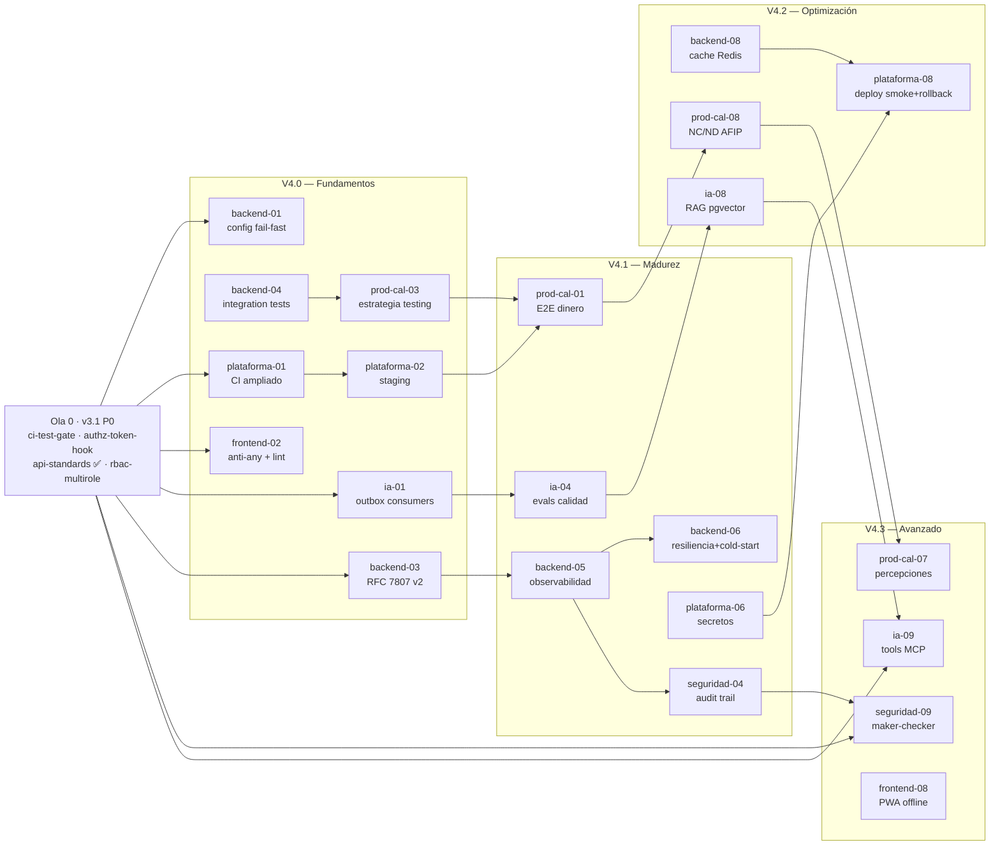

# CHANGES — Secuencia de Implementación

> Índice canónico de todos los changes del proyecto **EmprendeSmart** (MVP del EIE — Ecosistema Inteligente para Emprendedores).
> Cada change es atómico: un agente puede implementarlo en una sesión (~4-6 horas).
> **Leer este archivo antes de ejecutar cualquier `/opsx:propose`.**

---

## Cómo usar este documento

1. **Identificar el change**: buscá por tema en el árbol de dependencias o por fase. Cada change tiene un código `C-NN`.
2. **Leer la KB**: cada change lista los archivos de `knowledge-base/` que debés leer antes de proponer.
3. **Proponer**: ejecutá `/opsx:propose <nombre-kebab-del-change>` para crear el change con todos sus artifacts.
4. **Implementar y archivar**: ejecutá `/opsx:apply` y luego `/opsx:archive` al terminar.
5. **Marcar el checkbox**: cambiá `[ ]` a `[x]` en este archivo cuando el change esté archivado.

---

## Árbol de dependencias

```
C-01 billing-schema-migration
│
└── C-02 plan-gating-engine
    │
    ├── C-03 grace-period-logic
    │   └── C-10 subscription-ui-upgrade-flow
    │
    ├── C-04 ai-usage-counters-split
    │   └── C-11 ai-insights-rentabilidad-producto
    │       └── C-13 ai-price-suggestion
    │
    ├── C-05 multi-user-tenant-architecture      ← BLOQUEO MAYOR
    │   ├── C-06 roles-internos-basicos
    │   └── C-07 sucursales-module-pro
    │       └── C-08 stock-multisucursal
    │
    ├── C-09 community-bug-fixes                 ← independiente (bug fix)
    │
    ├── C-12 ai-comparative-reports
    │
    └── C-14 export-module

C-15 backend-data-layer                       ← scaffold ya archivado; esto agrega la capa de datos
│
└── C-16 backend-data-api-migration
    │
    ├── C-17 backend-payments-migration        ← CRITICO (dinero real)
    │
    └── C-18 frontend-decouple-datacontext

── FASE 6: V2.0 Retirada de deuda ──────────────────────────────────────────────────────────

C-19 v20-tenancy-cleanup                      ← CUELLO DE BOTELLA V2 (CRITICO, L)
│                                                incluye refactor backend Python + 11 Edge Functions
├── C-20 v20-sale-items-migration             ← ALTO, M
├── C-21 v20-inventory-unification            ← CRITICO, L
├── C-24 v20-insights-unification             ← BAJO, S
└── C-25 v20-outbox-activation                ← MEDIO, M

C-22 v20-fiscal-identity-clients              ← BAJO, S — independiente
C-23 v20-community-schema-split               ← MEDIO, M — independiente

── FASE 7: V2.1 Operación ────────────────────────────────────────────────────────────────

C-21 v20-inventory-unification ✓
│
└── C-26 v21-branch-as-root                   ← ALTO, M
    ├── C-28 v21-cash-session                 ← MEDIO, M
    └── C-29 v21-quote-salesorder             ← MEDIO, M (también depende C-20)
        └── C-30 v21-customer-supplier-accounts ← MEDIO, M

C-22 v20-fiscal-identity-clients ✓, C-26 ✓
│
└── C-27 v21-fiscal-profile                   ← CRITICO, M (AFIP)
```

> Nota: workers de IA/OCR (Edge Functions: `ai-insights`, `ai-prediccion`, `ai-resumen`, `ai-simulador`, `fair-advisor`, `invoice-ocr`) **NO se migran en esta fase** — permanecen como Supabase Edge Functions (ver DEC-15). Pospuesto hasta contar con presupuesto para Render paid y volumen que justifique workers Python (ARQ/LangChain).
>
> **Scaffolding archivado**: el change `fastapi-backend-monorepo` (2026-06-06) ya implementó: monorepo `frontend/` + `backend/`, FastAPI `backend/main.py`, auth JWT Supabase (`core/auth.py`, HS256), WebSocket manager (`core/ws_manager.py`, `/ws/{room_id}`), `pnpm-workspace.yaml` y 8 tests. Archivado en `openspec/changes/archive/2026-06-06-fastapi-backend-monorepo/`. La FASE 5 cubre lo **pendiente**.
>
> **Regla de V2 (RN-97 — hard rule):** **Ninguna feature nueva sobre tablas en retirada.** No se agrega lógica a `products.stock`, `sales.product_id` (header flat), `company_id` ni `user_id`-como-tenancy mientras estén activos los changes de V2.0. El orden importa — C-19 (`v20-tenancy-cleanup`) es el cuello de botella de toda la Fase 6: bloquea C-20, C-21, C-24 y C-25.
>
> **Preguntas abiertas que el PO debe responder antes del `/opsx:propose v20-tenancy-cleanup`:** PA-16 (¿refactor backend en C-19 atómico o change paralelo?), PA-17 (¿ventana mantenimiento o zero-downtime?), PA-18 (¿6 filas de `companies` son datos reales?). Ver `knowledge-base/10_preguntas_abiertas.md`.

### Paralelismo por fase

```
GATE 0: inicio (sin dependencias)
  → C-01 billing-schema-migration              [Agente A]
  → C-09 community-bug-fixes                  [Agente B]   ← FORK inmediato

GATE 1: C-01 ✓
  → C-02 plan-gating-engine                   [Agente A]

GATE 2: C-02 ✓                                ← FORK MAYOR
  → C-03 grace-period-logic                   [Agente A]
  → C-04 ai-usage-counters-split              [Agente B]
  → C-05 multi-user-tenant-architecture       [Agente C]

GATE 3: C-02 ✓, C-04 ✓
  → C-11 ai-insights-rentabilidad-producto    [Agente B]
  → C-12 ai-comparative-reports               [Agente B]

GATE 4: C-03 ✓
  → C-10 subscription-ui-upgrade-flow         [Agente A]

GATE 5: C-05 ✓                                ← FORK
  → C-06 roles-internos-basicos               [Agente C]
  → C-07 sucursales-module-pro                [Agente C — si C-05 ✓]

GATE 6: C-07 ✓
  → C-08 stock-multisucursal                  [Agente C]

GATE 7: C-11 ✓
  → C-13 ai-price-suggestion                  [Agente B]

GATE 8: C-02 ✓
  → C-14 export-module                        [Agente A]

GATE 9: scaffold archivado (fastapi-backend-monorepo ✓) — sin dependencia en C-01..C-14
  → C-15 backend-data-layer                   [Agente A]

GATE 10: C-15 ✓
  → C-16 backend-data-api-migration           [Agente A]

GATE 11: C-16 ✓                              ← FORK
  → C-17 backend-payments-migration           [Agente A — requiere aprobación humana]
  → C-18 frontend-decouple-datacontext        [Agente B]

── Fase 6 ──────────────────────────────────────────────────────────────────────────────────

GATE 12: inicio V2.0 (PA-16/PA-17/PA-18 respondidas por PO)   ← FORK V2
  → C-19 v20-tenancy-cleanup                  [Agente A — CUELLO DE BOTELLA]   ← CRITICO
  → C-22 v20-fiscal-identity-clients          [Agente B — paralelo/independiente]
  → C-23 v20-community-schema-split           [Agente C — paralelo/independiente]

GATE 13: C-19 ✓                              ← FORK MAYOR V2
  → C-20 v20-sale-items-migration             [Agente A]
  → C-21 v20-inventory-unification            [Agente B]
  → C-24 v20-insights-unification             [Agente B — si C-21 puede esperar]
  → C-25 v20-outbox-activation                [Agente C]

── Fase 7 ──────────────────────────────────────────────────────────────────────────────────

GATE 14: C-21 ✓                              ← desbloquea rama Branch
  → C-26 v21-branch-as-root                   [Agente A]

GATE 15: C-26 ✓                              ← FORK V2.1
  → C-27 v21-fiscal-profile                   [Agente A — si C-22 ✓; CRITICO AFIP]
  → C-28 v21-cash-session                     [Agente B]
  → C-29 v21-quote-salesorder                 [Agente C — si C-20 ✓]

GATE 16: C-29 ✓
  → C-30 v21-customer-supplier-accounts       [Agente A]
```

### Camino crítico (6 changes originales + 4 Fase 5 + 8 V2 — mínimo irreducible)

```
C-01 → C-02 → C-03 → C-10 → C-05 → C-07*           ← MVP (Fases 1–4, completado)

[scaffold archivado] → C-15 → C-16 → C-17**          ← Fase 5 (completado)
                              └── C-18

C-19 → C-21 → C-26 → C-27***                         ← V2.0/V2.1 camino crítico
C-19 → C-20 → C-29 → C-30                            ← V2.1 rama ventas/cuentas corrientes
```

> `*` C-07 (sucursales) es la feature de mayor valor diferencial del plan PRO.
> `**` C-17 es CRÍTICO (dinero real); requiere aprobación humana explícita antes de cortar el webhook de pagos.
> La cadena C-15 → C-16 → {C-17, C-18} es independiente del camino crítico original.
> `***` C-27 (`v21-fiscal-profile`) es el último CRÍTICO del camino V2: facturación electrónica AFIP, sin la cual la PyME usa la app además de su facturador, no en lugar de (DEC-22).
> C-19 (`v20-tenancy-cleanup`) es el cuello de botella de toda la Fase 6 — bloquea 4 changes en paralelo. No puede iniciarse sin respuesta a PA-16/PA-17/PA-18.

### Plan óptimo con 3 agentes

| Paso | Agente A (Billing/Core) | Agente B (IA/Analytics) | Agente C (Multi-tenant/Módulos) |
|------|------------------------|------------------------|----------------------------------|
| 1 | C-01 billing-schema-migration | C-09 community-bug-fixes | — |
| 2 | C-02 plan-gating-engine | — | — |
| 3 | C-03 grace-period-logic | C-04 ai-usage-counters-split | C-05 multi-user-tenant-architecture |
| 4 | C-10 subscription-ui-upgrade-flow | C-11 ai-insights-rentabilidad-producto | C-06 roles-internos-basicos |
| 5 | C-14 export-module | C-12 ai-comparative-reports | C-07 sucursales-module-pro |
| 6 | — | C-13 ai-price-suggestion | C-08 stock-multisucursal |

**Fase 5 — Migración Backend (secuencia separada; scaffold ya archivado)**

| Paso | Agente A (Backend Python) | Agente B (Frontend) | Agente C |
|------|--------------------------|---------------------|----------|
| 7 | C-15 backend-data-layer | — | — |
| 8 | C-16 backend-data-api-migration | — | — |
| 9 | C-17 backend-payments-migration *(requiere aprobación)* | C-18 frontend-decouple-datacontext | — |

**Fase 6 — V2.0 Retirada de deuda** *(requiere PO responder PA-16/PA-17/PA-18 antes del paso 10)*

| Paso | Agente A (Tenancy/Core) | Agente B (Inventario) | Agente C (Schema/Fiscal) |
|------|------------------------|----------------------|--------------------------|
| 10 | C-19 v20-tenancy-cleanup *(CRITICO — 4-6 días)* | C-22 v20-fiscal-identity-clients | C-23 v20-community-schema-split |
| 11 | C-20 v20-sale-items-migration | C-21 v20-inventory-unification | — |
| 12 | C-25 v20-outbox-activation | C-24 v20-insights-unification | — |

**Fase 7 — V2.1 Operación**

| Paso | Agente A (Branch/Fiscal) | Agente B (Caja) | Agente C (Ventas/Cuentas) |
|------|--------------------------|-----------------|---------------------------|
| 13 | C-26 v21-branch-as-root | — | — |
| 14 | C-27 v21-fiscal-profile *(CRITICO, AFIP)* | C-28 v21-cash-session | C-29 v21-quote-salesorder |
| 15 | — | — | C-30 v21-customer-supplier-accounts |

---

## FASE 1 — Billing y Monetización

> Esta fase es el cuello de botella principal: C-01 y C-02 deben completarse antes de casi todo lo demás. C-09 puede correr en paralelo porque es un bug fix sin dependencias de billing.

### [C-01] `billing-schema-migration`
- **Estado**: `[x]` completado
- **Scope**:
  - Migración SQL: ampliar `profiles.plan` de 2 valores (`'free'`, `'pro'`) a 4 valores (`'gratis'`, `'inicial'`, `'avanzado'`, `'pro'`)
  - Migración SQL: agregar campos a `profiles` — `plan_started_at TIMESTAMPTZ`, `plan_expires_at TIMESTAMPTZ`, `grace_period_ends_at TIMESTAMPTZ`, `billing_provider TEXT`, `billing_subscription_id TEXT`
  - Migración SQL: dividir `insights_used` en dos contadores — `ai_queries_used INTEGER DEFAULT 0`, `ai_advice_used INTEGER DEFAULT 0`, mantener `insights_reset_at`
  - Migración SQL: tabla `plan_limits` (seed con los 4 planes × todos los límites de RN-03) — evita hardcodear límites en código
  - Migración SQL: tabla `billing_events` para audit trail de cambios de plan
  - Actualizar `lib/constants.ts`: reemplazar objeto de límites hardcodeado por fetch de `plan_limits`
  - Actualizar tipos TypeScript en `lib/types.ts`: tipo `Plan = 'gratis' | 'inicial' | 'avanzado' | 'pro'`
  - RLS en `plan_limits`: lectura pública (sin auth), escritura solo admin
  - Tests: verificar que migration no rompe usuarios existentes (todos deben quedar en `'pro'`), verificar seed de `plan_limits`
- **Dependencias**: ninguna
- **Governance**: CRITICO
- **Leer antes**:
  - `knowledge-base/03_actores_y_roles.md` §Planes Comerciales
  - `knowledge-base/05_reglas_de_negocio.md` §RN-01 a RN-05
  - `knowledge-base/04_modelo_de_datos.md` §profiles
  - `knowledge-base/10_preguntas_abiertas.md` §INC-01

---

### [C-02] `plan-gating-engine`
- **Estado**: `[x]` completado
- **Scope**:
  - Hook `usePlanLimits()`: fetch de `plan_limits` por plan del usuario, expone `canDo(feature, currentUsage)` y `limit(feature)`
  - Función `checkPlanLimit(userId, feature)` en `lib/services/planService.ts`: consulta `plan_limits` + uso actual del usuario
  - Actualizar `lib/constants.ts` con los 4 planes y sus límites tal como define RN-03
  - Gating activo en productos: bloquear INSERT si `count(products) >= plan_limits.max_products`
  - Gating activo en clientes: bloquear INSERT si `count(clients) >= plan_limits.max_clients`
  - Gating activo en operaciones mensuales: bloquear INSERT de venta/compra/gasto si `count(ops_this_month) >= plan_limits.max_operations_per_month`
  - Gating activo en historial: filtrar queries de ventas/compras/gastos por `date >= NOW() - plan_limits.history_days`
  - UI: componente `<PlanGateAlert feature="X" />` que muestra CTA de upgrade cuando el límite es alcanzado
  - Feature flags en sidebar: ocultar/mostrar items de navegación según plan (rentabilidad, reportes comparativos, sucursales)
  - Tests: verificar que usuario en `'gratis'` no puede crear el producto #101, ni ver datos de hace 31 días
- **Dependencias**: `C-01`
- **Governance**: CRITICO
- **Leer antes**:
  - `knowledge-base/03_actores_y_roles.md` §RBAC y §Planes Comerciales
  - `knowledge-base/05_reglas_de_negocio.md` §RN-03, §RN-06
  - `knowledge-base/08_arquitectura_propuesta.md` §Gestión de Estado
  - `knowledge-base/06_funcionalidades.md` §Estado por Módulo

---

### [C-03] `grace-period-logic`
- **Estado**: `[x]` completado
- **Scope**:
  - Campo `grace_period_ends_at` ya añadido en C-01; aquí se implementa la lógica de uso
  - Trigger PostgreSQL `trg_set_grace_period`: al INSERT en `profiles`, setear `grace_period_ends_at = NOW() + INTERVAL '60 days'`
  - Edge Function o pg_cron job `downgrade-expired-users`: corre diariamente, busca perfiles donde `grace_period_ends_at < NOW()` y `plan != 'gratis'` y no tienen `billing_subscription_id` activo → downgrade a `'gratis'`, INSERT en `billing_events`
  - Email `grace_expiry_warning` (7 días antes): trigger/cron que detecta `grace_period_ends_at BETWEEN NOW() AND NOW() + 7 days` → INSERT en `email_logs`
  - Email `grace_expiry_final` (día del vencimiento): INSERT en `email_logs` con CTA de upgrade
  - Middleware Next.js: verificar `grace_period_ends_at` en sesión y agregar banner de alerta a la UI
  - Componente `<GracePeriodBanner />`: muestra días restantes y CTA de upgrade
  - Resolver PA-02: documentar respuestas a las 4 sub-preguntas de PA-02 en `knowledge-base/10_preguntas_abiertas.md`
  - Tests: simular vencimiento de gracia, verificar downgrade, verificar emails
- **Dependencias**: `C-02`
- **Governance**: ALTO
- **Leer antes**:
  - `knowledge-base/05_reglas_de_negocio.md` §RN-02
  - `knowledge-base/10_preguntas_abiertas.md` §PA-02
  - `knowledge-base/04_modelo_de_datos.md` §email_logs, §Triggers Automáticos
  - `knowledge-base/07_flujos_principales.md` §Flujo 7 (Email Transaccional)

---

### [C-09] `community-bug-fixes`
- **Estado**: `[x]` completado
- **Scope**:
  - Auditoría completa del módulo `app/(dashboard)/comunidad/`: leer componentes, identificar bugs reportados
  - Fixes específicos según PA-04 (preguntas abiertas sobre bugs conocidos) — enumerar en el change una vez relevados
  - Verificar RLS de `posts` y `replies`: lectura pública a usuarios auth, escritura solo plan pro
  - Resolver PA-03: documentar exactamente qué pueden y no pueden hacer usuarios `free` en comunidad
  - Agregar CTA de upgrade en el botón de "Crear post" para usuarios free
  - Tests E2E: crear post como pro, intentar crear como free (debe mostrar CTA), borrar post propio, intentar borrar ajeno (debe fallar)
- **Dependencias**: ninguna
- **Governance**: MEDIO
- **Leer antes**:
  - `knowledge-base/06_funcionalidades.md` §Épica 6
  - `knowledge-base/05_reglas_de_negocio.md` §RN-60, §RN-61
  - `knowledge-base/10_preguntas_abiertas.md` §PA-03, §PA-04
  - `knowledge-base/03_actores_y_roles.md` §RBAC

---

## FASE 2 — IA Avanzada y Contadores

> C-04 puede correr en paralelo con C-03 una vez C-02 está completo.

### [C-04] `ai-usage-counters-split`
- **Estado**: `[x]` completado
- **Scope**:
  - Migración SQL: renombrar `insights_used` a `ai_queries_used`, agregar `ai_advice_used INTEGER DEFAULT 0`
  - Migración SQL: actualizar `insights_reset_at` → `ai_counters_reset_at` (misma columna, rename)
  - Migración SQL: pg_cron job mensual `reset-ai-counters`: primer día de cada mes, setear `ai_queries_used = 0`, `ai_advice_used = 0` en todos los perfiles
  - Actualizar Edge Functions: `ai-insights`, `ai-prediccion`, `ai-resumen`, `ai-simulador`, `copiloto-ia` → incrementar `ai_queries_used`
  - Actualizar Edge Functions: `fair-advisor` → incrementar `ai_advice_used`
  - Actualizar `usePlanLimits()` (de C-02) para verificar ambos contadores
  - Resolver PA-05: documentar período de reset en `knowledge-base/10_preguntas_abiertas.md`
  - Tests: generar 6 insights como usuario `gratis` → el 6to debe ser bloqueado con CTA de upgrade
- **Dependencias**: `C-02`
- **Governance**: ALTO
- **Leer antes**:
  - `knowledge-base/05_reglas_de_negocio.md` §RN-05, §RN-30 a §RN-34
  - `knowledge-base/04_modelo_de_datos.md` §profiles, §Tablas de IA
  - `knowledge-base/10_preguntas_abiertas.md` §PA-05
  - `knowledge-base/08_arquitectura_propuesta.md` §Capa de Edge Functions

---

### [C-11] `ai-insights-rentabilidad-producto`
- **Estado**: `[x]` completado
- **Scope**:
  - Nueva feature: rentabilidad por producto (disponible solo en `'avanzado'` y `'pro'`)
  - RPC PostgreSQL `rpc_product_profitability(p_user_id, p_period_days)`: calcula por SKU — `total_revenue`, `total_cost`, `gross_margin`, `gross_margin_pct`, `units_sold`, `last_sale_date`
  - Edge Function `ai-rentabilidad`: llama a `rpc_product_profitability` → formatea para OpenAI → genera ranking de top/bottom 5 productos por margen → INSERT en `ai_insights` (type='margen')
  - Page `/rentabilidad`: tabla con ranking de productos por margen real, gráfico bar chart (Recharts), botón "Analizar con IA"
  - Gating UI: ocultar página para `'gratis'` e `'inicial'`, mostrar CTA de upgrade
  - Tests: calcular margen de producto con ventas y compras conocidas, verificar que el resultado es correcto
- **Dependencias**: `C-02`, `C-04`
- **Governance**: MEDIO
- **Leer antes**:
  - `knowledge-base/05_reglas_de_negocio.md` §RN-06, §RN-30, §RN-32
  - `knowledge-base/04_modelo_de_datos.md` §sales, §purchases, §products
  - `knowledge-base/06_funcionalidades.md` §Épica 4
  - `knowledge-base/08_arquitectura_propuesta.md` §Patrón de Operaciones Atómicas

---

### [C-12] `ai-comparative-reports`
- **Estado**: `[x]` completado
- **Scope**:
  - Nueva feature: reportes comparativos período vs período (disponible solo en `'avanzado'` y `'pro'`)
  - RPC `rpc_period_comparison(p_user_id, p_period_a_start, p_period_a_end, p_period_b_start, p_period_b_end)`: devuelve ventas totales, gastos totales, operaciones, top productos para ambos períodos
  - Edge Function `ai-comparativo`: llama a la RPC → envía a OpenAI → análisis narrativo de variaciones → INSERT en `ai_insights` (type='general')
  - Page `/reportes/comparativo`: selectores de fecha para 2 períodos, charts lado a lado (Recharts), sección de análisis IA
  - Respetar límite de historial por plan (30 días para `'gratis'`, 12m para `'inicial'`, etc.)
  - Gating UI: ocultar para `'gratis'` e `'inicial'`
  - Tests: comparar dos períodos con datos conocidos, verificar cálculo de delta porcentual
- **Dependencias**: `C-02`, `C-04`
- **Governance**: MEDIO
- **Leer antes**:
  - `knowledge-base/05_reglas_de_negocio.md` §RN-03 (historial por plan), §RN-06
  - `knowledge-base/06_funcionalidades.md` §Épica 4
  - `knowledge-base/04_modelo_de_datos.md` §sales, §expenses
  - `knowledge-base/07_flujos_principales.md` §Flujo 4

---

### [C-13] `ai-price-suggestion`
- **Estado**: `[x]` completado
- **Scope**:
  - Nueva feature: sugerencia de precio óptimo por producto (disponible solo en `'avanzado'` y `'pro'`)
  - Edge Function `ai-precio`: recibe `product_id`, consulta historial de ventas del producto (últimos 90 días), elasticidad implícita (variación cantidad vs precio), costos → OpenAI sugiere precio óptimo con argumento narrativo
  - Botón "Sugerir precio IA" en la vista de detalle de producto y en la página de rentabilidad (C-11)
  - Modal con resultado: precio sugerido, margen proyectado, argumento IA
  - INSERT en `ai_insights` (type='oportunidad')
  - Gating UI: ocultar para `'gratis'` e `'inicial'`
  - Tests: verificar que con 0 ventas el modelo retorna fallback gracioso
- **Dependencias**: `C-11`
- **Governance**: MEDIO
- **Leer antes**:
  - `knowledge-base/05_reglas_de_negocio.md` §RN-06, §RN-30, §RN-31
  - `knowledge-base/04_modelo_de_datos.md` §products, §sales, §ai_insights
  - `knowledge-base/06_funcionalidades.md` §Épica 4
  - `knowledge-base/08_arquitectura_propuesta.md` §Capa de Edge Functions

---

## FASE 3 — Multi-usuario y Tenant

> C-05 es el change de mayor complejidad estructural del proyecto. Bloquea C-06, C-07 y C-08. Debe planificarse cuidadosamente con el equipo antes de implementar.

### [C-05] `multi-user-tenant-architecture`
- **Estado**: `[x]` completado
- **Scope**:
  - Nuevo concepto: `organizations` (tenant) que agrupa múltiples `auth.users` con un plan compartido
  - Migración SQL: tabla `organizations` — `id UUID PK`, `name TEXT`, `plan TEXT`, `plan_started_at`, `grace_period_ends_at`, `billing_subscription_id`, `owner_id UUID FK auth.users`, `created_at`
  - Migración SQL: tabla `organization_members` — `id UUID PK`, `org_id UUID FK organizations`, `user_id UUID FK auth.users`, `role TEXT ('owner'|'admin'|'member')`, `invited_at`, `joined_at`, UNIQUE(org_id, user_id)
  - Migración SQL: agregar `org_id UUID FK organizations NULLABLE` a `profiles`
  - Definir estrategia de migración de usuarios existentes: cada usuario actual → nueva org individual, `org_id` seteado, `profiles.plan` migra a `organizations.plan`
  - Actualizar RLS en todas las tablas: `user_id = auth.uid()` → `user_id IN (SELECT user_id FROM organization_members WHERE org_id = (SELECT org_id FROM profiles WHERE id = auth.uid()))`
  - Actualizar `lib/supabase/server.ts` y `lib/supabase/client.ts`: incluir `org_id` en contexto de sesión
  - Hook `useOrganization()`: expone org actual, miembros, plan de la org
  - Page `/organizacion`: ver miembros, invitar (hasta el límite del plan), ver rol propio
  - Emails: invitación a organización (INSERT en `email_logs`, template `org_invite`)
  - Tests: usuario owner puede invitar hasta el límite del plan, usuario extra no puede unirse si org está al límite
- **Dependencias**: `C-02`
- **Governance**: CRITICO
- **Leer antes**:
  - `knowledge-base/05_reglas_de_negocio.md` §RN-07
  - `knowledge-base/03_actores_y_roles.md` §RBAC, §Planes Comerciales
  - `knowledge-base/04_modelo_de_datos.md` §profiles, §RLS
  - `knowledge-base/09_decisiones_y_supuestos.md` §DEC-08

---

### [C-06] `roles-internos-basicos`
- **Estado**: `[x]` completado
- **Scope**:
  - Roles internos de organización (disponible en `'avanzado'` y `'pro'`): `owner`, `admin`, `member`
  - `owner`: acceso completo, puede cambiar plan, puede eliminar org
  - `admin` (plan `'avanzado'`): acceso a todos los módulos, no puede cambiar plan ni eliminar org
  - `member` (plan `'avanzado'`): acceso de solo lectura a reportes y dashboard; no puede crear/editar operaciones financieras
  - Migración SQL: policy RLS diferenciada por `organization_members.role`
  - UI `/organizacion/roles`: listado de miembros con rol, botones de cambio de rol para `owner`
  - Page `/organizacion/invitar`: formulario de email + rol asignado
  - Gating: plan `'avanzado'` solo puede crear roles básicos (owner + member); plan `'pro'` desbloquea admin
  - Tests: member no puede crear venta, admin sí puede, owner puede cambiar rol de admin
- **Dependencias**: `C-05`
- **Governance**: ALTO
- **Leer antes**:
  - `knowledge-base/05_reglas_de_negocio.md` §RN-06, §RN-07
  - `knowledge-base/03_actores_y_roles.md` §Futuros Roles
  - `knowledge-base/04_modelo_de_datos.md` §RLS por tabla
  - `knowledge-base/10_preguntas_abiertas.md` §PA-06

---

### [C-07] `sucursales-module-pro`
- **Estado**: `[x]` completado — 2026-06-07
- **Scope**:
  - Módulo sucursales (disponible exclusivamente en `'pro'`)
  - Migración SQL: tabla `branches` — `id UUID PK`, `org_id UUID FK organizations`, `name TEXT`, `address TEXT`, `is_active BOOLEAN DEFAULT TRUE`, `created_at`; UNIQUE(org_id, name)
  - Migración SQL: agregar `branch_id UUID FK branches NULLABLE` a `sales`, `purchases`, `expenses`, `stock_movements`
  - RLS: usuario solo ve sucursales de su org
  - Page `/sucursales`: CRUD de sucursales (hasta 3 para plan PRO según RN-03)
  - Selectores de sucursal en formularios de venta, compra, gasto (dropdown opcional — si no se elige, queda `NULL = "principal"`)
  - Dashboard filtrable por sucursal (filtro dropdown en header)
  - Reporte por sucursal: ventas, gastos, operaciones desglosadas por branch
  - Gating UI: ocultar sección de menú para todos los planes excepto `'pro'`
  - Tests: crear 3 sucursales (límite), intentar crear la 4ta (debe fallar), registrar venta en sucursal, filtrar dashboard por sucursal
- **Dependencias**: `C-05`
- **Governance**: MEDIO
- **Leer antes**:
  - `knowledge-base/05_reglas_de_negocio.md` §RN-03 (Sucursales 1/1/1/3), §RN-06
  - `knowledge-base/04_modelo_de_datos.md` §sales, §purchases, §expenses, §stock_movements
  - `knowledge-base/06_funcionalidades.md` §Estado por Módulo
  - `knowledge-base/03_actores_y_roles.md` §Planes Comerciales

---

### [C-08] `stock-multisucursal`
- **Estado**: `[x]` completado — 2026-06-06
- **Scope**:
  - Extensión del módulo de sucursales: stock separado por sucursal (target: septiembre 2026 según RN-03)
  - Migración SQL: tabla `branch_stock` — `id UUID PK`, `product_id UUID FK products`, `branch_id UUID FK branches`, `quantity NUMERIC(15,4)`, `min_stock INTEGER`, UNIQUE(product_id, branch_id)
  - Migración SQL: agregar `branch_id` a `stock_movements` (ya planificado en C-07, aquí se activa la lógica)
  - Actualizar RPC `rpc_create_operation_aggregate`: si `branch_id` está presente, decrementar/incrementar `branch_stock.quantity` en lugar de `products.stock`
  - Trigger `check_low_stock` actualizado: verificar `branch_stock.quantity <= branch_stock.min_stock` por sucursal
  - Page `/sucursales/:id/stock`: inventario de la sucursal con ajustes manuales
  - Transferencia entre sucursales: RPC `rpc_transfer_stock(product_id, from_branch_id, to_branch_id, quantity)` → dos `stock_movements` (transfer_out + transfer_in)
  - Tests: vender en sucursal A reduce stock de A, no de B; transferir de A a B actualiza ambos
- **Dependencias**: `C-07`
- **Governance**: ALTO
- **Leer antes**:
  - `knowledge-base/05_reglas_de_negocio.md` §RN-20 a §RN-25
  - `knowledge-base/04_modelo_de_datos.md` §stock_movements, §products
  - `knowledge-base/07_flujos_principales.md` §Flujo 3 (UMV), §Flujo 9 (Ajuste Stock)
  - `knowledge-base/08_arquitectura_propuesta.md` §Patrón de Operaciones Atómicas

---

## FASE 4 — Upgrade Flow y Exportaciones

### [C-10] `subscription-ui-upgrade-flow`
- **Estado**: `[x]` completado — 2026-06-09
- **Scope**:
  - Page `/planes`: comparativo visual de los 4 planes con tabla de features, precios y CTA de compra
  - Integración con pasarela de pagos: MercadoPago Checkout Pro (preferido para Argentina) o Stripe — definir en `DEC-04` actualizado
  - Webhook de confirmación de pago: API route `/api/billing/webhook` → verifica firma → UPDATE `organizations.plan`, `plan_started_at`, `billing_subscription_id`, INSERT en `billing_events`
  - Email de confirmación de upgrade: INSERT en `email_logs` (template `plan_upgraded`)
  - Email de confirmación de downgrade voluntario: INSERT en `email_logs` (template `plan_downgraded`)
  - Page `/facturacion`: historial de pagos, plan actual, botón de cancelar suscripción
  - Webhook de cancelación (MercadoPago/Stripe): degradar plan al vencimiento del período pagado
  - Tests: simular webhook de pago exitoso → verificar upgrade de plan, simular pago fallido → plan no cambia
- **Dependencias**: `C-03`
- **Governance**: CRITICO
- **Leer antes**:
  - `knowledge-base/05_reglas_de_negocio.md` §RN-02 (gracia), §RN-03, §RN-04
  - `knowledge-base/09_decisiones_y_supuestos.md` §DEC-04
  - `knowledge-base/07_flujos_principales.md` §Flujo 7 (Email)
  - `knowledge-base/10_preguntas_abiertas.md` §PA-02

---

### [C-14] `export-module`
- **Estado**: `[x]` completado — 2026-06-06
- **Scope**:
  - Feature de exportación de datos según límite del plan (0/3/15/50 por mes para gratis/inicial/avanzado/pro)
  - Migración SQL: tabla `export_logs` — `id UUID PK`, `user_id UUID`, `org_id UUID`, `export_type TEXT`, `file_path TEXT`, `status TEXT`, `created_at`; contador mensual en `profiles.exports_used INTEGER DEFAULT 0`
  - Edge Function `generate-export`: recibe tipo (`sales_csv`, `purchases_csv`, `stock_csv`, `full_report_xlsx`), genera el archivo, lo guarda en Supabase Storage bucket `exports` (privado), retorna URL firmada
  - Botones de exportación CSV en páginas de ventas, compras, gastos, stock
  - Page `/exportaciones`: historial de exportaciones, links de descarga (URL firmada 1 hora)
  - Gating: plan `'gratis'` no puede exportar (bloquear con CTA), resto según límite mensual
  - Tests: exportar CSV de ventas con 3 filas, verificar formato correcto; plan gratis recibe error 403
- **Dependencias**: `C-02`
- **Governance**: MEDIO
- **Leer antes**:
  - `knowledge-base/05_reglas_de_negocio.md` §RN-03 (Exportaciones)
  - `knowledge-base/03_actores_y_roles.md` §Planes Comerciales
  - `knowledge-base/08_arquitectura_propuesta.md` §Storage Buckets
  - `knowledge-base/06_funcionalidades.md` §Estado por Módulo

---

## FASE 5 — Migración a Backend Python

> Fase independiente de las anteriores. Puede iniciarse en cualquier momento post-MVP sin bloquear los changes C-01..C-14. Los workers de IA/OCR (Edge Functions `ai-insights`, `ai-prediccion`, `ai-resumen`, `ai-simulador`, `fair-advisor`, `invoice-ocr`) **no se migran en esta fase** — se mantienen en Supabase Edge Functions hasta contar con presupuesto (ver DEC-15). La cadena de dependencias es: C-15 → C-16 → {C-17, C-18}.
>
> **Realtime se mantiene en Supabase Realtime (DEC-16); el WebSocket del backend ya scaffoldeado queda reservado como infra futura, sin uso en producción.**
>
> **Scaffolding YA archivado** (`openspec/changes/archive/2026-06-06-fastapi-backend-monorepo/`): el change `fastapi-backend-monorepo` implementó el monorepo `frontend/` + `backend/`, FastAPI `backend/main.py`, auth JWT Supabase (`core/auth.py`, HS256), WebSocket manager (`core/ws_manager.py`, `/ws/{room_id}`), `pnpm-workspace.yaml` y 8 tests. **La FASE 5 cubre lo PENDIENTE**: capa de datos (C-15), migración de API (C-16), pagos (C-17) y desacople de DataContext (C-18). **NO re-crear** `auth.py`, `main.py` ni el health endpoint — ya existen.

### [C-15] `backend-data-layer`
- **Estado**: `[x]` completado — 2026-06-07
- **Scope**:
  - **NO re-crear**: `core/auth.py`, `backend/main.py`, `GET /health`, `core/ws_manager.py` — ya implementados y archivados. Este change agrega la **capa de datos** al backend existente.
  - `core/database.py`: pool `asyncpg` con JWT-passthrough — claims del usuario inyectados vía `SET LOCAL request.jwt.claims` en cada conexión; RLS org-based sigue activa como red de seguridad; NUNCA `service_role` en el backend principal
  - `core/deps.py`: dependency `get_auth_context()` — resuelve org + rol + plan desde `organization_members` (una sola query); cacheable en Redis/Upstash; retorna `AuthContext(user_id, org_id, role, plan)`
  - `repositories/` base: clase base `BaseRepository(db_pool)` con método `_execute(query, *args)` que inyecta JWT-claims; las implementaciones concretas llaman a los RPCs existentes en PostgreSQL
  - `core/errors.py`: mapeo de errores PostgreSQL a mensajes en español — FK violation → "recurso no encontrado"; unique violation → "ya existe"; check violation → "valor fuera de rango"; 23xxx codes completos
  - Integración Sentry (free tier) para error tracking del backend
  - Variables de entorno nuevas: `DATABASE_URL` (asyncpg pool), `REDIS_URL` (Upstash) — `SUPABASE_JWT_SECRET` ya configurada en el scaffold
  - Tests: query con JWT inyectado respeta RLS (cross-org → 0 filas); `get_auth_context()` resuelve org + rol correctamente para owner, admin y member; error PG FK violation → respuesta 404 con mensaje en español
- **Dependencias**: ninguna (el scaffold ya existe)
- **Governance**: ALTO
- **Leer antes**:
  - `knowledge-base/08_arquitectura_propuesta.md` §"Evolución Arquitectónica: Backend Python/FastAPI", §"Decisión #0 — JWT-passthrough"
  - `knowledge-base/09_decisiones_y_supuestos.md` §DEC-12, §DEC-13
  - `knowledge-base/04_modelo_de_datos.md` §organization_members
  - `openspec/changes/archive/2026-06-06-fastapi-backend-monorepo/` (contexto del scaffold archivado)

---

### [C-16] `backend-data-api-migration`
- **Estado**: `[x]` completado — 2026-06-07
- **Scope**:
  - Migración de la API de datos via **Strangler Fig con feature flags** — el frontend puede apuntar al nuevo endpoint o al antiguo por flag; nunca corte abrupto
  - **Sub-etapa 1 — LOW risk**: `expenses` + `clients` → routers, schemas Pydantic v2, services con `require_plan()`, repositories que llaman a los RPCs existentes
  - **Sub-etapa 2 — MEDIO risk**: `products` + `branches` + `stock` → mismo patrón; preservar idempotencia (`idempotency_key`), paridad de stock, transferencias entre sucursales (`rpc_transfer_stock`)
  - **Sub-etapa 3 — MEDIO-ALTO risk**: `sales` + `purchases` + `organizations` → mismo patrón; orquesta `rpc_create_operation_aggregate`; verifica counters de plan pre-insert
  - Guards por router: `require_role(["owner", "admin"])` en mutaciones → `member` recibe 403; `require_plan(["inicial", "avanzado", "pro"])` donde aplica
  - Feature flag: variable de entorno `NEXT_PUBLIC_USE_PYTHON_API=true/false`; `DataContext` dirige tráfico al endpoint correcto
  - Tests por router: happy path; `member` intenta mutación → 403; p95 latency ≤ latency actual + 50ms (medido con `pytest-asyncio` + `httpx`)
  - OpenAPI docs en `/docs` (automático FastAPI) y `/redoc`
- **Dependencias**: `C-15`
- **Governance**: ALTO
- **Leer antes**:
  - `knowledge-base/04_modelo_de_datos.md` (completo — entidades a migrar)
  - `knowledge-base/05_reglas_de_negocio.md` (completo — guards y límites de plan)
  - `knowledge-base/08_arquitectura_propuesta.md` §"Backend Python", §"Patrón de Operaciones Atómicas", §"Lo que SÍ migra"
  - `knowledge-base/09_decisiones_y_supuestos.md` §DEC-06 (idempotencia), §DEC-07 (ledger inmutable)

---

### [C-17] `backend-payments-migration`
- **Estado**: `[x]` completado
- **Scope**:
  - Migrar el webhook de pago (MercadoPago / Stripe, implementado en C-10) de Next.js API Routes a FastAPI con **doble verificación de firma**
  - El nuevo webhook corre en **paralelo** al webhook actual durante la transición; los resultados se comparan (log de discrepancias) antes de hacer el corte
  - `POST /api/billing/webhook`: verifica firma HMAC del provider; valida idempotencia del evento (`billing_events.provider_event_id`); ejecuta `UPDATE organizations.plan`, `plan_started_at`, `billing_subscription_id`; INSERT en `billing_events`
  - Trigger de emails: INSERT en `email_logs` (templates `plan_upgraded`, `plan_downgraded`) via patrón DEC-09 existente
  - **Requiere aprobación humana explícita antes de apagar el webhook Next.js** (dinero real — governance CRITICO)
  - Tests: webhook pago exitoso → plan upgrade correcto; firma inválida → 400 rechazado sin efecto; evento duplicado → idempotente (no doble upgrade); webhook cancelación → downgrade al vencimiento
- **Dependencias**: `C-16`
- **Governance**: CRITICO
- **Leer antes**:
  - `knowledge-base/05_reglas_de_negocio.md` §RN-02, §RN-03, §RN-04
  - `knowledge-base/09_decisiones_y_supuestos.md` §DEC-09 (patrón email), §DEC-04 (billing)
  - `CHANGES.md` §C-10 (implementación original del webhook)
  - `knowledge-base/04_modelo_de_datos.md` §billing_events, §organizations

---

### [C-18] `frontend-decouple-datacontext`
- **Estado**: `[x]` completado (2026-06-07)
- **Scope**:
  - Eliminar el God Object `contexts/data-context.tsx`; reemplazar con hooks de **React Query** que consumen la API Python (C-16)
  - Un hook por dominio: `useExpenses()`, `useClients()`, `useProducts()`, `useBranches()`, `useStock()`, `useSales()`, `usePurchases()`, `useOrganizations()` — siguiendo el patrón de hooks ya existente en `hooks/`
  - El frontend queda como **UI pura**: consume FastAPI para datos; mantiene conexión directa a Supabase solo para Realtime (WebSocket), Auth (`supabase.auth.*`) y Storage (signed URLs)
  - Apagar feature flags legacy de la migración (C-16) una vez validada la paridad
  - Borrar las Edge Functions de datos migradas (las de IA/OCR se mantienen — ver DEC-15): `create-sale`, `create-purchase`, `delete-product`
  - OpenAPI docs del backend accesibles desde la UI dev en `/docs` (vía proxy Next.js o link)
  - Load testing con k6: 50 usuarios concurrentes → p95 ≤ 500ms en endpoints críticos (`/sales`, `/products`)
  - Tests: cada hook retorna datos correctos mockeando la API Python; invalidación de cache post-mutación funciona
- **Dependencias**: `C-16`
- **Governance**: MEDIO
- **Leer antes**:
  - `knowledge-base/08_arquitectura_propuesta.md` §"Evolución Arquitectónica: Backend Python/FastAPI", §"Lo que NO se migra", §"Modelo híbrido"
  - `knowledge-base/06_funcionalidades.md` §Estado por Módulo
  - `knowledge-base/09_decisiones_y_supuestos.md` §DEC-15 (IA/OCR pospuesto), §DEC-16 (realtime por WS)
  - `knowledge-base/02_descripcion_general.md` §Stack

---

---

## FASE 6 — V2.0 Retirada de Deuda

> **Ninguna feature nueva sobre tablas en retirada (RN-97).** El orden importa: C-19 es el cuello de botella de toda esta fase — bloquea C-20, C-21, C-24 y C-25. C-22 y C-23 son independientes y pueden correr en paralelo a C-19. Los changes marcados [CRÍTICO] usan Strangler Fig: nueva estructura → backfill → migrar lecturas → drop viejo.
>
> **C-19 completado (2026-06-09)** — PA-16/PA-17/PA-18 resueltas. Antes de proponer C-20, C-21 o C-25 el PO debe responder PA-20, PA-19 y PA-21 respectivamente (ver `knowledge-base/10_preguntas_abiertas.md`).

### [C-19] `v20-tenancy-cleanup`
- **Estado**: `[x]` completado — 2026-06-09 (archivado: `openspec/changes/archive/2026-06-09-v20-tenancy-cleanup`)
- **Scope**:
  - Backfill `account_id` en tablas ERP que lo tienen con NULLs (completar vacíos)
  - Agregar `account_id` a `suppliers` (actualmente solo tiene `company_id`) + backfill via `company_id → accounts` join
  - Actualizar RLS de `suppliers` para usar `account_id` (alinear con `current_account_ids()` + `is_account_writer()`)
  - Refactorizar backend Python: reemplazar `user_id` por `account_id` en los 7 repositories (`sales_repository.py`, `purchase_repository.py`, `product_repository.py`, `expense_repository.py`, `client_repository.py`, `branch_repository.py`, `stock_repository.py`) — 118 ocurrencias totales — y en `core/auth.py` / `core/deps.py`
  - Actualizar `AuthContext` en el backend: agregar `account_id` (reemplaza `org_id` como clave de tenancy en el backend)
  - Actualizar las 11 Edge Functions de IA/OP: `ai-insights`, `ai-resumen`, `ai-comparativo`, `ai-simulador`, `ai-prediccion`, `ai-precio`, `ai-rentabilidad`, `fair-advisor`, `invoice-ocr`, `generate-export`, `ai-quota.ts` — cambiar filtro primario de `user_id` a `account_id`
  - Actualizar hooks frontend con `user_id` como clave de query: `use-products`, `use-posts`, `use-clients`, `use-expenses-query` (4 archivos)
  - Drop `company_id` de las tablas ERP (después de verificar 0 usos activos) — tras ventana de validación post-backfill
  - Drop `user_id` de tablas ERP donde es tenancy (no identidad) — tras ventana de validación
  - Auditar y resolver las 6 filas de `companies` (con el PO): si son reales → migrar a `accounts`; si son prueba → descartar
  - Migración con feature flag en el backend (variable de entorno `V2_TENANCY_ACCOUNT_ID=true`) para Strangler Fig sin downtime
  - Tests: cross-account query devuelve 0 filas con `account_id` correcto; repositorio `sales` pasa test de aislamiento; Edge Function `ai-insights` filtra por `account_id`; 118 ocurrencias confirmadas substituidas (script de búsqueda en CI)
- **Dependencias**: ninguna (puede iniciar tras respuesta del PO a PA-16/PA-17/PA-18)
- **Governance**: CRITICO
- **Leer antes**:
  - `knowledge-base/09_decisiones_y_supuestos.md` §DEC-17, §DEC-23
  - `knowledge-base/04_modelo_de_datos.md` §accounts, §account_members, §RLS
  - `openspec/explore/2026-06-09-modelo-dominio-v2.md` §2.4 (118 ocurrencias `user_id`), §3 (interacción Fase 5), §4 sizing paso 1
  - `modelo-dominio-aliadata-v2.md` §7 paso 1, §5.4 (tenancy única)
  - `knowledge-base/10_preguntas_abiertas.md` §PA-16, §PA-17, §PA-18

---

### [C-20] `v20-sale-items-migration`
- **Estado**: `[x]` completado — 2026-06-10 (archivado: `openspec/changes/archive/2026-06-10-v20-sale-items-migration`)
- **Nota**: Grupo 10 (DROP del header plano) **diferido a change propio** — requiere aprobación separada del PO y está bloqueado por la representación de líneas de servicio en las tablas de ítems (product_id NULL, hoy solo existen en el header via COALESCE). Migraciones 20260616000001–09 + 3 hotfixes completas, RPC v2 con flag por cuenta (26/26 ON), EFs deployadas, repos + hooks actualizados, suite backend 85/85 verde, PRs #153/#154/#155 mergeados.
- **Scope** (completado):
  - Backfill: para cada una de las 128 ventas legacy con `product_id NOT NULL` en el header, crear 1 fila en `sale_items` con `variant_id = NULL` (PA-20 resuelta 2026-06-10: variante opcional, sin variantes default) ✓
  - Versionar el RPC `rpc_create_sale_operation`: nueva versión escribe exclusivamente en `sale_items`; versión legacy queda como fallback con feature flag ✓
  - Actualizar `backend/repositories/sales_repository.py`: query paginada migra de `SELECT s.product_id, s.quantity, s.amount` del header a `JOIN sale_items ON s.id = si.sale_id` ✓
  - Actualizar `frontend/hooks/data/use-sales.ts`: mapper que lee de `sale_items` join en lugar de campos flat del header ✓
  - Actualizar Edge Functions que leen `sale.product_id/amount/quantity`: `ai-insights/index.ts`, `ai-precio/index.ts` ✓
  - Vista de compatibilidad temporal en `sales` (`v_sales_flat`) que expone `product_id/amount/quantity` como columnas calculadas — mantiene otras queries sin romper durante la transición ✓
  - Proceso simétrico para `purchases`/`purchase_items`: backfill, RPC versionado, repo, hook ✓
  - Tests: venta creada con nuevo RPC tiene 1 fila en `sale_items`; hook `use-sales` devuelve ítems correctos; venta legacy pre-backfill es accesible; `purchase_items` espeja el comportamiento ✓
  - Drop de `product_id`, `amount`, `quantity`, `total` del header `sales` → **DIFERIDO a change propio** (Group 10, bloqueado)
  - Drop de las columnas equivalentes en `purchases` → **DIFERIDO a change propio** (Group 10, bloqueado)
- **Dependencias**: `C-19` ✓
- **Governance**: ALTO
- **Leer antes**:
  - `openspec/explore/2026-06-09-modelo-dominio-v2.md` §2.3 (campos planos en ventas), §4 sizing paso 2
  - `modelo-dominio-aliadata-v2.md` §7 paso 2, §5.3 (SaleItem como parte de Sale)
  - `knowledge-base/04_modelo_de_datos.md` §sales, §sale_items, §purchases, §purchase_items
  - `knowledge-base/09_decisiones_y_supuestos.md` §DEC-06 (idempotencia), §DEC-07 (ledger inmutable)
  - `knowledge-base/10_preguntas_abiertas.md` §PA-20

---

### [C-21] `v20-inventory-unification`
- **Estado**: `[x]` completado — 2026-06-12 (archivado: `openspec/changes/archive/2026-06-12-v20-inventory-unification`). PRs #157 (apply) #158 (fix backfill account_id) #159 (checkpoint #1: DROP Sistema B) #160 (hotfix write-path dual-write) #161 (checkpoint #2: DROP `products.stock`, single-write). `branch_stock` es el único ledger; gate de venta = Σ branch_stock (global, decisión PO); specs `inventory-single-ledger` (nueva) y `branch-stock` (actualizada) sincronizadas.
- **Scope**:
  - Crear Branch "Casa Central" para cada `account_id` sin branches (o cuyo `branch_id` esté NULL en operaciones) — INSERT en `branches` con `is_default = true`
  - Migrar 19 filas de `inventory_stock` y 22 filas de `inventory_movements` a `branch_stock` + `stock_movements` con `branch_id = casa_central_id`
  - Resolver las 6 filas de `warehouses` (PA-19 resuelta 2026-06-10): migrar sus 19 filas de stock a `branch_stock` de Casa Central; los warehouses (auto-generados "Main Warehouse") NO se convierten en branches — se descartan con el drop
  - Vista de compatibilidad `v_products_with_stock`: calcula `products.stock = SUM(quantity) FROM branch_stock WHERE product_id = ?` para preservar lecturas legacy durante la transición
  - Actualizar `backend/repositories/stock_repository.py`: `SELECT stock FROM products WHERE id = $1 AND user_id = $2` → query sobre `branch_stock` con `account_id`; también `StockOut` schema de Pydantic
  - Actualizar los 15 archivos frontend que leen `products.stock` directamente (a través de la vista o cambiando el source del hook `use-products`): `use-products.ts`, `stock/page.tsx`, `product-catalog.tsx`, `sale-form.tsx`, `stock-adjustment-modal.tsx`, `low-stock-alert.tsx`, `product-picker.tsx`, `ai-summary-card.tsx`, `buildBusinessSnapshot.ts`, `aiCopilotService.ts`, `validator.ts`, `importer.ts`, `unit-utils.ts`, `dashboard/page.tsx`, `backend/repositories/stock_repository.py`
  - Drop columna `products.stock` (último paso, tras validar que todo lee la vista o `branch_stock` directamente)
  - Drop tablas `inventory_stock`, `inventory_movements`, `warehouses` (tras migración y validación)
  - Tests: stock total de producto = suma de `branch_stock` filas; venta en sucursal A no afecta stock de sucursal B; importador de CSV escribe en `branch_stock`; vista `v_products_with_stock` devuelve valores consistentes
- **Dependencias**: `C-19`
- **Governance**: CRITICO
- **Leer antes**:
  - `openspec/explore/2026-06-09-modelo-dominio-v2.md` §2.1 (`products.stock` — 15 archivos frontend), §2.5 (`inventory_stock`/`warehouses`), §4 sizing paso 3
  - `modelo-dominio-aliadata-v2.md` §7 paso 3, §5.2 (Branch como Aggregate Root)
  - `knowledge-base/04_modelo_de_datos.md` §branch_stock, §stock_movements, §products
  - `knowledge-base/09_decisiones_y_supuestos.md` §DEC-19
  - `knowledge-base/10_preguntas_abiertas.md` §PA-19

---

### [C-22] `v20-fiscal-identity-clients`
- **Estado**: `[x]` completado — 2026-06-10 (archivado: `openspec/changes/archive/2026-06-10-v20-fiscal-identity-clients`)
- **Scope**:
  - Migración SQL: agregar columnas nullable a `clients` — `tax_id TEXT` (CUIT/DNI), `iva_condition TEXT CHECK ('responsable_inscripto','monotributista','exento','consumidor_final')`, `legal_name TEXT`
  - UI: formulario de cliente actualizado con sección "Datos fiscales" (campos opcionales con label `CUIT/DNI`, `Condición IVA`, `Razón social`)
  - Validación de CUIT en frontend: regex `^\d{2}-\d{8}-\d{1}$` + verificación de dígito verificador (módulo 11)
  - Actualizar hook `use-clients`: incluir campos `tax_id`, `iva_condition`, `legal_name` en el mapper
  - Actualizar endpoint backend `clients`: `ClientOut` schema en Pydantic incluye los nuevos campos; `ClientCreate`/`ClientUpdate` los acepta opcionales
  - Tests: crear cliente con CUIT inválido → error de validación; crear cliente sin CUIT → OK (nullable); cliente con CUIT válido → persistido correctamente
- **Dependencias**: ninguna (paralela a C-19, C-23)
- **Governance**: BAJO
- **Leer antes**:
  - `openspec/explore/2026-06-09-modelo-dominio-v2.md` §H5 (cliente sin identidad fiscal), §4 sizing paso 4
  - `modelo-dominio-aliadata-v2.md` §5.5 (FiscalIdentity como VO compartido), §7 paso 4
  - `knowledge-base/04_modelo_de_datos.md` §clients, §suppliers (referencia de esquema fiscal existente)
  - `knowledge-base/09_decisiones_y_supuestos.md` §DEC-18, §DEC-22

---

### [C-23] `v20-community-schema-split`
- **Estado**: `[x]` completado — 2026-06-10 (archivado: `openspec/changes/archive/2026-06-10-v20-community-schema-split`). Nota: se usó `ALTER TABLE SET SCHEMA` (no recreación) + vista puente `community.profiles` para el embedding de PostgREST; 16 tablas (incluye `course_progress`, no listada originalmente)
- **Scope**:
  - Crear schema Postgres `community` en el proyecto Supabase
  - Migrar tablas de dominio no-ERP al nuevo schema: `courses`, `course_modules`, `course_lessons`, `course_enrollments`, `lesson_progress`, `posts`, `replies`, `post_likes`, `meetings`, `seguros`, `purchase_pools`, `landing_sections`, `fair_recommendations`, `fair_ai_tools`, `copilot_prompts`
  - Estrategia: en Supabase no existe `ALTER TABLE SET SCHEMA` sin recrear la tabla — se requiere: CREATE TABLE `community.<tabla>` como el schema original + COPY de datos + DROP TABLE `public.<tabla>` + crear FK constraints + recrear RLS policies en el nuevo schema
  - Actualizar todas las referencias en código frontend a las tablas movidas: queries de `posts`, `replies`, `courses`, etc. deben apuntar al schema `community`
  - Actualizar los tipos TypeScript generados (`database.types.ts`) via `supabase gen types typescript`
  - Verificar que el ERP (ventas, compras, stock, productos) no tiene FKs cruzadas hacia las tablas community
  - Tests: crear post → persiste en `community.posts`; inscribirse en curso → `community.course_enrollments`; módulo de ventas no afectado
- **Dependencias**: ninguna (paralela a C-19, C-22)
- **Governance**: MEDIO
- **Leer antes**:
  - `openspec/explore/2026-06-09-modelo-dominio-v2.md` §H6 (scope creep fuera del ERP), §4 sizing paso 5
  - `modelo-dominio-aliadata-v2.md` §7 paso 5, §2.6 riesgo 4 (módulo comunidad comparte ciclo de deploy con ERP)
  - `knowledge-base/06_funcionalidades.md` §Épica 6 (Comunidad), §Épica 7 (Educación)
  - `knowledge-base/04_modelo_de_datos.md` §Tablas de Comunidad y Educación

---

### [C-24] `v20-insights-unification`
- **Estado**: `[x]` completado — 2026-06-13 (archivado; tabla única `insights` + fix bug RLS)
- **Scope**:
  - Definir schema canónico unificado — decisión: usar el schema de `ai_insights` como base (`message`, `priority`, `type`, `account_id`) por ser el más completo
  - Migrar las 427 filas de `insights` al schema unificado: mapear `content → message`, derivar `account_id` via join `user_id → accounts`, `actionable → priority` ('high' si `actionable = true`)
  - Decisión PO 2026-06-10: **Opción A** — migrar las 427 filas legacy a `ai_insights` y renombrar `ai_insights` → `insights` (nombre definitivo, sin tabla transitoria)
  - Actualizar las Edge Functions que escriben en `ai_insights` (todas las de IA): apuntar al nombre canónico post-renaming
  - Actualizar el frontend que lee de `insights` (si existe — verificar en `use-insights` hook o componentes de dashboard)
  - Drop tabla `insights` legacy tras validar que 0 referencias activas la leen
  - Tests: 427 filas legacy accesibles en el esquema unificado; Edge Function `ai-insights` escribe en tabla correcta; `account_id` correctamente derivado para todas las filas migradas
- **Dependencias**: `C-19` (necesita `account_id` limpio para el backfill de `insights.account_id`)
- **Governance**: BAJO
- **Leer antes**:
  - `openspec/explore/2026-06-09-modelo-dominio-v2.md` §H7 (insights duplicados), §4 sizing paso 6
  - `modelo-dominio-aliadata-v2.md` §7 paso 6, §5.8 (Insight unificado)
  - `knowledge-base/04_modelo_de_datos.md` §ai_insights, §Tablas de IA
  - `knowledge-base/09_decisiones_y_supuestos.md` §DEC-21

---

### [C-25] `v20-outbox-activation`
- **Estado**: `[x]` completado — 2026-06-18 (archivado: `openspec/changes/archive/2026-06-18-v20-outbox-activation`)
- **Scope**:
  - La tabla `events` ya existe con RLS habilitado y 0 filas — esta tarea es de wiring, no de creación de infraestructura
  - Implementar relay: función (Edge Function o backend Python) que lee `events WHERE processed_at IS NULL` periódicamente y dispatcha a consumers vía routing por `event_type`
  - Consumer inicial obligatorio: `AuditLog` — INSERT en `audit_logs` por cada evento procesado
  - Consumer inicial: `EmailNotification` — para eventos del tipo `sale_created` / `stock_adjusted` / `plan_changed`
  - Producir eventos desde las mutaciones principales del backend Python: `SaleCreated`, `PurchaseCreated`, `StockAdjusted` — INSERT en `events` dentro de la misma transacción que la mutación (patrón DEC-20)
  - Idempotencia de consumers: reusar tabla `operation_idempotency` con `(event_id, consumer_type)` como clave única
  - Scope del outbox en V2.0: solo `AuditLog` + `EmailNotification` — consumers de IA/reporting postergados a V2.1 (resolver PA-21 con PO antes de proponer)
  - Tests: `SaleCreated` evento → `audit_logs` tiene entrada; evento duplicado procesado dos veces → idempotente (solo 1 fila en `audit_logs`); relay falla con excepción → `events.processed_at` permanece NULL (retry en próxima ejecución)
- **Dependencias**: `C-19` (para que los eventos tengan `account_id` limpio)
- **Governance**: MEDIO
- **Leer antes**:
  - `openspec/explore/2026-06-09-modelo-dominio-v2.md` §H8 (`events` outbox — 0 filas, infraestructura lista), §4 sizing paso 7
  - `modelo-dominio-aliadata-v2.md` §7 paso 7, §5.9 (Transactional Outbox)
  - `knowledge-base/09_decisiones_y_supuestos.md` §DEC-09 (patrón email vía DB), §DEC-20 (consistencia transaccional hot path + outbox para el resto)
  - `knowledge-base/04_modelo_de_datos.md` §events, §audit_logs, §operation_idempotency
  - `knowledge-base/10_preguntas_abiertas.md` §PA-21

---

## FASE 7 — V2.1 Operación

> Fase habilitada una vez completada la retirada de deuda. Construye lo nuevo sobre el esquema limpio: Branch como root real, caja, cotizaciones, órdenes de venta, cuentas corrientes y facturación AFIP. C-26 es el prerequisito interno de la mayoría — completar primero.

### [C-26] `v21-branch-as-root`
- **Estado**: `[x]` completado — 2026-06-12 (archivado: `openspec/changes/archive/2026-06-13-v21-branch-as-root`). PRs #164 (propose) #165 (apply). Lifecycle Branch (status active/closed + open/close RPCs, cierre bloqueado con stock o última operativa), StockTransfer como entidad (`stock_transfers` + `transfer_id` en movements), invariante `onHand >= 0` (CHECK + gate per-branch; sin branch → default operativa), `P0422 branch_closed` en operaciones. Backend 124/124, frontend 203/203. Specs `branches`/`branch-stock`/`stock-transfer` sincronizadas. Nota: el invariante exigió UPDATE-then-INSERT en el helper (los CHECK se validan sobre la fila propuesta antes del ON CONFLICT).
- **Scope**:
  - Promover `Branch` a Aggregate Root real con lifecycle completo: comandos `open()` y `close()` para apertura/cierre operacional de la sucursal
  - `BranchStock` con invariante: `onHand >= 0` verificado en la transacción (sin stock negativo)
  - `StockTransfer` como entidad de primer nivel: hoy existe como RPC `rpc_transfer_stock`, convertirlo en dominio con historial propio en `stock_movements` (movement_type = 'transfer_out' / 'transfer_in')
  - Migración SQL: agregar `status TEXT ('active','closed')` y `opened_at TIMESTAMPTZ`, `closed_at TIMESTAMPTZ` a `branches`
  - Actualizar el backend Python `BranchRepository`: incluir comandos de apertura/cierre; `StockTransfer` como transacción atómica
  - UI `/sucursales/:id`: mostrar estado de la sucursal; botón apertura/cierre; listado de transferencias
  - Tests: abrir sucursal → estado 'active'; transferir stock A→B → ambos `branch_stock` actualizados en la misma transacción; intentar vender en sucursal cerrada → error
- **Dependencias**: `C-21`
- **Governance**: ALTO
- **Leer antes**:
  - `modelo-dominio-aliadata-v2.md` §5.2 (Branch como Aggregate Root), §3.2
  - `knowledge-base/09_decisiones_y_supuestos.md` §DEC-19, §DEC-20
  - `knowledge-base/04_modelo_de_datos.md` §branches, §branch_stock, §stock_movements
  - `openspec/explore/2026-06-09-modelo-dominio-v2.md` §5 (v21-branch-as-root scope)

---

### [C-27] `v21-fiscal-profile`
- **Estado**: `[x]` completado — 2026-06-12 (archivado: `openspec/changes/archive/2026-06-12-v21-fiscal-profile`). PRs #168 (propose) #169 (design/decisions) #170 (apply — mergeado). Multi-PV con `points_of_sale` + `document_sequences` por PV, `fiscal_documents` con maquina de estados `pending_cae→authorized/rejected`, relay `pg_cron` (`relay-process-pending-cae`), adaptador `WSFEAdapter`/`WSFEStubAdapter` contra ambiente del perfil, `resolve_invoice_type` puro (A/B/C), bucket privado `afip-certs`. Backend 181/181 (57 nuevos), frontend 221/221 (18 nuevos). Specs `fiscal-profile`/`document-sequence`/`afip-fiscal-document` sincronizadas. **Nota: task 5.2 (E2E homologacion ARCA) pendiente del tramite ARCA del PO — no bloqueo merge.**
- **Scope**:
  - `FiscalProfile` como entidad dentro de `Account`/`Organization`: campos `cuit TEXT`, `iva_condition TEXT`, `iibb_condition TEXT`, `punto_de_venta INTEGER`, `certificado_afip TEXT` (referencia a Storage)
  - Migración SQL: tabla `fiscal_profiles` — `id UUID PK`, `account_id UUID FK accounts`, `cuit TEXT NOT NULL`, `iva_condition TEXT`, `punto_de_venta INTEGER`, `created_at`, UNIQUE(account_id)
  - `DocumentSequence` para numeración AFIP sin huecos: tabla `document_sequences` — `(fiscal_profile_id, comprobante_type, last_number INTEGER)` con lock serializado por `SELECT FOR UPDATE`
  - Adaptador WSFE (AFIP) detrás de ACL: interfaz `FiscalDocumentPort` con método `requestCAE(invoice_data) → CAEResponse`; implementación real vs. stub para tests
  - CAE asíncrono: la venta confirma y persiste con `status = 'pending_cae'`; el adaptador AFIP solicita el CAE en background; reintento con backoff en caso de error AFIP (DEC-22)
  - UI `/configuracion/fiscal`: formulario de configuración de perfil fiscal; upload de certificado a Storage
  - **PA-22 ✅ RESUELTA (2026-06-12)**: el adaptador real apunta a **homologación** de ARCA; ambiente como config por cuenta (`AFIPConfiguration.ambiente`); trámites de producción (certificado + punto de venta WSFE) en paralelo, por cuenta emisora — no bloquean el change (ver `knowledge-base/10` §PA-22)
  - Tests: crear `DocumentSequence` para dos `fiscal_profile` en paralelo → sin duplicados (test de lock); `requestCAE` stub → devuelve CAE ficticio; secuencia de números → sin huecos tras 100 calls concurrentes
- **Dependencias**: `C-22`, `C-26`
- **Governance**: CRITICO
- **Leer antes**:
  - `modelo-dominio-aliadata-v2.md` §5.6 (FiscalProfile, DocumentSequence, adaptador AFIP), §3.6
  - `knowledge-base/09_decisiones_y_supuestos.md` §DEC-22 (AFIP en V2.1, CAE asíncrono), §DEC-18 (FiscalIdentity)
  - `knowledge-base/10_preguntas_abiertas.md` §PA-22
  - `openspec/explore/2026-06-09-modelo-dominio-v2.md` §5 (v21-fiscal-profile scope)
  - `knowledge-base/04_modelo_de_datos.md` §organizations (estructura de Account existente)

---

### [C-28] `v21-cash-session`
- **Estado**: `[x]` completado — 2026-06-17 (archivado, PR #190; helper intra-tx `c28_register_cash_movement`; hotfix saldo MAX→SUM 2026-06-29, PR #245)
- **Scope**:
  - `Cashbox` — entidad de caja por sucursal: `(id, branch_id, name, currency DEFAULT 'ARS')`
  - `CashSession` — sesión de caja con ciclo de vida: `open(opening_balance)` / `close(closing_balance)` / `arqueo(counted_balance)` → calcula diferencia
  - `CashMovement` — append-only: `(id, session_id, amount, movement_type, reference_id, created_at)`. Tipos: `sale`, `purchase_payment`, `expense`, `advance`, `withdrawal`
  - Migración SQL: tablas `cashboxes`, `cash_sessions`, `cash_movements` con RLS por `account_id` via `branch_id → branches → account_id`
  - Integrar `CashMovement` en el hot path de `SalesOrder.confirm()` (C-29): una venta en efectivo genera un `cash_movement` en la misma transacción
  - UI `/sucursales/:id/caja`: apertura de sesión, listado de movimientos, cierre con arqueo, diferencia visible
  - Tests: abrir sesión → `status = 'open'`; venta en efectivo → `cash_movements` tiene la fila; cerrar sesión → calcular diferencia correctamente; no se puede abrir sesión si hay una abierta en la misma caja
- **Dependencias**: `C-26`
- **Governance**: MEDIO
- **Leer antes**:
  - `modelo-dominio-aliadata-v2.md` §5.7 (CashSession, Cashbox, CashMovement), §3.7
  - `knowledge-base/09_decisiones_y_supuestos.md` §DEC-20 (consistencia transaccional hot path)
  - `knowledge-base/04_modelo_de_datos.md` §branches
  - `openspec/explore/2026-06-09-modelo-dominio-v2.md` §5 (v21-cash-session scope)

---

### [C-29] `v21-quote-salesorder`
- **Estado**: `[x]` archivado (2026-06-17, PRs #193 + hotfix #194 mergeados, archivado `2026-06-17-v21-quote-salesorder`)
- **Scope**:
  - `Quote` — cotización con ciclo de vida: `draft()` / `send()` / `accept()` / `expire()` / `reject()`; referencias `sale_items` via `quote_items`
  - `SalesOrder` — orden de venta con `confirm()` transaccional: en una sola transacción → (a) decrementa `branch_stock` por cada ítem, (b) genera `cash_movement` (si pago en efectivo), (c) genera `DocumentSequence` number (si factura), (d) INSERT en `events` outbox
  - Comando `quickSale()` — acceso directo a POS: crea y confirma un `SalesOrder` en un único paso con UI simplificada
  - Migración SQL: tablas `quotes`, `quote_items`, `sales_orders`, `sales_order_items` con RLS
  - Actualizar `rpc_create_sale_operation` (o reemplazarlo): el nuevo `SalesOrder.confirm()` orquesta el hot path completo
  - Vista de retrocompatibilidad: las ventas legacy (`sales` table) siguen accesibles; las nuevas órdenes se crean en `sales_orders`
  - Tests: `quickSale()` de 2 unidades → `branch_stock` decrementa 2; intento de venta con stock 0 → error "stock insuficiente"; `Quote.accept()` → crea `SalesOrder` con mismo items; `SalesOrder.confirm()` falla a mitad → rollback total (cero efectos parciales)
- **Dependencias**: `C-20`, `C-26`
- **Governance**: MEDIO
- **Leer antes**:
  - `modelo-dominio-aliadata-v2.md` §5.3 (Quote, SalesOrder), §3.3, §2.5 (relación Sales→Inventory transaccional)
  - `knowledge-base/09_decisiones_y_supuestos.md` §DEC-20, §DEC-06 (idempotencia)
  - `knowledge-base/04_modelo_de_datos.md` §sales, §sale_items, §branch_stock
  - `openspec/explore/2026-06-09-modelo-dominio-v2.md` §5 (v21-quote-salesorder scope)

---

### [C-30] `v21-customer-supplier-accounts`
- **Estado**: `[x]` archivado 2026-06-20
- **Scope**:
  - `CustomerAccount` — cuenta corriente del cliente con ledger append-only: `AccountMovement(id, customer_account_id, amount, balance_after, movement_type, reference_id, created_at)`. Tipos: `sale`, `payment_received`, `credit_note`, `adjustment`
  - Integrar con `SalesOrder.confirm()` (C-29): si el cliente tiene cuenta corriente habilitada, la venta genera un `AccountMovement` en la misma transacción
  - `SupplierAccount` — simétrico: `SupplierAccountMovement` con `payment_made`, `purchase`, `debit_note`
  - Integrar con `PurchaseOrder.receive()` (si existe — si no, con el flujo de compras actual): genera `SupplierAccountMovement`
  - `PaymentReceived` — registro de cobro parcial/total: vincula `CustomerAccount` con la venta correspondiente
  - `PaymentMade` — registro de pago a proveedor: vincula `SupplierAccount` con la compra
  - Migración SQL: tablas `customer_accounts`, `customer_account_movements`, `supplier_accounts`, `supplier_account_movements`, `payments_received`, `payments_made`
  - UI `/clientes/:id/cuenta`: saldo actual, historial de movimientos, registrar cobro
  - UI `/proveedores/:id/cuenta`: simétrico
  - Tests: crear `CustomerAccount`; confirmar venta → `balance_after` correcto; registrar cobro → saldo disminuye; saldo nunca va negativo (invariante); `SupplierAccount` espeja el comportamiento
- **Dependencias**: `C-29`
- **Governance**: MEDIO
- **Leer antes**:
  - `modelo-dominio-aliadata-v2.md` §5.4 (CustomerAccount, SupplierAccount, cuentas corrientes), §3.4
  - `knowledge-base/09_decisiones_y_supuestos.md` §DEC-18 (Customer/Supplier separados)
  - `knowledge-base/04_modelo_de_datos.md` §clients, §suppliers, §sales, §purchases
  - `openspec/explore/2026-06-09-modelo-dominio-v2.md` §5 (v21-customer-supplier-accounts scope)

---

## FASES FUTURAS (placeholder — sin changes numerados aún)

> Estas fases requieren completar V2.0 y V2.1. No se descomponen en changes hasta que las preguntas abiertas relevantes (PA-22, PA-23 y las dudas del PO sobre presupuesto/AFIP) estén resueltas.

### V2.5 — Finanzas

- `BankReconciliation` ✅ **COMPLETA (3/3)**: C1 `bank-account-ledger` ✅ (2026-06-27, PR #243) → C2 `bank-payment-routing` ✅ (2026-07-02, PR #249) → **C3 `bank-reconciliation` ✅ (2026-07-02, PRs #252/#253 — import de extracto + sesiones FSM + matching + cierre con diferencia; ver "Post-roadmap V2.x")**. C3 nació con modelo V3 aplicado: FSM open→closed terminal, motivo obligatorio (RN-A5) y fechas locales (RN-D5)
- `JournalEntry` ✅ V1 entregado (`journal-entry-outbox`, 2026-06-27 — ver "Post-roadmap V2.x"): partida doble generada async vía Consumer 3 del outbox para ventas/compras/pagos/NC. Falta: plan de cuentas configurable + UI, gastos/cierre de caja, export contable (V2.6)
- `CostCenter` ✅ dimensión + catálogo entregados (`cost-center-dimension`, 2026-06-27 — ver "Post-roadmap V2.x"): catálogo plano `cost_centers` + columna `cost_center_id` en gastos/compras + CRUD y selector opcional. Falta: reporting/agregación por centro (llega con `JournalEntry`/reporting)
- **`v25-tax-perceptions`** (percepciones y retenciones AR) — promovido a change nombrado con bloque propio (ver "Post-roadmap V2.x" / Roadmap Modelo V3). Governance **CRÍTICO** (fiscal). Dependencia técnica `v3-snapshot-pattern` ✅ satisfecha; dependencia de secuencia `v31-fiscal-cae-real-adapter` (H-01) antes de facturación real.
- **Del modelo V3 (§11) entran en esta fase**: `v3-notifications-realtime` (§3, el outbox ya está maduro) y `v3-reporting-invariants` (§8) — ver "Roadmap Modelo V3" abajo

### V3 — Inteligencia

> **Deja de ser placeholder**: `ROADMAP_MEJORAS_ALIADATA.md` §6.2 (`ia-ml`, 17 mejoras verificadas contra `audit/ia.md`) ya descompuso esta fase. El gate de **DEC-21** (`AIAgent` "nace cuando tenga invariantes de negocio reales") **ya está técnicamente satisfecho**: las invariantes (RPCs `SECURITY DEFINER` con DEC-24, FSM+historial, snapshots) existen desde 2026-07-02/07/07. Lo que falta NO es esperar más invariantes, sino cerrar la **higiene de IA** y la dependencia de **RBAC**.

Orden de secuencia recomendado (dependencias reales, no solo temáticas):

1. **`v3-ia-hygiene-baseline`** — Governance BAJO-MEDIO, esfuerzo M. Bundle de higiene que **ningún `v31-*` cubre hoy**: M-IA-04 (gating/quota del Copiloto, `frontend/app/api/ai/copilot/route.ts` sin ninguno), M-IA-05 (tenancy `ai_conversations` de `user_id` → `account_id`), M-IA-06 (consolidar `_shared/` — hoy solo `ai-quota.ts`, 9 copias del cliente OpenAI), M-IA-07 (sanitizar prompt injection en `ai-simulador`/OCR), M-IA-08 (unificar fuente de métricas a `v_sales_flat` — 3 funciones leen `sales` header), M-IA-09 (unificar persistencia de `insights` a `rpc_atomic_log_ai_insight` — hoy 2 caminos de escritura), M-IA-10 (homogeneizar contrato JSON+gating de `ai-resumen`/`ai-prediccion`/`ai-simulador`). Referenciar (no duplicar) `v31-ia-ratelimit-budget` (H-11, cubre solo `invoice-ocr`) y `v31-ia-telemetry-evals` (H-20, telemetría/evals) como hermanos ya scopeados.
2. **`v3-outbox-consumer-registry`** — Governance **ALTO** (toca la RPC crítica `rpc_process_outbox_dispatch`). = M-AUTO-01/M-IA-03/M-INT-07/M-ARQ-08 convergentes. Tabla `outbox_consumers(event_type, consumer_name, enabled, order)` + dispatch dinámico reemplazando el `IF event_type IN (...)` **hardcodeado** (agregar el Consumer 4 ya obligó un `CREATE OR REPLACE` de toda la función). Retirar/blindar el relay Python divergente (`OutboxRelayService`, 2/4 consumers, invocable por cualquier autenticado — **H-09**) + guard a `rpc_mark_event_processed`. **Prerequisito bloqueante de toda automatización de esta fase** — no es una nota al pie. Separa de `v31-ia-telemetry-evals` la preocupación "outbox no extensible" (ALTO governance) que hoy convive mal con "telemetría/evals" (BAJO).
3. **`v3-stock-alert-automation`** — Governance BAJO, quick win. = M-IA-15. Primer caso de uso sobre el registro de consumers: trigger de cruce de umbral `branch_stock.min_stock` → notificación (sin costo LLM). Insumos **ya completados**: `v3-notifications-realtime` ✅ + `branch-min-stock-realign` ✅ — solo falta el consumer/trigger, una vez exista (2).
4. **`v3-knowledgebase-rag-pgvector`** — Governance MEDIO. = M-IA-12. Habilitar `pgvector` (**revalidar primero el supuesto de costo con el PO**: no hay `CREATE EXTENSION vector` en las migraciones y `pgvector` corre dentro del Postgres ya contratado — el supuesto "requiere presupuesto para vector DB" **no está verificado**) + KB mínima (FAQ, catálogo con embeddings, OCR ya extraído) reemplazando el "RAG" hoy inexistente (snapshot numérico, no retrieval vectorial). Dependencia: `v3-ia-hygiene-baseline` (tenancy correcta antes de indexar).
5. **`v3-ai-agent-mcp-tools`** — Governance **CRÍTICO/ALTO** (sign-off PO antes de otorgar cualquier tool de escritura). = M-IA-11. AIAgent como capa de tools tipadas sobre los RPCs `SECURITY DEFINER` existentes, vía servidor MCP interno. **Dependencias explícitas: `v3-ia-hygiene-baseline` + `v3-rbac-multirole`** (para que el agente respete permisos por rol al ejecutar acciones de escritura — crear venta, cobrar) — dependencia hoy AUSENTE del placeholder pese a que M-IA-11 la señala.
6. **`v3-product-composition`** — ya nombrado (ver su ficha propia). Mantiene su lugar en la fase.
7. **`v3-uom-conversion`** — Governance BAJO. = M-FUNC-10 (§11/V3.5). Conversión entre unidades del mismo `type` (compra en kg, vende por unidad). El `type` ya se persiste desde `v3-catalog-masters` ✅ → sin migración de datos, solo la lógica de conversión.

**Backlog de la fase** (sin urgencia de arranque, explícito para no perderlo): M-IA-14 (forecasting con serie temporal real), M-IA-16 (anomalías en caja/conciliación), M-IA-17 (scoring de clientes).

> **Leer antes** (toda la fase): `ROADMAP_MEJORAS_ALIADATA.md` §6.2 (M-IA-01…17, M-AUTO-01, M-INT-07, M-ARQ-08), `audit/ia.md` (H-09/H-20), `modelo-dominio-aliadata-v3.md` §11, `knowledge-base/09_decisiones_y_supuestos.md` DEC-21.

---

## Tabla Resumen

| ID | Nombre | Fase | Governance | Dependencias | Estado |
|----|--------|------|------------|--------------|--------|
| C-01 | billing-schema-migration | 1 — Billing | CRITICO | — | `[x]` |
| C-02 | plan-gating-engine | 1 — Billing | CRITICO | C-01 | `[x]` |
| C-03 | grace-period-logic | 1 — Billing | ALTO | C-02 | `[x]` |
| C-04 | ai-usage-counters-split | 2 — IA | ALTO | C-02 | `[x]` |
| C-05 | multi-user-tenant-architecture | 3 — Multi-tenant | CRITICO | C-02 | `[x]` |
| C-06 | roles-internos-basicos | 3 — Multi-tenant | ALTO | C-05 | `[x]` |
| C-07 | sucursales-module-pro | 3 — Multi-tenant | MEDIO | C-05 | `[x]` |
| C-08 | stock-multisucursal | 3 — Multi-tenant | ALTO | C-07 | `[x]` |
| C-09 | community-bug-fixes | 1 — Billing | MEDIO | — | `[x]` |
| C-10 | subscription-ui-upgrade-flow | 4 — Upgrade | CRITICO | C-03 | `[x]` |
| C-11 | ai-insights-rentabilidad-producto | 2 — IA | MEDIO | C-02, C-04 | `[x]` |
| C-12 | ai-comparative-reports | 2 — IA | MEDIO | C-02, C-04 | `[x]` |
| C-13 | ai-price-suggestion | 2 — IA | MEDIO | C-11 | `[x]` |
| C-14 | export-module | 4 — Upgrade | MEDIO | C-02 | `[x]` |
| C-15 | backend-data-layer | 5 — Migración Python | ALTO | — (scaffold archivado) | `[x]` |
| C-16 | backend-data-api-migration | 5 — Migración Python | ALTO | C-15 | `[x]` |
| C-17 | backend-payments-migration | 5 — Migración Python | CRITICO | C-16 | `[x]` |
| C-18 | frontend-decouple-datacontext | 5 — Migración Python | MEDIO | C-16 | `[x]` |
| C-19 | v20-tenancy-cleanup | 6 — V2.0 Retirada deuda | CRITICO | — | `[x]` |
| C-20 | v20-sale-items-migration | 6 — V2.0 Retirada deuda | ALTO | C-19 | `[x]` (Grupo 10 diferido) |
| C-21 | v20-inventory-unification | 6 — V2.0 Retirada deuda | CRITICO | C-19 | `[x]` |
| C-22 | v20-fiscal-identity-clients | 6 — V2.0 Retirada deuda | BAJO | — | `[x]` |
| C-23 | v20-community-schema-split | 6 — V2.0 Retirada deuda | MEDIO | — | `[x]` |
| C-24 | v20-insights-unification | 6 — V2.0 Retirada deuda | BAJO | C-19 | `[x]` |
| C-25 | v20-outbox-activation | 6 — V2.0 Retirada deuda | MEDIO | C-19 | `[x]` |
| C-26 | v21-branch-as-root | 7 — V2.1 Operación | ALTO | C-21 | `[x]` |
| C-27 | v21-fiscal-profile | 7 — V2.1 Operación | CRITICO | C-22, C-26 | `[x]` |
| C-28 | v21-cash-session | 7 — V2.1 Operación | MEDIO | C-26 | `[x]` |
| C-29 | v21-quote-salesorder | 7 — V2.1 Operación | MEDIO | C-20, C-26 | `[x]` |
| C-30 | v21-customer-supplier-accounts | 7 — V2.1 Operación | MEDIO | C-29 | `[x]` |

---

## Estado del Roadmap V2 — COMPLETO

**Fase 6: 7/7 completados ✅** — C-19 (2026-06-09), C-20/C-22/C-23 (2026-06-10), C-21 (2026-06-12), C-24 (2026-06-13), **C-25 (2026-06-18)** archivados.
**Fase 7: 5/5 completados ✅** — C-26 (2026-06-12), C-27 (2026-06-12), C-28 (2026-06-17), C-29 (2026-06-17), **C-30 (2026-06-20)** archivados.

### 🎉 Roadmap V2 completo — C-30 `v21-customer-supplier-accounts` recién archivado

**C-30** `v21-customer-supplier-accounts` ✅ (2026-06-20, archivado `2026-06-20-v21-customer-supplier-accounts`, PR #199) — `CustomerAccount` / `SupplierAccount` con ledger append-only; `rpc_register_payment_received` / `rpc_register_payment_made` idempotentes; integración con `SalesOrder.confirm()` (`payment_method='credit'` en la misma transacción); specs `customer-account` (nueva) + `supplier-account` (nueva) + `sales-order` (credit añadido) sincronizadas. Migraciones `20260720000001` + `20260720000002` LIVE en prod; 7/7 smoke cases OK.

**Recién archivado (anterior):**
- **C-29** `v21-quote-salesorder` ✅ (2026-06-17, archivado `2026-06-17-v21-quote-salesorder`, PRs #193 + #194) — `Quote`/`SalesOrder` + `quickSale()` POS; hot path transaccional con `branch_stock` + `cash_movement` + outbox + retrocompat `sales`/`sale_items`; 278 tests pasando; 44 tests nuevos (TDD RED→GREEN→TRIANGULATE→REFACTOR completo); migraciones `20260702000001` + `20260702000002` (hotfix: `events.company_id`/`entity_type` nullable para prod drift — C-25 reconcilia). Smoke 4/4 OK.
- **C-25** `v20-outbox-activation` ✅ (2026-06-18, archivado `2026-06-18-v20-outbox-activation`) — Transactional outbox V2.0: `AuditLog` (consumer mandatorio, append-only) + `EmailNotification` (sale_created/stock_adjusted/plan_changed) + consumers idempotentes vía `(event_id, consumer_type)` + relay pure-SQL `rpc_process_outbox_dispatch` via pg_cron (sin `service_role`). Schema reconciliation migration (`events`: canonical V2 columns, legacy nullable, partial index). Producers `PurchaseCreated`/`StockAdjusted` same-tx. Backend 218+ tests (TDD RED→GREEN→TRIANGULATE→REFACTOR), migrations idempotentes. Specs `transactional-outbox` sincronizada. Nota: reconcilia drift de `public.events` de C-29 hotfix (company_id/entity_type now nullable).

**Pendiente externo (no bloquea):**
- **C-27 task 5.2** — Verificacion E2E en homologacion ARCA (WSAA ticket → WSFEv1 CAE): pendiente del tramite AFIP del PO (certificado de homologacion). El adaptador `WSFEAdapter` esta implementado y testeado con SOAP mockeado.
- **v22 task 9.1** — E2E homologacion del modelo de delegacion (facturar por un CUIT representado con el cert de plataforma): mismo gate externo del PO (tramite ARCA). El codigo del modelo de delegacion ya esta en prod y con regresion verde; ver "Post-roadmap V2.x" abajo.

**Diferido:**
- **C-20 Grupo 10** — DROP del header plano (`sales.product_id`, etc.) — bloqueado por representación de líneas de servicio. Será un change propio tras aprobación PO.
- **Vista de presupuestos UI** — pantalla de listado/gestión de presupuestos; diferida del C-29 apply. Candidata para change propio en Fases Futuras.

**Próximo trabajo:** `v3-rbac-multirole` del Modelo V3 (CRÍTICO — análisis + sign-off PO) — `v3-snapshot-pattern` ✅ 2026-07-02, `v3-document-status-history` ✅ 2026-07-03, `v3-notifications-realtime` ✅ 2026-07-04 (PR #262), `v3-soft-delete-policy` ✅ 2026-07-06, `v3-provisioning-seed` ✅ 2026-07-06 (PR #279), `v3-catalog-masters` ✅ 2026-07-06 (PR #282), `v3-reporting-invariants` ✅ 2026-07-07 (PRs #284/#285, archivada), `v3-api-standards` ✅ 2026-07-07 (PR #287, archivada). Después: percepciones (V2.5), V2.6 contable, V3 Inteligencia.

---

## Post-roadmap V2.x (changes no numerados, post C-30)

> Trabajo dirigido por el PO tras cerrar el roadmap numerado C-01→C-30. No llevan código `C-NN`; viven en `openspec/changes/archive/` con nombre propio. Se listan acá para que CHANGES.md refleje el estado real del repo.

### `cost-center-dimension` — Centro de costo (🎉 abre Fase V2.5 Finanzas)
- **Estado**: `[x]` archivado 2026-06-27 (`2026-06-27-cost-center-dimension`, PR #238). Migración `20260802000001` aplicada por CI al mergear.
- **Governance**: BAJO (catálogo CRUD + columna nullable aditiva; no toca dinero, hot path de venta ni fiscal).
- **Scope**: dimensión analítica opcional `cost_center_id` (modelo de dominio V2 §3.5). Catálogo plano `cost_centers` (account-scoped, RLS lectura=miembros / escritura=owner+admin vía `is_account_writer`, `UNIQUE(account_id, lower(name))`, soft-delete `is_active`); columna nullable `cost_center_id` en `expenses` y `purchases` (`ON DELETE SET NULL`, sin backfill); `rpc_create_purchase_operation` gana `p_cost_center_id` opcional y lo propaga a todas las líneas de la operación. Backend FastAPI 3 capas (`/cost-centers` CRUD, guard owner/admin) + frontend (catálogo + selector opcional en alta de gasto/compra). 44 tests backend + 18 frontend nuevos (TDD RED→GREEN→TRIANGULATE).
- **Por qué ahora**: de-riskea el próximo change pesado `journal-entry-outbox` (su `JournalLine` referencia `cost_center`) metiendo la columna con volumen bajo, evitando la migración dolorosa que el modelo §3.5 advierte.
- **Spec sincronizada**: `cost-center` (nueva).
- **Diferido (fuera de scope)**: jerarquías, distribución porcentual, reporting/agregación por centro (llega con `journal-entry-outbox`/reporting), imputación en ventas (el centro de costo es para costos, no ingresos).
- **Leer antes**: `modelo-dominio-aliadata-v2.md` §3.5, `knowledge-base/05_reglas_de_negocio.md`.

### `journal-entry-outbox` — Contabilidad partida doble vía outbox (V2.5 #2)
- **Estado**: `[x]` archivado 2026-06-27 (`2026-06-27-journal-entry-outbox`, PR #240). Migraciones `20260803000001/02/03` aplicadas por CI (deploy success); verificado en prod read-only (tablas + RLS + relay + 1 solo overload de `rpc_create_purchase_operation`).
- **Governance**: ALTA (registros contables que usa el contador). Diseño firmado por el PO antes del apply.
- **Scope**: `JournalEntry`/`JournalLine` (partida doble) generados **async** desde documentos ya commiteados, vía un **Consumer 3 nuevo en el relay del outbox C-25** (`rpc_process_outbox_dispatch`, SQL puro, sin service_role/HTTP). 5 eventos V1: `SaleConfirmed`, `PurchaseCreated`, `PaymentReceived`, `PaymentMade`, `CreditNoteIssued`. Plan de cuentas ~10 códigos AR hardcodeados (`account_code TEXT`, sin FK). IVA discriminado en A/B (neto 4100 + IVA DF 4200); Factura C single-line. Idempotencia `UNIQUE(source_event_id)`; balance Σdebe=Σhaber como ASSERT (P0450) con retry. `cost_center_id` propagado desde la compra. NC = asiento espejo (reversal). 2 producers nuevos creados (`PurchaseCreated` —hueco real de C-25— y `CreditNoteIssued`/`rpc_issue_credit_note`). `GET /journal-entries` read-only. 84 tests nuevos (suite outbox 126/126).
- **Decisiones (PO + técnicas)**: plan de cuentas hardcodeado (tabla+UI → V2.6); scope ventas+compras+pagos+NC (gastos/caja → V2.6); consumer SQL puro; disparador venta = `SaleConfirmed` (no FiscalDocumentIssued, p/ monotributista); discriminar IVA.
- **Fix en el camino**: bug latente de overload de `rpc_create_purchase_operation` (C-21 lo revirtió a 4 args → cost-center dejó 2 overloads; `42725`). Colapsado a 1 canónico vía DO-block + COMMENT con firma. Ver engram `opsx/journal-entry-outbox/apply`.
- **Diferido (V2.6)**: plan de cuentas configurable + UI, asientos de gastos/`CashSessionClosed`/`StockAdjusted`, export a Tango/Bejerman/Colppy.
- **Specs sincronizadas**: `journal-entry` (nueva), `transactional-outbox` (Consumer 3).
- **Leer antes**: `modelo-dominio-aliadata-v2.md` §5.6/§5.8/§5.9, `openspec/explore/2026-06-27-journal-entry-outbox.md`, `knowledge-base/05_reglas_de_negocio.md`.

### `bank-account-ledger` — Ledger bancario, carga manual (V2.5 #3 · BankReconciliation C1/3)
- **Estado**: `[x]` archivado 2026-06-27 (`2026-06-27-bank-account-ledger`, PR #243). Migración `20260804000002_bank_account_ledger.sql` aplicada por CI al mergear.
- **Specs sincronizadas**: `bank-account` (nueva), `bank-movement` (nueva).
- **Governance**: MEDIO (tablas aisladas nuevas + RPCs manuales; no toca el hot path de venta/pago ni dinero real existente).
- **Secuencia**: **C1 de 3** de BankReconciliation → C1 `bank-account-ledger` → C2 `bank-payment-routing` → C3 `bank-reconciliation`. C1 entrega un dominio bancario **autónomo, carga manual únicamente**, + costuras documentadas (no construidas) para C2/C3.
- **Scope**: `bank_accounts` (root **org-level**, tenancy directa por `account_id` — NO branch-scoped como las cajas; `cbu` 22 dígitos validado, `alias`, `currency`, `opening_balance`, `is_active`) + `bank_movements` (ledger append-only espejo de `cash_movements`: `amount` con signo, `balance_after`, `value_date`, `branch_id` nullable analítica; CHECK con el **enum completo ya fijado** `transfer_in/transfer_out/card_settlement/fee/tax_debit/interest/manual_adjustment`). Helper intra-tx `_register_bank_movement` (**contrato C1→C2**, espejo de `c28_register_cash_movement`, REVOKE de PUBLIC). RPCs SECURITY DEFINER `rpc_create_bank_account`/`rpc_update_bank_account`/`rpc_register_bank_movement` (carga manual — solo acepta `transfer_in/transfer_out/manual_adjustment`, rechaza los reservados). RLS: SELECT por `account_id` (denormalizado en `bank_movements`, sin subquery por fila — patrón `journal_lines` D7); escritura solo vía RPC. Migración `20260804000002_bank_account_ledger.sql`. ERRCODEs P0401/P0410/P0411/P0412.
- **Principio**: dos ledgers sincronizados por el outbox — `bank_movements` = OPERACIONAL (base de la conciliación C3); `1110 Banco` = espejo CONTABLE alimentado async por C2. **C1 NO postea al journal** (`1110` sigue reservado y vacío) — eso es C2.
- **Greenfield**: no existe ninguna tabla `bank_*`; la regla "ninguna feature nueva sobre tablas en retirada" (RN-97) NO aplica.
- **Diferido (C2/C3)**: captura de `payment_method`, ruteo automático al banco, posteo a `1110`, reinterpretar `payment_method='other'` (C2); import de extracto CSV/Excel, matching, `reconciliation_sessions`, columnas aditivas `statement_line_id`/`reconciliation_status`/`reconciled_at` (C3). Modelado de `card_settlement` bruto≠neto y DV del CBU también diferidos.
- **Leer antes**: `modelo-dominio-aliadata-v2.md` §3.5 + diagrama de clases (`BankAccount`/`ReconciliationSession`), `supabase/migrations/20260701000001_c28_cash_session.sql` (espejo), `knowledge-base/05_reglas_de_negocio.md`.

### `bank-payment-routing` — Ruteo de pagos al banco + posteo 1110 (V2.5 C2 · BankReconciliation C2/3)
- **Estado**: `[x]` archivado 2026-07-02 (`2026-07-02-bank-payment-routing`, PR #249). Migración `20260804000007_bank_payment_routing.sql` aplicada en prod (verificado: RPC firma de 6 args live, `_journal_post_from_event` rutea a `1110`).
- **Governance**: ALTA (rutea dinero real de pagos/cobros al ledger bancario y al journal contable). Diseño firmado por el PO antes del apply.
- **Secuencia**: **C2 de 3** de BankReconciliation → C1 `bank-account-ledger` ✅ → C2 `bank-payment-routing` ✅ → C3 `bank-reconciliation` (próximo).
- **Scope**: `rpc_register_payment_received`/`rpc_register_payment_made` ganan `p_payment_method`/`p_bank_account_id` (aditivos, default retrocompatible `cash`/`NULL`); un método bancario (`transfer`/`card`/`check`) escribe un `bank_movement` intra-tx vía el helper `_register_bank_movement` (contrato C1→C2) y exige `p_bank_account_id` válido/activo (`P0400`/`P0412`). El evento de outbox (`PaymentReceived`/`PaymentMade`) lleva `payment_method` en el payload; el Consumer 3 (`_journal_post_from_event`) lo lee y rutea la contrapartida contable a `1110 Banco` (antes reservada y vacía) vs `1100 Caja`. `SaleConfirmed` también rutea: `sales_orders.payment_method` CHECK ampliado a `{cash, transfer, card, other, credit}`; transfer/card → `1110` async (journal-only, sin `bank_movement` operacional del lado de venta).
- **Decisiones (OQ-1..5, PO sign-off 2026-07-01)**: OQ-1 cuenta bancaria por **parámetro explícito** (`p_bank_account_id`, la UI elige, sin default por org); OQ-2 taxonomía `{cash, transfer, card, check}` con **card incluido y bruto** (fee/tax netting → C3); OQ-3 enum de ventas ampliado con `transfer`/`card`, `other` sigue mapeando a `1100`; OQ-4 ruteo del lado de venta es **journal-only** (sin `bank_movement` operacional, `_c29_confirm_order_core` no se toca más allá del CHECK); OQ-5 **sin backfill** (pagos históricos quedan como cash, default retrocompatible).
- **Specs sincronizadas**: `bank-movement` (ADDED + MODIFIED), `customer-account` (MODIFIED), `supplier-account` (MODIFIED), `journal-entry` (MODIFIED).
- **Leer antes**: `openspec/changes/archive/2026-07-02-bank-payment-routing/design.md` (D1-D6 + OQ-1..5), `openspec/changes/archive/2026-06-27-bank-account-ledger/` (contrato C1→C2), `knowledge-base/05_reglas_de_negocio.md`.

### `bank-reconciliation` — Conciliación bancaria vs extracto (V2.5 C3 · BankReconciliation C3/3, cierra la secuencia)
- **Estado**: `[x]` archivado 2026-07-02 (`2026-07-02-bank-reconciliation`, PRs #252 feature + #253 fix deploy). Migración `20260805000001_bank_reconciliation.sql` aplicada en prod (verificado read-only + smoke transaccional con rollback: fee manual → P0410 card_settlement → import → open → match → undo → re-match → close P0431/dif=77 — cero rastros).
- **Governance**: MEDIO (greenfield sobre el ledger existente; no toca dinero en vuelo, hot path ni journal).
- **Scope**: `bank_statement_imports`/`bank_statement_lines` (extracto crudo **inmutable**, filas normalizadas jsonb — parseo CSV en el cliente, dedupe por `file_hash`, cap 5000, idempotencia `bank_statement_import`); `reconciliation_sessions` con FSM `open→closed` **terminal** (anti doble-apertura UNIQUE parcial P0409; cierre calcula `difference` con corte por `value_date` RN-D5; diferencia ≠ 0 exige motivo P0431 RN-A5); `reconciliation_matches` como grafo con `match_group` (1:1/1:N/N:1, Σ montos validada P0433, anti doble-match UNIQUE parcial + P0434, **undo con motivo sin borrar**); `bank_movements.reconciliation_status`/`reconciled_at` denormalizados (solo los tocan las RPCs de match); `rpc_register_bank_movement` ampliada a `fee`/`tax_debit`/`interest` ("solo anotar" V1, decisión PO — `card_settlement` sigue reservado). Backend 3 capas + endpoint manual REST (C1 no tenía wiring) + fix gap `errors.py` (P0410/P0411/P0412 caían en 500). Frontend `/finanzas/conciliacion` (parser es-AR + SHA-256, panel doble, sugerencias 1:1 ±3 días, cierre con motivo, "Anotar"). **La conciliación NUNCA toca el journal** (gate negativo). 42 tests backend (suite 810) + 13 frontend (suite 410).
- **Incidente de deploy (lección/REGLA)**: el primer `db push` falló con 23514 — el DROP+ADD del CHECK de `operation_idempotency.operation_kind` omitía `event_consumer` (hotfix outbox `20260804000005`, con filas en prod); CI no lo atrapa porque su DB nace vacía. **REGLA: al recrear ese CHECK, enumerar la UNIÓN vigente en prod (verificar `pg_get_constraintdef`), no solo los kinds que el change conoce.** Fix transaccional-seguro editando la migración no registrada (#253) + test de regresión.
- **Specs sincronizadas**: `bank-reconciliation` (nueva), `bank-movement` (MODIFIED taxonomía + RPC manual; ADDED estado de conciliación).
- **Diferido (fast-follow)**: auto-generación de asientos de ajuste, netting de `card_settlement` (bruto≠neto), sugerencias IA, presets de mapeo CSV por banco, XLSX nativo.
- **Leer antes**: `openspec/changes/archive/2026-07-02-bank-reconciliation/design.md` (D1-D9), specs `bank-reconciliation`/`bank-movement`.

### `v25-tax-perceptions` — Percepciones y retenciones AR (V2.5 fiscal)
- **Estado**: `[ ]` pendiente — solo análisis/diseño hasta sign-off explícito del PO
- **Governance**: **CRÍTICO** (fiscal — alícuotas incorrectas = contingencia impositiva real para el usuario final; señalado por M-FUNC-03, nunca declarado explícito en el CHANGES.md previo).
- **Por qué tiene bloque propio ahora**: era la única "próxima prioridad" nombrada (líneas 895/965/1085) **sin formato de change** (sin Governance/Scope/Dependencias estructurados), pese a ser dinero + fisco. `v3-snapshot-pattern` ✅ (su única dependencia declarada) está satisfecha desde 2026-07-02.
- **Scope**:
  - Cálculo automático de percepciones/retenciones en `FiscalDocument` para el mercado argentino, justificado contra el `FiscalIdentitySnapshot` completo del receptor (condición fiscal vigente al momento de emisión).
  - **Alícuotas como catálogo versionado desde el día uno**: `tax_perception_rates(jurisdiction, regime, rate, valid_from, valid_to)` — **explícitamente para NO repetir el patrón de plan-de-cuentas-hardcodeado de `journal-entry-outbox`**. Acá el costo de un hardcode desactualizado es **legal**, no solo contable: IIBB/percepciones cambian por norma provincial con frecuencia.
  - **Soporte del array `Tributos` en `WSFEAdapter`/`WSFEStubAdapter`** — percepciones/retenciones van en un array separado del de IVA en el esquema WSFEv1 de AFIP. Trabajo estructuralmente igual al array `Iva` que `v21-wsfe-production-hardening` ya construyó.
  - **Tratamiento sobre notas de crédito** (reversión proporcional) como parte del scope, no como nota lateral.
- **Dependencias**:
  - `v3-snapshot-pattern` ✅ (satisfecha).
  - `v3-reporting-invariants` ✅ — **dependencia de datos**: la distinción devengado/percibido (RN-D3, ya implementada) es relevante si las retenciones se calculan al cobro y no a la facturación.
  - `v31-fiscal-cae-real-adapter` (H-01) — **dependencia de secuencia**: recomendar cerrarla antes de habilitar percepciones en facturación real, o la primera percepción calculada se valida contra un CAE **fabricado** (el fire-and-forget fiscal usa hoy siempre el adapter STUB).
  - `v31-wsaa-ticket-cache` (H-18) — **dependencia de escala**: si el volumen con percepciones supera 1 comprobante/día por ambiente, choca con el mismo cooldown WSAA que ya bloquea facturación en volumen (sin `PlatformPostgresTicketCache`).
- **Leer antes**: `modelo-dominio-aliadata-v3.md` §1 (FiscalIdentitySnapshot), `ROADMAP_MEJORAS_ALIADATA.md` §M-FUNC-03, `audit/seguridad.md` H-01 + estado WSAA/H-18, C-27/v21/v22 (WSFE), `knowledge-base/05_reglas_de_negocio.md` §fiscal.

### `v22-afip-delegation-billing` — Facturación AFIP por delegación
- **Estado**: `[x]` archivado 2026-06-26. Código ya en prod; gate externo del PO = **task 9.1** (E2E homologación ARCA, ver "Pendiente externo" arriba).
- **Governance**: CRÍTICO (fiscal — la clave privada del cert de plataforma es el secreto más sensible del sistema).
- **Scope**: migración del modelo **cert-por-usuario → delegación** (como Xubio/Facturante/TusFacturas). La plataforma tiene **un único** certificado representante y factura por cuenta de cada usuario; el usuario sólo autoriza a EmprendeSmart en ARCA (Administrador de Relaciones → "Facturación Electrónica") y atestigua el flag `delegacion_autorizada`.
  - `WSFEAdapter` autentica SIEMPRE con el cert de plataforma; `Auth.Cuit` = CUIT del emisor/representado por comprobante.
  - Factory `build_cae_adapter`: gate "¿cert de plataforma configurado?" (no per-account); `WSFEStubAdapter` sigue siendo el default seguro.
  - Caché del TA WSAA keyada por `(representante + ambiente)` — ~1 TA por ambiente compartido entre CUIT.
  - Deprecados los endpoints de upload de cert por usuario (`POST /fiscal/profile/cert-upload-url`, `PUT /fiscal/profile/cert-path`).
  - UI: se reemplaza la sección de upload por la guía de delegación ARCA en `FiscalSettings.tsx`.
- **Specs sincronizadas**: `afip-platform-credential` (nueva), `afip-fiscal-document` (modificada), `fiscal-profile` (modificada + deprecaciones).
- **OQ-5 (botón "Enviar al ARCA" en la venta)**: salió como change propio → `facturar-venta-afip` (abajo).
- **Leer antes**: `knowledge-base/05_reglas_de_negocio.md` (dominio fiscal), engram `opsx/v22-afip-delegation-billing/*`.

### Otros changes post-roadmap (archivados)
- **`c29-write-sale-items`** ✅ (2026-06-22, PRs #203/#204) — el hot path de C-29 escribe `sale_items` (migración `20260721000001`) + backfill de ventas legacy; primer paso hacia el desbloqueo de C-20 Grupo 10.
- **`fix-delete-stock-restore`** ✅ (2026-06-22, PR #201) — el borrado de una venta repone el stock decrementado (bug de borrado-sin-reponer).
- **`v21-wsfe-homologacion-wiring`** ✅ (2026-06-23, PRs #205/#207) — wiring WSAA→WSFEv1 contra homologación ARCA; CAE real de homologación obtenido (cierra C-27 task 5.2).
- **`v21-wsfe-production-hardening`** ✅ (2026-06-23, PRs #208/#209) — los 5 gaps de producción del WSFE: `CondicionIVAReceptorId` (RG 5616), array `Iva`, numeración vía `FECompUltimoAutorizado`, caching del TA en Postgres, supabase-py.
- **`idle-session-timeout`** + **`idle-session-server-enforcement`** ✅ (2026-06-24) — cierre de sesión por inactividad (cliente + enforcement server-side).
- **`facturar-venta-afip`** ✅ (2026-06-26, PRs #228/#229) — emitir factura AFIP desde la venta (MVP Factura C). Era la OQ-5 de v22.
- **`fiscal-receptor-iva-relay`** ✅ (2026-06-26, PRs #226/#227) — propaga la identificación del receptor (`DocTipo`/`DocNro`) + desglose de IVA a través del relay del CAE.
- **`register-name-terms-captcha`** ✅ (2026-06-27, PRs #231–#235) — alta con nombre+apellido, consentimiento legal + opt-in email, captcha Turnstile en toda la auth; + provincia, mail al admin y validación de formato de email/teléfono.
- **`facturar-venta-manual`** ✅ (2026-06-27, PR #242) — promoción lazy de una venta legacy de `/ventas` a `SalesOrder` facturable (`rpc_promote_legacy_sale_to_order`, side-effect-free) + botón "Facturar"; cierra la asimetría con el flujo AFIP.
- **`bank-account-crud`** ✅ (2026-07-04, PR #272) — alta de cuentas bancarias: `POST /bank-accounts` (3 capas, sin migraciones — reusa `rpc_create_bank_account`) + `BankAccountFormDialog` (RHF+Zod) accesible desde el empty state y el header de `/finanzas/conciliacion` + rename del ítem de sidebar "Conciliación bancaria"→"Bancos"; cierra el gap de UI de alta que `bank-account-ledger` (C1) había dejado. Spec sincronizada: `bank-account` (MODIFIED).

---

## Roadmap Modelo V3 (2026-07-02) — changes derivados de `modelo-dominio-aliadata-v3.md`

> El PO adoptó el **modelo de dominio V3** (`modelo-dominio-aliadata-v3.md`, 2026-07-02): extensión del V2 con patrones extraídos de la spec Food Store — **no reemplaza al V2, lo extiende**. El V3 §11 asignaba sus deltas a fases V2.0/V2.1 que ya cerraron, así que esos ítems entran como **retrofit** sobre el schema vivo. Los changes de esta sección no llevan código `C-NN` (convención post-roadmap). Gap-analysis verificado contra el código el 2026-07-02.

### Gap-analysis (modelo V3 vs. código en prod)

| V3 § | Patrón | Estado verificado en código | Change |
|---|---|---|---|
| §1 | Snapshot Pattern | ✅ Columnas snapshot congeladas en líneas (`name`, `sku`, `unit_cost`, `iva_rate`) + `stock_movements.unit_cost_snapshot` + `FiscalIdentitySnapshot` del receptor (`receptor_legal_name`, `receptor_iva_condition`). **Desbloquea C-20 Grupo 10** (línea de servicio = `product_id NULL` + `name_snapshot`). Archivada 2026-07-02. | ✅ `v3-snapshot-pattern` |
| §2 | FSM + historial de estados | ✅ Tabla append-only `document_status_history`, catálogo `document_status_transitions` con política como datos, `record_status_transition` helper, `allowed_role` permisivo (inerte hoy, activado por RBAC). Archivada 2026-07-03. Desbloquea matriz rol×transición de RBAC. | ✅ `v3-document-status-history` |
| §3 | Notificación post-commit | ✅ Consumer 4 (`_notification_from_event` idempotente) + tabla `notifications` read-model RLS-guarded + hook Realtime `useNotifications` + 5 producers (CashSessionClosed, StockBelowMinimum, QuoteAccepted, TransferDispatched, FiscalDocumentRejected). Archivada 2026-07-04. Desbloquea UI realtime. | ✅ `v3-notifications-realtime` |
| §4 | Soft delete uniforme | ✅ `deleted_at`/`deleted_by` en 6 maestros (`clients`, `products`, `suppliers`, `cost_centers`, `cashboxes`, `bank_accounts`); índices únicos parciales RN-B3; guard RN-B4 (trigger en `products`: rechaza borrado con stock ≠ 0 o referencia en documentos `draft`); `BaseRepository.soft_delete()` centralizado; `is_active` conservado en paralelo (no se dropea). `branches` queda fuera de scope (V3 §4: se desactiva, no se borra); `categories`/`price_lists` no existen como tablas. Archivada 2026-07-06. | ✅ `v3-soft-delete-policy` |
| §5 | RBAC multi-rol | ❌ `account_members.role` singular, CHECK `('owner','admin','member')`; sin `assigned_by`/`expires_at`, sin roles funcionales (SELLER/CASHIER/STOCK/…) | `v3-rbac-multirole` |
| §6 | UoW + capas | ✅ COMPLETADA 2026-07-07 (PR #287): layering routers→services→repositories confirmado; la transaccionalidad del hot path vive en **RPCs SQL `SECURITY DEFINER`** (equivalente funcional del UoW, registrado como DEC-24 — no requería refactor). `BaseRepository` ganó helper de paginación (`soft_delete()` ya existía desde `v3-soft-delete-policy`); RFC 7807 uniforme implementado en `backend/core/errors.py` + `backend/main.py`. | ✅ `v3-api-standards` |
| §6.3 | Idempotencia | ✅ COMPLETADA 2026-07-07 (PR #287): `operation_idempotency` + dedupe de consumers `(event_id, consumer_type)` ya existían; `Idempotency-Key` del cliente generalizado vía header HTTP (con fallback deprecado a `idempotency_key` en el body), incluyendo `cash_session_close` (`operation_kind` nuevo en el CHECK) | ✅ `v3-api-standards` |
| §7.1 | UnidadMedida tipada | ✅ Formalizado como contrato: `type` (`unit\|weight\|volume\|length\|custom`) ya era `NOT NULL` + `CHECK` en prod (10 unidades del sistema tipadas), catálogo mixto global (`is_system`)/per-tenant (`account_id`). Spec-only, cero DDL. Archivada 2026-07-06. | ✅ `v3-catalog-masters` |
| §7.2 | Composición de producto (BOM) | ❌ No existe | fase V3 (`v3-product-composition`) |
| §7.3 | Direcciones múltiples | ✅ Tabla `client_addresses` (operativa, distinta de la fiscal): `alias`, `is_primary` con índice único parcial + RPC `rpc_set_primary_client_address` de switch atómico, soft-delete alineado a V3 §4. UI diferida (solo DB + API + tipo TS). Archivada 2026-07-06. | ✅ `v3-catalog-masters` |
| §7.4 | Imágenes de producto | ❌ `products` sin imágenes (solo landing usa Storage) | — (descartado por PO 2026-07-04, no se implementa) |
| §7.5 | Seed de provisioning | ✅ COMPLETADA 2026-07-06 (PR #279): `handle_new_user` siembra eager branch "Casa Central" + cashbox "Caja Principal" (ARS); backfill de las ~29 cuentas existentes. Lista de precios/formas de pago/plan de cuentas quedan OUT (estructuras no existentes — ver nota en la sección del change) | `v3-provisioning-seed` ✅ |
| §8 | Invariantes reporting RN-D | ✅ COMPLETADA 2026-07-07: revenue de línea (`COALESCE(total,amount)`) en los 3 RPCs desviados (+17,53% en prod, sign-off PO), NC restan vía cta cte ledger (RN-D1), devengado/percibido con `collected==invoiced` hoy (RN-D3, 0 NC/cta cte en prod), fecha local del tenant generalizada en todos los bordes (RN-D5), conteo de operaciones unificado. RN-D2/D4 ya cumplidos por trabajo previo. Archivada 2026-07-07. | ✅ `v3-reporting-invariants` |
| §9 | Endurecimiento plataforma | ⚠️ Captcha ✅, firma de webhooks ✅ (C-17), fixtures por rol ✅ (conftest); rate limiting/refresh token = config de Supabase Auth (tarea PO, no change) | — |
| §10 | Rechazos explícitos | ✅ Ya alineados: `branch_stock` único ledger (C-21), rol en membership (C-05), Supabase Realtime (DEC-16), Postgres real en CI (validate-kpis) | — (decisiones registradas) |

### Secuencia recomendada

```
C3 bank-reconciliation ✅ (2026-07-02 — nació con RN-A/RN-D5 aplicadas)
  → v3-snapshot-pattern ✅ (2026-07-02, PR #255 — DESBLOQUEÓ C-20 Grupo 10)
  → v3-document-status-history ✅ (2026-07-03, PRs #258/#259 — FSM + historial, RBAC-ready)
  → v3-notifications-realtime ✅ (2026-07-04, PRs #262/#264 — Consumer 4 + campana Realtime + specs synced)
  → v3-soft-delete-policy ✅ (2026-07-06, PRs #275/#276/#277)
  → v3-provisioning-seed ✅ (2026-07-06, PR #279)
  → v3-catalog-masters ✅ (2026-07-06, PR #282 — UoM tipada spec-only + client_addresses)
  → v3-reporting-invariants ✅ (2026-07-07, PRs #284/#285 — revenue de línea, NC restan, devengado/percibido, fecha local, conteo de operaciones unificado)
  → v3-api-standards ✅ (2026-07-07, PR #287 — RFC 7807, paginación estándar, Idempotency-Key, DEC-24)
  → v3-rbac-multirole ⭐ SIGUIENTE   (CRÍTICO — análisis + sign-off PO antes de escribir; consume allowed_role de v3-document-status-history)
  → percepciones-retenciones         (V2.5, después del snapshot fiscal)
```

---

### `v3-snapshot-pattern` — Inmutabilidad histórica de documentos (V3 §1) ⭐
- **Estado**: `[x]` ✅ completada 2026-07-02 (PR #255)
- **Governance**: ALTO (toca los RPCs del hot path de venta/compra; cambios aditivos, sin drops)
- **Scope**:
  - Columnas snapshot en `sale_items`, `purchase_items`, `quote_items`, `sales_order_items`: `name_snapshot TEXT`, `sku_snapshot TEXT`, `unit_cost_snapshot NUMERIC(15,2)`, `iva_rate_snapshot NUMERIC(5,2)`
  - Los RPCs de escritura (`rpc_create_sale_operation` v2, `rpc_create_purchase_operation`, `_c29_confirm_order_core`, RPCs de quotes) congelan los snapshots desde el maestro **en la misma transacción**
  - `stock_movements.unit_cost_snapshot` para valuación de inventario (V3 §1: el ledger ya congela `balance_after`; se agrega el costo)
  - `fiscal_documents`: completar el `FiscalIdentitySnapshot` del receptor — `receptor_legal_name`, `receptor_iva_condition` (hoy solo doc tipo/nro) + datos del emisor vigentes al emitir
  - Nueva regla de negocio en `knowledge-base/05`: **tras `confirm()` las líneas no se editan** — corrección = documento nuevo (NC, ajuste), nunca UPDATE (equivalente RN-04 Food Store)
  - Backfill best-effort de líneas históricas desde el maestro actual, marcadas `snapshot_backfilled = true` (reportes distinguen dato exacto vs. aproximado)
  - Reporting de margen (`rpc_product_profitability`, KPIs de dashboard) migra a leer snapshots (RN-D2)
- **Desbloquea**: **C-20 Grupo 10** (DROP del header plano) — la línea de servicio pasa a representarse como ítem con `product_id NULL` + `name_snapshot`, que era exactamente el bloqueo registrado
- **Dependencias**: ninguna (aditivo)
- **Leer antes**: `modelo-dominio-aliadata-v3.md` §1 y §8, `modelo-dominio-aliadata-v2.md` §5.3, `knowledge-base/05_reglas_de_negocio.md`

### `v3-document-status-history` — FSM + historial de estados append-only (V3 §2)
- **Estado**: `[x]` ✅ completada 2026-07-03 (PRs #258 squash `9adf785`, #259 `fcdb32c`)
- **Governance**: MEDIO (tabla nueva + RPC de historial; cambios aditivos a otros RPCs)
- **Scope**: ✅ Implementado
  - Tabla `document_status_history` genérica append-only: `(id, account_id, document_type, document_id, from_status, to_status, performed_by, reason, occurred_at)`; RLS sin UPDATE/DELETE (RN-A3 enforzado con grants + REVOKE)
  - RN-A1: toda transición de Quote/SalesOrder/FiscalDocument/CashSession/ReconciliationSession/StockTransfer inserta historial **en la misma transacción**; RN-A2: creación registra `from_status = NULL`
  - `document_status_transitions` catálogo con datos: transiciones válidas + `is_terminal_to`, `requires_reason`, `allowed_role` (permisivo, inerte)
  - Helpers STABLE: `is_valid_transition()`, `is_terminal_status()`, `transition_requires_reason()` accesibles a `authenticated`
  - `record_status_transition()` helper DEFINER: valida transición + exige reason si `requires_reason`, inserta en historial
  - Retrofit: `rpc_accept_quote`, `_c29_confirm_order_core`, `rpc_open_cash_session`, `rpc_close_cash_session`, `rpc_close_reconciliation_session`, `rpc_emit_pending_cae` + relay CAE (backend)
  - UI: componente `DocumentTimeline` (Server Component) renderiza historial ordenado por `occurred_at` en detalles de venta/presupuesto/factura
  - RN-A4 (dimensión por rol) estructurada vía `allowed_role` pero inerte; se activa con `v3-rbac-multirole`
- **Dependencias**: ninguna
- **Leer antes**: `modelo-dominio-aliadata-v3.md` §2, `knowledge-base/05_reglas_de_negocio.md` (RN-A1..A5), migraciones anteriores a `20260807000001` (FSMs en CHECKs, catálogo seed)
- **PRs**: #258 (Squash apply completo + tests + gates), #259 (post-apply follow-up), migración `20260807000001` aplicada prod + smoke OK

### `v3-notifications-realtime` — Notificaciones in-app post-commit (V3 §3)
- **Estado**: `[x]` ✅ completada 2026-07-04 (PR #262 squash `d0c5f26` + PR de cierre)
- **Governance**: MEDIO (consumer nuevo del outbox + tabla read-model; no toca transacciones de negocio)
- **Scope**: ✅ Implementado
  - Tabla `notifications` (read model): `(id, account_id, branch_id, type, severity, payload jsonb, audience uuid[], read, created_at, read_at)`; RLS por audiencia (SELECT/UPDATE con USING+WITH CHECK, sin INSERT policy); índices dropdown + parcial no-leídas; TTL 30 días solo-leídas vía pg_cron
  - **Consumer 4 del relay del outbox** (`rpc_process_outbox_dispatch`, consumers 1-3 preservados byte-a-byte): helper `_notification_from_event` idempotente por `(event_id,'Notification')`; audiencia resuelta server-side en `_notification_audience` (punto único migrable a `v3-rbac-multirole`)
  - Canal Supabase Realtime `postgres_changes` sobre `notifications` (primera suscripción Realtime del frontend) — RLS filtra el stream server-side; hook `useNotifications` (React Query, resync FS §9.6, sin polling) + `NotificationBell` en el header
  - **5 producers nuevos**: `CashSessionClosed` (rpc_close_cash_session), `StockBelowMinimum` (reutiliza trigger `check_branch_low_stock` / `branch_stock.min_stock`), `QuoteAccepted` (rpc_accept_quote, seller=created_by proxy), `TransferDispatched` (rpc_transfer_stock), `FiscalDocumentRejected` (trigger AFTER UPDATE — el rechazo CAE lo persiste el backend Python con service_role, sin RPC)
  - **No confundir con `sale_notifications`** (log de envíos WhatsApp/email al cliente final — otra cosa, no se tocó)
- **Dependencias**: outbox activo ✅ (C-25 + revival 2026-07-01 #248)
- **Leer antes**: `modelo-dominio-aliadata-v3.md` §3, spec `transactional-outbox`, `knowledge-base/09_decisiones_y_supuestos.md` §DEC-16 (Realtime en Supabase)
- **PRs**: #262 (apply completo: migraciones `20260808000001`/`20260808000002` + frontend + 5 tests Vitest), cierre con `20260808000003` (REVOKE advisor). Verificado en prod: publicación Realtime ✅, RLS ✅, smoke Consumer 4 con rollback ✅, advisors sin hallazgos nuevos residuales

### `branch-min-stock-realign` — Realineación de min_stock por sucursal (hallazgo de `v3-notifications-realtime`)
- **Estado**: `[x]` ✅ completada 2026-07-04 (PRs #265 squash `f1fe4e1` + fix `93f9ced`, #266 squash `f43ec3a`)
- **Governance**: MEDIO (RPC nueva + backfill + vista recreada; no toca dinero ni auth)
- **Scope**: RPC `rpc_set_product_min_stock` propaga `products.min_stock` a **todas** las filas `branch_stock` del producto en la misma transacción de creación/edición (wired en `product_repository.create()`/`update()`); backfill idempotente `products→branch_stock` con gate de 0 divergencias; vista `v_products_with_stock` recreada exponiendo `min_stock` derivado de `branch_stock` (no de `products.min_stock`); `products.min_stock` queda **DEPRECATED** (comentario en columna, sin DROP — conservada por el dual-write del importador). Nació de un hallazgo durante `v3-notifications-realtime`: el trigger `check_branch_low_stock` ya leía `branch_stock.min_stock`, pero nada lo poblaba desde el formulario — el umbral quedaba frozen en 0.
- **Specs sincronizadas**: `branch-stock` (2 ADDED: propagación + backfill; 1 MODIFIED: alerta de stock bajo), `inventory-single-ledger` (1 MODIFIED: vista de compatibilidad con `min_stock` derivado).
- **Dependencias**: ninguna (aditivo; DROP de `products.min_stock` diferido a change destructivo posterior)
- **Leer antes**: `knowledge-base/05_reglas_de_negocio.md` (RN-23), `modelo-dominio-aliadata-v3.md` §3 (contexto de `v3-notifications-realtime`)

### `v3-soft-delete-policy` — Política única de borrado (V3 §4)
- **Estado**: `[x]` ✅ completada 2026-07-06 (PRs #275 `58688a2`, #276 `0b1b2a6`, #277 `62f5a15`)
- **Governance**: MEDIO (cambia semántica de borrado de maestros; documentos/ledgers no se tocan)
- **Scope**: ✅ Implementado
  - Política por categoría (V3 §4): maestros → soft delete (`deleted_at` + `deleted_by`); documentos confirmados → jamás se borran, se **anulan** por transición con motivo; ledgers → contra-asiento; drafts → hard delete OK; Membership se revoca, UserAccount se anonimiza
  - `deleted_at`/`deleted_by` agregados a los 6 maestros: `clients` (solo tenía `deleted_at`, sin `deleted_by` — verificado durante propose/apply), `products`, `suppliers`, `cost_centers`, `cashboxes`, `bank_accounts`. `categories`/`price_lists` **no existen como tablas** en el modelo actual (verificado; no había nada que migrar). `branches` queda **fuera de scope** (V3 §4: una sucursal se desactiva, no se borra — `is_active` sigue siendo la política correcta ahí)
  - RN-B3: índices únicos parciales (`WHERE deleted_at IS NULL`) para recrear claves naturales (ej. SKU) previamente borradas
  - RN-B4: trigger en `products` rechaza el soft delete con stock ≠ 0 o referencia activa en documentos `draft`
  - RN-B1/B2 en el backend: `BaseRepository.soft_delete(table, row_id, account_id, deleted_by)` centralizado; filtro `deleted_at IS NULL` no se repite por query concreta
  - `is_active` se conserva en paralelo en las entidades que ya lo tenían (no se dropea; convive con `deleted_at`)
- **Specs sincronizadas**: `soft-delete-policy` (NUEVA capability, 5 Requirements ADDED), `base-repositories` (2 Requirements ADDED: `soft_delete()` + lecturas que excluyen borrados por defecto)
- **Dependencias**: ninguna (sinergia con `v3-api-standards` por `BaseRepository`)
- **Leer antes**: `modelo-dominio-aliadata-v3.md` §4, `modelo-dominio-aliadata-v2.md` §2.6.5 (H-riesgo original), `knowledge-base/04_modelo_de_datos.md`

### `v3-rbac-multirole` — Membership multi-rol con expiración (V3 §5)
- **Estado**: `[ ]` pendiente — **BLOQUEADO por prerequisitos de auditoría** (ver Dependencias duras)
- **Governance**: **CRÍTICO** (auth/RLS — solo análisis y diseño hasta sign-off explícito del PO). El scope ampliado no baja el nivel: lo hace más honesto — el sign-off del PO en la práctica cubre **3 changes** (este + `v31-authz-token-hook` + la decisión de `v31-tenancy-pool-rls`).
- **Hallazgo que reescribe el scope (auditoría 2026-07-07)**: el bloque original diseña la capa 3 (RBAC/DB) sobre una capa 2 (autorización de aplicación) que la auditoría **confirmó ficticia** (H-07) y una capa de aislamiento (RLS) que confirmó **inerte para el backend** (H-05). Migrar el pivot de roles y reescribir `require_role` para leerlo **no cambia nada en prod** si el rol nunca llega al JWT.
- **Scope**:
  - Pivot `account_member_roles`: `(member_id, role, assigned_by, assigned_at, expires_at)` reemplaza `account_members.role` singular (verificado: CHECK `('owner','admin','member')` en `20260606010000_roles_internos.sql`); compat: cada rol legacy migra a una fila del pivot.
  - Catálogo cerrado y global (sin RBAC dinámico por tenant): `OWNER / ADMIN / SELLER / CASHIER / STOCK / PURCHASES / ACCOUNTANT / VIEWER`.
  - `expires_at` (rol temporal: cajero suplente, contador en balance) evaluado en `isActive()` — el enforcement ignora roles vencidos. **Incluye estrategia de invalidación de cache/sesión** (M-ARQ-04): resolución determinística de la cuenta activa (`backend/core/deps.py` hoy sin `ORDER BY`) + invalidación de la membresía cacheada; si se decide NO cachear, documentar explícitamente que el vencimiento se resuelve por re-lectura por request (latencia de hasta 1 request de margen).
  - **Fix del fixture de auth**: ✅ **COMPLETADO 2026-07-31 en `v31-fix-auth-shape-500`** (PR #308, commit `826c267`), como change prerequisito separado en vez de "mismo PR" — `TypedDict AuthContext` con el shape real `{user_id, role, plan}` ya declarado y verificado por test anti-deriva; los tests nuevos de RBAC de este change parten de ese contrato en lugar de heredar la ceguera de H-06.
  - Migrar `require_role` (10+ services) y los helpers RLS (`is_account_writer`, `current_account_ids`) a leer el pivot — con feature flag estilo Strangler Fig. **La forma de esta tarea depende de la decisión de `v31-tenancy-pool-rls`**: si se elige Opción B (barrido manual de `account_id`), se reemplaza "migrar helpers RLS" por "propagar el chequeo de rol al filtro manual de cada repository".
  - **Criterios de aceptación explícitos** (no solo consecuencia esperada): (a) `cost_centers` deja de dar 403 universal (H-07) para roles habilitados; (b) gating de plan **fail-closed** (`accounts.billing_plan` con default `'gratis'`, reemplazando el fail-open actual de "999999 para todos").
  - Matriz **rol × transición FSM** (RN-A4): `CASHIER` cobra pero no anula; `STOCK` ajusta con motivo pero no confirma compras — enforcement sobre `StatusTransitionPolicy`. Prerequisito `v31-fsm-status-triggers` (H-17) ✅ **COMPLETADO 2026-07-31** (PR #309, commit `df9fda2`): el trigger `BEFORE UPDATE` ya está activo en las 6 tablas de documento, así que RN-A4 puede construirse sobre el enforcement real en vez de documentar la brecha como conocida.
  - **Gancho de datos maker-checker** (M-SEC-13): dejar `requires_second_approval` en `document_status_transitions`/`account_member_roles` en el mismo DDL si el costo marginal es bajo — evita una segunda migración destructiva sobre la misma tabla.
  - UI `/organizacion/roles`: asignación multi-rol con quién/cuándo/vencimiento.
- **Dependencias DURAS (bloqueantes, nuevas — no estaban en el bloque original)**:
  - `v31-authz-token-hook` (H-07) — **prerequisito real**, no "sinergia en prosa": el `custom_access_token_hook` existe en DB pero está DESHABILITADO en Supabase Auth de prod (`config.toml:267-272`; 29 usuarios, 0 con claim de rol). Debe estar cerrado y verificado en prod (claim de rol viajando en el JWT de al menos 1 usuario de prueba) **antes de mergear** el pivot.
  - `v31-tenancy-pool-rls` (H-05) — **decisión de plataforma con sign-off** (Opción A: rol sin `BYPASSRLS` + policies + GUC con claims vs Opción B: barrido de repos con `account_id`) **antes** de tocar `is_account_writer`/`current_account_ids`. El pool corre hoy como `postgres` con `rolbypassrls=true` → RLS inerte para el backend.
  - `v31-fix-auth-shape-500` (H-06) — ✅ **COMPLETADO 2026-07-31** (PR #308) — fixture de auth corregido antes de escribir los tests de la matriz rol×transición.
- **Dependencias (secuencia / ya satisfechas)**: `v3-document-status-history` ✅ (matriz por transición — consume `allowed_role`); `v31-fsm-status-triggers` (H-17) ✅ **COMPLETADO 2026-07-31** (PR #309) para enforcement DB de RN-A4.
- **Bloqueante de diseño a resolver ANTES de escribir código**: gating por plan (¿roles funcionales solo en `avanzado`/`pro`?) — con fecha y owner (PO). No es un detalle menor: "roles internos avanzados" ya es promesa comercial del plan PRO (M-ARQ-03).
- **Leer antes**: `modelo-dominio-aliadata-v3.md` §5 y §10, `knowledge-base/03_actores_y_roles.md`, migración `20260606010000_roles_internos.sql`, `audit/seguridad.md` (H-05/H-06/H-07) + `audit/arquitectura.md` (H-05), `ROADMAP_MEJORAS_ALIADATA.md` §M-ARQ-03/M-ARQ-04/M-SEC-13.

### `v3-provisioning-seed` — Aprovisionamiento completo por tenant (V3 §7.5)
- **Estado**: `[x]` ✅ COMPLETADA 2026-07-06 (PRs #279/#280)
- **Governance**: MEDIO (toca `handle_new_user` — camino de registro)
- **Qué se implementó**: `handle_new_user` siembra EAGER una sucursal default "Casa Central" + caja default "Caja Principal" (ARS) en el mismo paso de provisioning del signup, en sub-bloque `BEGIN...EXCEPTION WHEN OTHERS THEN RAISE WARNING...END` (un fallo del seed degrada, nunca aborta el registro). Backfill idempotente de las ~29 cuentas existentes en la misma migración (`20260812000001_v3_provisioning_seed.sql`, PR #279). PR #280 registra la verificación post-merge en prod (baseline vs. conteos finales).
- **Scoped OUT (verificado contra el código real, no supuesto — ver design.md)**: lista de precios default (la tabla `price_lists` NO existe — crearla es otro change), formas de pago (`EFECTIVO`/`TRANSFERENCIA`/`MERCADOPAGO`/`CTA_CTE` — hoy solo un CHECK de 2 valores `cash|other` en `sales_orders`, sin tabla ni enum — convertirlo en catálogo es un change propio), plan de cuentas mínimo (diferido a V2.6, un test lo prohíbe activamente), unidades de medida (YA provisionadas globalmente vía `is_system=true` + RLS `uom_account_select` desde `20260509211504` — nada per-tenant que seedear).
- **Pendiente (no bloqueante)**: task 3.3 (T3 manual, "<5 minutos para vender") queda a cargo del PO — registrar un usuario real en prod y confirmar que puede abrir caja y hacer una quickSale sin crear branch/caja a mano. Requiere el flujo real de signup (captcha + verificación de email); la verificación DB-level equivalente ya fue hecha (branch+cashbox se crean correctamente vía el trigger real). Ver design.md.
- **Dependencias**: ninguna
- **Leer antes**: `modelo-dominio-aliadata-v3.md` §7.5, `supabase/migrations/20260812000001_v3_provisioning_seed.sql`, `openspec/changes/archive/2026-07-06-v3-provisioning-seed/`, `knowledge-base/07_flujos_principales.md` §Flujo registro

### `v3-reporting-invariants` — Invariantes RN-D en KPIs y proyecciones (V3 §8)
- **Estado**: `[x]` ✅ COMPLETADA y ARCHIVADA 2026-07-07 (18/18 tasks, TDD estricto, migración `20260814000001`, PR #284 mergeado `041a234` + verificación post-merge PR #285 `d033b65`, archive PR — specs sincronizadas a `openspec/specs/reporting-invariants` (nueva) + `dashboard-kpi-summary`/`product-profitability`/`comparative-reports` (modificadas))
- **Governance**: BAJO-MEDIO (read models; no toca escritura)
- **Veredictos de la auditoría (audit-then-fix, read-only vía `pg_get_functiondef` en prod)**:
  - **Revenue inconsistente (defecto transversal)**: `rpc_product_profitability`, `rpc_period_comparison` y `rpc_branch_report` sumaban `sales.amount` (precio unitario) en vez de `COALESCE(total, amount)` (total de línea) — revenue subvaluado 17,53% en prod. Fix: los 3 RPCs pasan a `COALESCE(total, amount)`, alineados con `rpc_dashboard_kpi_summary` (que ya lo hacía bien).
  - **RN-D1**: ninguna RPC de reporting restaba notas de crédito del revenue — violación latente (0 NC en prod al momento de la auditoría). Fix: `rpc_dashboard_kpi_summary` y `rpc_period_comparison` restan `customer_account_movements.movement_type='credit_note'` por `created_at`.
  - **RN-D3**: no existía métrica de ingresos percibidos (cobrados), solo facturado (devengado). Fix: `rpc_dashboard_kpi_summary` expone 4 columnas nuevas (`invoiced_revenue`, `prev_invoiced_revenue`, `collected_revenue`, `prev_collected_revenue`, DROP+CREATE por cambio de `RETURNS TABLE`); UI mínima — línea "Cobrado: $X" en la tarjeta Ganancia Neta, visible solo cuando difiere de lo facturado.
  - **RN-D5**: `rpc_period_comparison`/`rpc_branch_report` casteaban el borde superior `DATE` a medianoche UTC (excluía filas con hora real el último día del rango); `rpc_product_profitability` anclaba la ventana relativa a `CURRENT_DATE` (UTC del servidor). Fix: helper `reporting_local_today()` (constante de plataforma `America/Argentina/Mendoza`) + bordes `>= p_start::timestamptz AND < (p_end+1)::timestamptz`.
  - **Conteo de operaciones**: `rpc_period_comparison` contaba filas (`COUNT(*)`, ventas multi-línea contaban N veces); `rpc_branch_report` usaba `COUNT(DISTINCT operation_id)` que ignoraba NULL (18 ventas legacy sin `operation_id` no contaban). Fix: `COUNT(DISTINCT COALESCE(operation_id, id))` unificado con el dashboard.
  - Ya cumplido por trabajo previo (no rehecho): RN-D2 (snapshots, `v3-snapshot-pattern`), RN-D4 (NUMERIC en todos los RPCs), RN-D5 del dashboard principal (fix 2026-06-08).
- **Descubrimiento durante la verificación** (`npx supabase db reset` local): `customer_account_movements.movement_type` NO tiene un valor `'charge'` como asumía el design original — el CHECK vigente en prod (C-30) es `('sale','payment_received','credit_note','adjustment')`; `'sale'` es el tipo real que incrementa la deuda del cliente. Además, el ledger guarda la NC con `amount` **negativo** (acredita). Corregido en la migración antes del merge (`ABS()` para NC, filtro `movement_type='sale' AND amount>0` para cargos).
- **Sign-off PO**: OQ1 (shift de números ~+17,5%) y OQ2 (UI mínima "Cobrado") aprobados 2026-07-06 sin comunicación especial (corrección de bug, no cambio de criterio). OQ3 (atribución de NC por canal) queda abierto, no bloqueante.
- **Verificación post-merge en prod (read-only, MCP)**: los 4 RPCs vivos contienen los predicados nuevos; `rpc_dashboard_kpi_summary` expone las 16 columnas (12 previas + 4 nuevas); delta de revenue confirmado exactamente: `SUM(amount)=$7.905.976,19` vs `SUM(COALESCE(total,amount))=$9.291.711,19` → **+17,53%**; `customer_account_movements` con 0 filas → `collected == invoiced` en todas las cuentas hoy.
- **Dependencias**: `v3-snapshot-pattern` ✅ (satisfecha)
- **Leer antes**: `modelo-dominio-aliadata-v3.md` §8, `knowledge-base/05_reglas_de_negocio.md` §RN-D1/D3/D5, `openspec/changes/archive/2026-07-07-v3-reporting-invariants/`

### `v3-api-standards` — Estándares de plataforma backend (V3 §6)
- **Estado**: `[x]` ✅ COMPLETADA y ARCHIVADA 2026-07-07 (31/31 tasks, TDD estricto, PR #287 squash `0066e00`, migración `..._v3_api_standards.sql` con `operation_kind` nuevo `cash_session_close`; suite backend 960→1023 verde, frontend 441→443 + `tsc` limpio)
- **Governance**: BAJO (transversal, sin cambio de comportamiento de negocio)
- **Scope real implementado**:
  - Errores RFC 7807 uniformes (`application/problem+json` con `type`/`title`/`status`/`detail` + extensiones `code`/`field`) sobre el mapeo existente de `core/errors.py` — lo envuelve, no lo reemplaza. Handler nuevo de `RequestValidationError` (antes ausente: los 422 de Pydantic salían en el shape default de FastAPI).
  - Paginación estándar `?page&size → {items, total, page, pages}` unificada en todos los listados — reemplaza los shapes divergentes previos (`total_operations` en sales/purchases, `total` suelto en payments, listas planas de `limit/offset` en customer_accounts/supplier_accounts/journal_entries). Frontend migrado en el mismo change (BREAKING intencional, sin consumidores externos).
  - `Idempotency-Key` por header HTTP generalizado a toda mutación no-idempotente (crear venta, cobrar, emitir comprobante, cerrar caja), con `idempotency_key` en el body como fallback deprecado (header tiene precedencia). Requirió agregar `cash_session_close` al CHECK `operation_idempotency_operation_kind_check` (antes solo cubría `sale, purchase, payment_received, payment_made, supplier_charge, bank_movement, event_consumer, bank_statement_import`) — única migración del change, siguiendo la Lección C3 (enumerar la unión vigente en prod con `pg_get_constraintdef` antes de recrear el CHECK).
  - `BaseRepository` gana un helper de paginación (calcula `offset`/`pages`, arma el envelope, compatible con `not_deleted_clause()`). `soft_delete()` **ya existía** desde `v3-soft-delete-policy` — no se reimplementó, solo se sumó paginación al lado.
  - **DEC-24 registrada** en `knowledge-base/09_decisiones_y_supuestos.md`: el equivalente del UoW de Food Store en Aliadata son los **RPCs SQL `SECURITY DEFINER`** — la transacción vive en Postgres, no en Python; los services no comitean (RN-C1 ya se cumplía por diseño, sin refactor).
- **Scope real vs. plan — desviaciones explícitas**:
  - Los endpoints fiscales (`emit-invoice`, `emit-pending-cae`) **NO** llevan `require_idempotency_key` — son CRÍTICOS (AFIP) y ya son idempotentes por clave natural (CAE/comprobante), agregar el header hubiera sido gobernanza redundante sin beneficio.
  - Las vistas combinadas `GET /clientes/{id}/cuenta` y `GET /proveedores/{id}/cuenta` **no** migran a `PageOut` — solo los listados `.../movements` (las vistas combinadas no son un listado paginable).
  - **Bugfix de paso** (no planeado): `GET /supplier-accounts/{id}/movements` llamaba internamente a `get_account` en vez de listar los movimientos — nunca había funcionado; corregido de paso al migrar el endpoint a paginación.
- **Specs sincronizadas**: `api-standards` (capability **NUEVA** — RFC 7807, paginación, Idempotency-Key), `base-repositories` (1 Requirement ADDED — helper de paginación)
- **Dependencias**: ninguna (sinergia con `v3-soft-delete-policy` por `BaseRepository`)
- **Leer antes**: `modelo-dominio-aliadata-v3.md` §6, `backend/core/errors.py`, `knowledge-base/08_arquitectura_propuesta.md`, `openspec/changes/archive/2026-07-07-v3-api-standards/`

### `v3-catalog-masters` — Maestros menores: UoM tipada + direcciones (V3 §7.1, §7.3)
- **Estado**: `[x]` ✅ COMPLETADA 2026-07-06 (22/22 tasks, TDD estricto, suite 960 verde — 912 baseline + 48 nuevos)
- **Governance**: BAJO
- **Scope**:
  - `units_of_measure`: **spec-only, cero DDL** — se verificó en prod que `type` (`unit|weight|volume|length|custom`) ya es `NOT NULL` con `CHECK` y catálogo mixto (`is_system` global + `account_id` per-tenant) ya vigente. Formalizado en `openspec/specs/units-of-measure/spec.md` (sync a main en el archive), no se migró nada.
  - `client_addresses`: tabla nueva (additiva, migración `20260813000001_v3_client_addresses.sql`), direcciones operativas múltiples con `alias` e `is_primary` (invariante: exactamente una primaria viva, índice único parcial `idx_client_addresses_primary` + RPC `rpc_set_primary_client_address`); la dirección **fiscal** sigue en FiscalIdentity (inmutable por snapshot), estas son operativas/editables. UI diferida (solo DB + API + tipo TS `ClientAddress`).
- **Decisiones (D1–D6, ver design.md del change archivado)**: D1 UoM spec-only sin rename de enum; D2 `client_addresses` con `account_id` DIRECTO (scope de tenancy simple, entra a `SOFT_DELETE_TABLES`); D3 invariante "exactamente una primaria" vía índice único parcial + RPC de switch atómico; D4 soft-delete del cliente padre NO propaga (inalcanzable por lectura, reversible al reactivar); D5 API anidada 3 capas bajo `/clients/{client_id}/addresses`; D6 migración idempotente/both-worlds-safe con gate auto-limpiante.
- **Dependencias**: ninguna
- **Leer antes**: `modelo-dominio-aliadata-v3.md` §7.1 y §7.3, `knowledge-base/04_modelo_de_datos.md` §units_of_measure y §client_addresses, `openspec/changes/archive/2026-07-06-v3-catalog-masters/`
- **Open Questions para el PO (no bloquean este change, quedan pendientes)**:
  - **OQ1**: ¿Alinear el enum de `units_of_measure.type` a la nomenclatura canónica del V3 (`peso|volumen|contable`)? Es BREAKING (CHECK + `frontend/lib/types.ts` + colapsar `length`/`custom`). Hoy 0 filas per-tenant → costo de datos mínimo, costo real es frontend/semántico. Si se aprueba, change chico aparte con migración de datos.
  - **OQ2**: ¿Reactivar un cliente debe dejar sus direcciones operativas intactas (comportamiento actual, sin cascade de soft-delete) o deben borrarse junto con el cliente?
  - **OQ3**: ¿Alcanza con dirección operativa "plana" (`street`/`city`/`province`/`postal_code`/`notes`) o hace falta georreferencia / campos AR específicos (localidad vs. departamento)?

### `v3-product-composition` — BOM ligera de un nivel (V3 §7.2, fase V3)
- **Estado**: `[ ]` pendiente — **fase V3** (no proponer antes de cerrar V2.5)
- **Governance**: MEDIO (toca el hot path de venta cuando el producto es COMPOSITE). **Gobernanza efectiva sube a ALTO** mientras H-15 y/o H-10 sigan abiertos al momento de proponer — ver Dependencias.
- **Scope**:
  - `Product.kind ('SIMPLE','COMPOSITE')` + tabla `product_components (product_id, component_id, qty, optional)`.
  - Regla de stock: vender un `COMPOSITE` registra movimientos **sobre los componentes** (explosión simple de 1 nivel, dentro de la misma transacción de la venta); sin recursión multi-nivel ni órdenes de producción (eso es manufactura — fuera de alcance).
  - **Costeo en `Decimal`/`NUMERIC` end-to-end**: la suma de N costos de componentes se hace sin pasar por el `float` intermedio que la auditoría (H-16) encontró en fronteras de service (`cash.py`, `customer_accounts.py`).
  - **Orden determinístico de lock de componentes** (`ORDER BY component_id`) en la explosión de stock, para prevenir deadlocks cuando dos ventas simultáneas comparten componentes (el hot path ya usa `FOR UPDATE` en otros puntos).
  - **Nueva invariante de reporting** (extensión, NO cubierta por `v3-reporting-invariants` ✅): margen de un COMPOSITE = `precio de línea − Σ costos de componentes explotados` (no el RN-D2 "precio − costo snapshot de línea"). Ampliar `rpc_product_profitability` para esa agregación.
  - Casos target: combos, canastas, panadería/rotisería (segmento real).
- **Dependencias**:
  - `v3-snapshot-pattern` ✅ (el componente congela su costo al explotar) — satisfecha.
  - `v31-document-lines-consistency` (H-15) — **dependencia real, nueva**: `sale_items` no es universal (flag `sale_items_rpc_v2` off en 3/29 cuentas; 50/293 `name_snapshot` NULL; 293/293 `iva_rate_snapshot` NULL). Vender un COMPOSITE en una cuenta sin el flag heredaría el mismo hueco de snapshot que causó el bug de revenue del 17,53%. Activar el flag en las 3 cuentas + backfill **antes o junto con** este change.
  - `v31-sales-delete-rpc-reversal` (H-10) — **dependencia recomendada / gate "no habilitar en prod hasta"**: el borrado de una venta COMPOSITE fuera del patrón RPC-as-UoW **multiplica el daño por N** (un movimiento huérfano por componente en vez de uno; agrava los 79 huecos verificados de `movement_number` y el descuadre contable).
- **Riesgo de calidad de dato (documentar, no bloqueante)**: K8 / M-FUNC-05 — `rpc_create_purchase_operation` **no escribe `purchase_items`** (compras = header plano). Si un componente se adquirió sin línea de compra con costo unitario, el `unitCostSnapshot` al explotar solo tiene el header agregado, no el costo por línea.
- **Nota de diseño (no bloqueante)**: prorrateo de descuentos a componentes — si en el futuro existe un motor de descuentos (M-FUNC-07), definir si el descuento a la línea del COMPOSITE se prorratea a los componentes explotados o vive solo a nivel del compuesto. Dejarlo anotado para no reabrir el modelo de datos.
- **Leer antes**: `modelo-dominio-aliadata-v3.md` §7.2 y §10, `audit/codigo-backend.md` (H-10/H-15/H-16), `ROADMAP_MEJORAS_ALIADATA.md` §M-FUNC-05/M-FUNC-07, `supabase/migrations/` (estado de `sale_items_rpc_v2`).

---

## Roadmap v3.1 — Remediación de Auditoría (2026-07-07)

> **Origen**: auditoría técnica integral pre-producción del 2026-07-07 (`AUDITORIA_ALIADATA.md` / `.docx`; detalle exhaustivo por dimensión en `audit/*.md`). Metodología: 10 auditores especializados en paralelo + verificación adversarial de cada hallazgo CRÍTICO/ALTO contra la DB de prod (read-only) → 103 hallazgos crudos, 16 confirmados / 24 ajustados / 0 refutados → **34 hallazgos consolidados H-01…H-34**.
> **Veredicto**: **APTO PARA PRODUCCIÓN CONDICIONAL**. El sistema opera bien a la escala actual (29 cuentas, bajo volumen) y no se halló corrupción activa ni fuga cross-tenant demostrada; la **condición para producción plena es cerrar el bloque P0**. El patrón dominante: la excelente documentación de diseño diverge de lo desplegado, y la brecha se concentra en dominios de gobernanza CRÍTICA (dinero, fiscalidad, aislamiento multi-tenant).
> **Relación con el resto del roadmap**: esta fase **NO reemplaza** el Modelo V3 en curso — `v3-rbac-multirole` (CRÍTICO), percepciones-retenciones (V2.5) y `v3-product-composition` (fase V3) siguen vigentes. Varios changes v3.1 tienen **sinergia** con ellos (p.ej. `v31-authz-token-hook` ↔ `v3-rbac-multirole`; `v31-tenancy-pool-rls` es prerequisito de seguridad para activar roles funcionales).
> **Governance**: los changes que tocan dinero / fiscal / auth / aislamiento son **CRÍTICO → solo análisis y diseño hasta sign-off explícito del PO** antes de escribir código (regla dura del proyecto). Los P0 de bajo riesgo (lockdown de superficie, gate de CI, fix de shape) se pueden implementar directo.

### Clasificación por área (auditoría)

| Área | Clasificación | Área | Clasificación |
|---|---|---|---|
| Base de datos | **Muy buena** | Arquitectura | Mejorable |
| Performance | **Buena** | Código Backend | Mejorable |
| Documentación | **Buena** | Código Frontend | Mejorable |
| | | Seguridad (OWASP) | Mejorable |
| | | UX/UI | Mejorable |
| | | IA / agentes | Mejorable |
| | | Testing | Mejorable |

> Ninguna área quedó "Crítica" como dimensión (el aislamiento por RLS a nivel DB está íntegro). Las 7 "Mejorable" comparten causa raíz: la ejecución en prod diverge del diseño documentado.

### Mapa hallazgo → change → prioridad

| Hallazgo | Severidad (verif.) | Change v3.1 | Prio | Governance | Esfuerzo |
|---|---|---|---|---|---|
| **H-01** Fire-and-forget fiscal usa siempre el adapter STUB → CAE falso ante AFIP | CRÍTICO | `v31-fiscal-cae-real-adapter` | **P0** | CRÍTICO (fiscal) | S |
| **H-02** Webhook de upgrade MercadoPago roto (route Next.js con cliente anónimo → RLS bloquea) → ningún pago acredita plan | CRÍTICO | `v31-mp-upgrade-webhook-fix` | **P0** | CRÍTICO (dinero) | M |
| **H-03** Edge Function `send-email` abierta con `service_role` (sin firma/JWT) → phishing/spam desde dominio verificado | CRÍTICO | `v31-send-email-lockdown` | **P0** | CRÍTICO (seguridad) | S |
| **H-04** CI no ejecuta ninguna suite + lógica de dinero testeada con DB mockeada (journal muerto 9 días con tests verdes) | CRÍTICO/proceso | `v31-ci-test-gate` | **P0** | MEDIO (proceso) | S |
| **H-05** Pool corre como `postgres` con `BYPASSRLS` → RLS inerte para el backend + endpoints by-id sin filtro `account_id` = IDOR cross-tenant | CRÍTICO/ALTO | `v31-tenancy-pool-rls` | **P0** | CRÍTICO (aislamiento) | L |
| **H-06** ✅ 2026-07-31 3 endpoints en 500 en prod (leen claves inexistentes del dict `auth`) — presupuestos y cta cte caídos; tests con fixture de shape falso no lo ven | ALTO | `v31-fix-auth-shape-500` | **P0** | MEDIO | S |
| **H-08** 5 RPCs admin `SECURITY DEFINER` ejecutables por `anon` (KPIs de negocio + funciones de mantenimiento) | ALTO | `v31-admin-rpc-lockdown` | **P0** | ALTO (seguridad) | S |
| **H-07** Capa de autorización ficticia (rol nunca viaja en JWT): `require_role` no-op / bloqueo total, `require_plan` dead code, gating fail-open; `cost_centers` = 403 universal | ALTO | `v31-authz-token-hook` | P1 | CRÍTICO (auth) | M |
| **H-09** Endpoint Python del outbox + `rpc_mark_event_processed` disparables por cualquier JWT → supresión de asientos contables | ALTO | `v31-outbox-endpoint-protect` | P1 | ALTO | S |
| **H-10** Borrado de ventas/compras fuera de RPC → toca ledger inmutable/contabilidad sin compensación. Si introduce la anulación de `sales_orders`, debe sembrar la fila `sales_order draft→canceled` en `document_status_transitions` en su propia migración (G3 de `v31-fsm-status-triggers` ✅ 2026-07-31: `canceled` está en el `CHECK` de columna pero no en el catálogo, así que el trigger `BEFORE UPDATE` lo rechaza hoy). | ALTO | `v31-sales-delete-rpc-reversal` | P1 | ALTO (contable) | M |
| **H-11** `invoice-ocr` sin techo de costo + sin rate limiting → DoS/costo OpenAI | ALTO | `v31-ia-ratelimit-budget` | P1 | MEDIO | M |
| **H-34** Sin tier de integración real contra Postgres en CI (arqueo, conciliación, partida doble, webhook) + gates SQL degradables a NOTICE | ALTO | `v31-money-integration-tests` | P1 | MEDIO | L |
| **H-15** `sale_items` no universal (flag off 3/29, `name_snapshot`/`iva_rate_snapshot` NULL) + `purchase_items` congelada mid-history | MEDIO | `v31-document-lines-consistency` | P1 | MEDIO | M |
| **H-20** IA sin telemetría (tokens/costo/latencia/calidad) ni evals; `_shared` de Edge Functions no consolidado | MEDIO | `v31-ia-telemetry-evals` | P1 | BAJO | M |
| **H-12** Frontera del híbrido erosionada (140 `supabase.from` + 31 `.rpc` directos, incl. mutaciones ERP con endpoints backend muertos) | MEDIO | `v31-hybrid-boundary-erp` | P1 | MEDIO | M |
| **H-17** ✅ 2026-07-31 FSM sin trigger `BEFORE UPDATE` de status (quotes/sales_orders/fiscal_documents) → invariante evadible | MEDIO | `v31-fsm-status-triggers` | P1 | MEDIO | S |
| **H-18** WSAA sin cache de tickets persistente (`PlatformPostgresTicketCache` sin implementar) → bloquea facturar a volumen | MEDIO | `v31-wsaa-ticket-cache` | P1 | ALTO (fiscal) | M |
| **H-19** Webhook MP sin transacción envolvente + lookup no determinista (atomicidad de billing) | MEDIO | `v31-mp-webhook-atomic` | P1 | ALTO (dinero) | S |
| **H-13** Cliente HTTP sin `ApiError` tipado (RFC 7807) + doble vía de lectura FastAPI/Supabase-directo sin coherencia de caché | MEDIO | `v31-http-client-typed-errors` | P1 | BAJO | M |
| **H-21** A11y: botones-ícono sin `aria-label`; formas de dinero núcleo sin RHF+Zod; 883 clases de color hardcodeadas | MEDIO | `v31-a11y-rhf-forms` | P1 | BAJO | M |
| **H-22** Doc descriptiva desfasada (KB 02/03/04, README raíz, AGENTS.md) + 15 specs en formato legacy (K6) | MEDIO | `v31-docs-refresh` | P1 | BAJO | S |
| **H-14** Rutas Supabase-directas sin `.eq('account_id')` explícito + falta de índices `(account_id, date DESC)` | MEDIO | `v31-tenant-scope-indexes` | P2 | MEDIO | M |
| **H-16** `float` para dinero en fronteras de service pese a schemas `Decimal` | MEDIO | `v31-money-decimal-e2e` | P2 | MEDIO | M |
| **H-29 / H-30** Índices faltantes en 48 FKs del hot path + índices/policies legacy de tenancy sin dropear | MEDIO | `v31-index-hygiene` | P2 | MEDIO | M |
| **H-26 / H-27** `platform_wsaa_tickets` sin REVOKE + 8 funciones `SECURITY DEFINER` sin `search_path` fijado | MEDIO | `v31-secdef-hardening` | P2 | ALTO (seguridad) | S |
| **H-31** Sin telemetría de errores del cliente (0 Sentry) → incidentes de prod (K5) sin traza | MEDIO | `v31-client-observability` | P2 | BAJO | S |
| **H-33 / H-21** Design system: color no tokenizado, spinner/moneda no unificados, confirmaciones destructivas sin `AlertDialog` | BAJO | `v31-design-system-consistency` | P2 | BAJO | M |
| **H-23 / H-25** CORS `*`+credentials y HS256 con defaults inseguros sin fail-fast en `app_env=production` | BAJO | `v31-startup-guards` | P3 | MEDIO | S |
| **H-24** `pyproject`↔`requirements` desalineados + sin ruff/import-linter + dead code | BAJO | `v31-backend-tooling` | P3 | BAJO | M |
| **H-28** CSV formula injection + CORS por origin en Edge Functions + leaked-password protection de Supabase | BAJO | `v31-owasp-residual` | P3 | MEDIO | S |
| **H-32** Charts sin code-splitting + `SalesChart` sobre datos sin agregar + catálogos sin paginar | BAJO | `v31-frontend-perf` | P3 | BAJO | M |
| **H-31 (fe)** Hooks muertos + `sale-form`/`purchase-form` monolíticos + PascalCase incumplido (87/161) | BAJO | `v31-frontend-cleanup` | P3 | BAJO | M |
| **H-34 (e2e)** Sin E2E Playwright de los 3 flujos de dinero + sin k6 nightly | BAJO | `v31-e2e-money-flows` | P3 | MEDIO | L |

> Esfuerzo: **S** (horas–1 día) · **M** (días) · **L** (semana+).

### P0 — Bloque bloqueante (antes de crecer en usuarios / activar facturación fiscal)

> Estos siete cierran los cuatro CRÍTICOS + los ALTOS que tocan dinero/fiscal/aislamiento. Esfuerzo agregado estimado: **2–3 semanas** de un equipo pequeño — la mayoría son fixes acotados sobre infraestructura **que ya existe** (el webhook backend correcto, el adapter real, el dispatch SQL de 4 consumers). Mientras el P0 esté abierto: **no emitir facturas fiscales reales a volumen** (H-01/H-18) y **no habilitar campañas de upgrade masivas** (H-02).

#### `v31-fiscal-cae-real-adapter` — CAE real en el fire-and-forget fiscal (H-01)
- **Estado**: `[ ]` pendiente · **Governance**: CRÍTICO (fiscal, AFIP) — solo análisis/diseño hasta sign-off PO
- **Problema**: la emisión asíncrona (`/fiscal/documents/emit*`) instancia el `WSFEStubAdapter` en vez del real → la factura queda `authorized` con un CAE fabricado que el cron con el certificado real nunca corrige (estado terminal).
- **Scope**: usar `build_cae_adapter_from_settings()` en el background del fire-and-forget; gate defensivo anti-stub cuando `app_env=production` (fail-closed si por config cae el stub). Verificar que el relay CAE fail-closed + backstop `pg_cron` cubran el reintento.
- **Leer antes**: `audit/seguridad.md` H-01 + `audit/codigo-backend.md`, `backend` puerto/adaptador AFIP, C-27/v21/v22.

#### `v31-mp-upgrade-webhook-fix` — Reconexión del webhook de upgrade (H-02)
- **Estado**: `[ ]` pendiente · **Governance**: CRÍTICO (dinero) — requiere sign-off PO (E2E de pago real)
- **Problema**: el route handler de Next.js que recibe el pago de MercadoPago usa cliente Supabase anónimo + cookies; la RLS de prod bloquea el `UPDATE accounts` y el `INSERT billing_events` → ningún upgrade acredita solo (caso real: pago de $69.900 reconciliado a mano, K5-relacionado). El webhook **backend** (FastAPI) ya es correcto (HMAC, idempotencia) — el flujo apunta al legacy.
- **Scope**: apuntar `notification_url` de la preferencia al webhook backend funcional (o mover la creación de preferencias al backend) + test E2E webhook→upgrade. Deduplicar el path legacy de Next.js.
- **Leer antes**: `audit/codigo-frontend.md` H-02, C-10/C-17.

#### `v31-send-email-lockdown` — Cerrar la Edge Function de email (H-03)
- **Estado**: `[ ]` pendiente · **Governance**: CRÍTICO (seguridad) — implementable directo (lockdown)
- **Problema**: `send-email` corre con `service_role` sin firma, JWT ni secreto → cualquiera con la URL pública puede spoofear correos desde `no-reply@aliadata.com.ar` a cualquier destinatario o a `recipient="all_users"`.
- **Scope**: exigir el secreto del DB Webhook (verificación de firma/header compartido), rechazar `recipient` arbitrario (solo IDs internos resueltos server-side), fail-closed, escapar HTML del cuerpo.
- **Leer antes**: `audit/seguridad.md` H-03, `supabase/functions/send-email`.

#### `v31-ci-test-gate` — Gate de tests en CI (H-04)
- **Estado**: `[ ]` pendiente · **Governance**: MEDIO (proceso) — implementable directo
- **Problema**: ningún workflow corre `pytest`/`vitest` como required check → un PR que rompa los ~1.466 tests igual mergea y deploya. Sumado a que la lógica de dinero vive en RPCs SQL testeados con DB mockeada (ver `v31-money-integration-tests`, P1).
- **Scope**: workflow de `pull_request` que corra backend `pytest` + frontend `vitest` como **required checks** de branch protection. (El tier de integración con Postgres real es P1.)
- **Leer antes**: `audit/testing.md` H-04, `.github/workflows/`.

#### `v31-tenancy-pool-rls` — Modelo de tenancy del pool (H-05)
- **Estado**: `[ ]` pendiente · **Governance**: CRÍTICO (aislamiento multi-tenant) — solo análisis/diseño hasta sign-off PO
- **Problema**: el pool asyncpg corre como `postgres` con `rolbypassrls=true` (verificado en `pg_roles`) → la "RLS como última línea de defensa" (DEC-13/KB-08) **no aplica al backend**. La tenancy descansa solo en el filtro manual `WHERE account_id`, ausente en varios endpoints by-id (quotes, sales-orders, settings de org, cajas, cta cte) → IDOR de lectura/escritura cross-tenant conociendo un UUID. Probablemente conectado a los 500 intermitentes (K5).
- **Scope (a diseñar con el PO)**: opción A — rol de app sin `BYPASSRLS` + policies + GUC transaction-local con los claims (JWT-passthrough real); opción B — barrido de repositorios exigiendo `account_id` en todo acceso by-id + tests de aislamiento. Evaluar impacto con pooler transaction-mode (no soporta `SET ROLE` — K10). **Prerequisito de seguridad para `v3-rbac-multirole`.**
- **Leer antes**: `audit/arquitectura.md` + `audit/seguridad.md` H-05, `audit/base-datos.md`, DEC-13, KB-08, `backend/core` (pool/db).

#### `v31-fix-auth-shape-500` — Fix de los 3 endpoints en 500 (H-06)
- **Estado**: ✅ **COMPLETADA 2026-07-31** (PR #308, commit `826c267`) · **Governance**: MEDIO — implementada directo
- **Problema**: presupuestos y consulta de cta cte cliente/proveedor devuelven 500 en prod por leer claves inexistentes del dict `auth` (`sub`/`account_id`); los 1.023 tests no lo detectan porque los overrides de fixtures usan un shape falso.
- **Scope**: corregir el acceso (`auth['user_id']` / `Depends(get_account_id)` según el contrato real), **arreglar el fixture de auth para que use el shape real** (o los tests seguirán ciegos), smoke E2E de los 3 endpoints.
- **Resultado**: `AuthContext` (`TypedDict`) declarado en `backend/core/auth.py` + los 3 call sites corregidos (`quotes.py`, `customer_accounts.py`, `supplier_accounts.py`) + test de contrato anti-deriva. Spec `backend-auth` sincronizada (delta `ADDED`, ver `openspec/changes/archive/2026-07-31-v31-fix-auth-shape-500/`). **Pendiente manual del PO (no bloqueante)**: verificación E2E contra el backend real desplegado en Render (tasks.md 6.5).
- **Leer antes**: `audit/codigo-backend.md` H-06, K5.

#### `v31-admin-rpc-lockdown` — Cerrar los RPCs admin legacy (H-08)
- **Estado**: `[ ]` pendiente · **Governance**: ALTO (seguridad) — implementable directo
- **Problema**: 5 RPCs admin `SECURITY DEFINER` ejecutables por `anon` (KPIs confidenciales: conversión, activación, MRR proxy) e incluso funciones de mantenimiento con efectos (`expire_trials`, `process_cancellations`).
- **Scope**: `REVOKE` a `anon`/`authenticated` + guard `is_admin()` interno + `search_path` fijado en las 5 RPCs y las funciones de mantenimiento.
- **Leer antes**: `audit/base-datos.md` + `audit/seguridad.md` H-08.

### P1 — Próximo trimestre (14 changes)

> Restaurar la autorización real, la red de test sobre la lógica de dinero, y cerrar la deuda que condiciona la operación segura y el roadmap V3. Detalle de cada uno en el mapa de arriba y en `audit/*.md`.

`v31-authz-token-hook` (H-07, CRÍTICO/auth) · `v31-outbox-endpoint-protect` (H-09) · `v31-sales-delete-rpc-reversal` (H-10) · `v31-ia-ratelimit-budget` (H-11) · `v31-money-integration-tests` (H-04/H-34, red de test sobre dinero) · `v31-document-lines-consistency` (H-15, desbloquea C-20 Grupo 10) · `v31-ia-telemetry-evals` (H-20) · `v31-hybrid-boundary-erp` (H-12) · `v31-fsm-status-triggers` (H-17) · `v31-wsaa-ticket-cache` (H-18, desbloquea facturar a volumen) · `v31-mp-webhook-atomic` (H-19) · `v31-http-client-typed-errors` (H-13) · `v31-a11y-rhf-forms` (H-21) · `v31-docs-refresh` (H-22, incl. K6 + refresco KB 02/03/04 + README).

### P2 — Backlog cercano (6 changes)

`v31-tenant-scope-indexes` (H-14) · `v31-money-decimal-e2e` (H-16) · `v31-index-hygiene` (H-29/H-30) · `v31-secdef-hardening` (H-26/H-27, `search_path` en 8 funciones) · `v31-client-observability` (H-31, Sentry — ayuda a triangular K5) · `v31-design-system-consistency` (H-33/H-21).

### P3 — Deuda de fondo (6 changes)

`v31-startup-guards` (H-23/H-25, fail-fast CORS/HS256) · `v31-backend-tooling` (H-24, ruff/import-linter) · `v31-owasp-residual` (H-28) · `v31-frontend-perf` (H-32) · `v31-frontend-cleanup` (H-31) · `v31-e2e-money-flows` (H-34).

### Pendientes externos del PO (K20 — no bloquean código pero condicionan la operación)
- Homologación ARCA E2E con certificado real de prod (prerequisito de `v31-fiscal-cae-real-adapter` para facturar de verdad).
- Configuración de verificación de email en Supabase Auth.

> **Secuencia recomendada**: `v31-ci-test-gate` + `v31-send-email-lockdown` + `v31-admin-rpc-lockdown` + `v31-fix-auth-shape-500` primero (bajo riesgo, alto valor, implementables ya) → en paralelo, análisis/diseño con sign-off PO de `v31-fiscal-cae-real-adapter`, `v31-mp-upgrade-webhook-fix` y `v31-tenancy-pool-rls` (los tres CRÍTICOS de dinero/fiscal/aislamiento) → P1 tras cerrar P0.

---

## Fase V4 — Profesionalización Integral (Backend + Frontend + Plataforma)

> **Adoptada 2026-07-09.** Bloque de 55 changes (`v4-*`) organizados en 6 pistas y 4 sub-olas (V4.0 → V4.3). Fuente de verdad del scope por change: `v4/track-backend.md`, `v4/track-frontend.md`, `v4/track-plataforma.md`, `v4/track-seguridad.md`, `v4/track-ia.md`, `v4/track-producto-calidad.md`.

Con el roadmap numerado (C-01→C-30) cerrado, la Fase V2.5 Finanzas casi completa y el Modelo V3 en retrofit, ALIADATA ya **funciona** a la escala actual (~29 cuentas, bajo volumen). La Fase V4 no agrega superficie funcional nueva: cierra la brecha entre **"funciona"** y **"es un producto profesional que aguanta crecer"**. Para ALIADATA, "profesional" significa cuatro cosas concretas: (1) el backend arranca fail-fast, se versiona, se observa y se resiste a fallos transitorios; (2) el frontend no tiene `any`, tiene error boundaries en las 63 rutas, cumple WCAG AA y funciona offline en el POS; (3) la plataforma tiene CI real, staging, IaC, backups verificados, secretos rotables y feature flags operables sin deploy; y (4) la IA deja de ser un conjunto de Edge Functions sin telemetría para volverse un agente con guardrails, memoria y herramientas auditadas.

**Relación con v3.1 (Ola 0 previa, prerequisito).** La Fase V4 **no reemplaza ni reimplementa** la remediación v3.1 (H-01…H-34): la **asume cerrada o en curso** y construye encima. Cada change v4 declara explícitamente qué `v31-*` extiende, detalla o consume como dependencia dura. Los P0 de v3.1 (gate de CI, lockdown de superficie, fix de auth, tenancy del pool, webhook de upgrade, CAE real) son la base sobre la que V4 apila madurez. Donde v3.1 dejó un stub (fila de tabla sin bloque de Scope — p.ej. `v31-e2e-money-flows`, `v31-a11y-rhf-forms`, `v31-design-system-consistency`), el change v4 correspondiente le da el contenido accionable sin duplicar la intención.

**Relación con V3 — Inteligencia.** La Pista 5 (IA) desarrolla la fase placeholder "V3 — Inteligencia" del roadmap: registro dinámico de consumers del outbox, higiene y tenancy del Copiloto, guardrails anti prompt-injection, evals de calidad, memoria conversacional real, automatizaciones proactivas, forecasting, RAG con pgvector y, como techo, la capa de herramientas MCP para el agente. Todo lo que ejecuta acciones reales de dinero/stock queda **duro-bloqueado** por el sign-off de `v3-rbac-multirole` + `v31-authz-token-hook` (rol real en el JWT); sin eso la segregación de funciones y el agente con tools serían decorativos.

### Nota metodológica — `hecho_verificado` vs `recomendación`

Cada change se etiqueta por el tipo de evidencia que lo sostiene:

- **`hecho_verificado`** — el gap fue confirmado leyendo código real de esta sesión (`main.py`, `core/config.py`, `core/database.py`, `core/redis_client.py`, `core/errors.py`, `conftest.py`, `frontend/`, `supabase/migrations/*`, `.github/workflows/*`) con evidencia `path:línea`. Se puede proponer y ejecutar con la governance indicada.
- **`recomendación`** — apuesta anticipatoria o decisión de costo/producto sin incidente real hoy; requiere validación/sign-off del PO antes de escribir código. Son: `v4-backend-09` (cola de trabajos pesados), `v4-frontend-09` (i18n), `v4-plataforma-05` (DR drill), `v4-seguridad-08` (pentest periódico) y `v4-producto-calidad-10` (portal del cliente).

Ningún change v4 duplica un `v31-*`: lo **referencia** en el campo **Consolida** y en **Dependencias**. Los changes que tocan dinero / fiscal / auth / aislamiento heredan la regla dura: **CRÍTICO → solo análisis y diseño hasta sign-off explícito del PO**.

---

### Pista 1 — Backend profesional (FastAPI / Python)

> 9 changes. Config fail-fast, versionado de API, taxonomía de errores madura, harness de integración real, observabilidad propia, resiliencia de conexión, rate limiting y cache Redis. Detalle: `v4/track-backend.md`.

#### `v4-backend-01` — Config fail-fast en producción (extiende `v31-startup-guards`)
- **Estado**: `[ ]` pendiente · **Governance**: ALTO · **Sub-ola**: V4.0 · **Esfuerzo**: S · **Evidencia**: hecho_verificado
- **Objetivo**: que el backend rechace arrancar en `app_env=production` si falta cualquier secreto/config crítico, extendiendo `v31-startup-guards` (hoy solo CORS/HS256) a toda la superficie de `Settings`.
- **Scope**:
  - `model_validator(mode='after')` en `Settings`: exigir no-vacío/no-default en `database_url`, `supabase_jwt_secret` (≠`'dev-secret'`), `redis_url`, `service_role_key`, `supabase_url`, `mercadopago_webhook_secret`, `mercadopago_access_token`, `relay_secret` cuando `app_env=='production'`.
  - Compartir el mismo validador que introduce `v31-startup-guards` (un solo lugar de validación, no dos).
  - `afip_platform_cert/key/cuit` exigibles solo si un flag de facturación delegada está activo (documentar la condición).
  - Test unitario de `Settings`: `app_env=production` + envs vacíos → falla antes de aceptar tráfico.
  - Documentar checklist de env vars requeridas por ambiente en `backend/README`.
  - Al fallar, loguear solo el nombre de la variable faltante, nunca su valor.
- **Criterios de aceptación**:
  - Con `APP_ENV=production` y cualquiera de las 8 variables críticas vacía, el proceso falla en startup con mensaje de qué falta.
  - Con `APP_ENV=development` el comportamiento actual no cambia.
  - Test cubre: todas presentes (pasa) / 1 crítica faltante (falla) / AFIP ausente sin flag activo (pasa).
  - `README` backend documenta env vars requeridas por ambiente.
- **Dependencias**: `v31-startup-guards` (H-23/H-25) — extiende el mismo validador, no lo duplica.
- **Consolida**: H-23/H-25 (extiende `v31-startup-guards` más allá de CORS/HS256).

#### `v4-backend-02` — Versionado `/api/v1` + OpenAPI docs versionada
- **Estado**: `[ ]` pendiente · **Governance**: ALTO · **Sub-ola**: V4.0 · **Esfuerzo**: M · **Evidencia**: hecho_verificado
- **Objetivo**: versionar la API bajo `/api/v1` con OpenAPI publicado y política de deprecación, sin romper el webhook público de MercadoPago ni el `/health` de keep-warm.
- **Scope**:
  - Prefijar los 23 routers de negocio de `backend/main.py` bajo `/api/v1`.
  - Excepción explícita: `POST /payments/webhook` (URL ya registrada en MercadoPago) y `GET /health` mantienen ruta actual sin cambios.
  - Publicar `GET /api/v1/openapi.json` + Swagger UI en `/api/v1/docs`.
  - Rutas legacy de negocio: header `Deprecation` o redirect 308 durante la ventana de transición mientras el frontend migra sus ~140 fetches directos (H-12).
  - Coordinar con `v31-http-client-typed-errors` (mismo punto de contacto: cliente HTTP del frontend).
  - Documentar política de versionado (cuándo abriría `/api/v2`).
- **Criterios de aceptación**:
  - Los 23 routers responden bajo `/api/v1/*`; `GET /api/v1/openapi.json` devuelve schema válido con `info.version`.
  - `POST /payments/webhook` sigue respondiendo 200 en su URL exacta — test que simula la `notification_url` actual.
  - `GET /health` sigue en la misma URL que usa `keep-backend-warm.yml`.
  - Rutas legacy de negocio devuelven `Deprecation`/redirect documentado, no 404 inmediato.
  - Módulos de mayor tráfico (ventas, dashboard) migrados a `/api/v1` sin regresión en la suite frontend.
- **Dependencias**: `v31-http-client-typed-errors` (H-13); `v31-hybrid-boundary-erp` (H-12).
- **Consolida**: M-ARQ-07 (versionado decidido, no implementado); coordina con H-12/H-13.

#### `v4-backend-03` — Taxonomía de errores RFC 7807 v2 (`instance`, `type` real, registro único)
- **Estado**: `[ ]` pendiente · **Governance**: MEDIO · **Sub-ola**: V4.0 · **Esfuerzo**: M · **Evidencia**: hecho_verificado
- **Objetivo**: madurar el RFC 7807 de `v3-api-standards` agregando `instance` (correlation-id), `type` como URI real y un registro único de códigos — contrato estable para el cliente tipado del frontend (H-13).
- **Scope**:
  - Agregar `instance` (mismo request-id del middleware de `v4-backend-05`) a los 4 puntos que emiten `problem_response` en `main.py`/`errors.py`.
  - Reemplazar `type_='about:blank'` (default actual, sin overrides en todo el repo) por URI real por código, ej. `/api/v1/errors/{code}`.
  - Consolidar `_BUSINESS_ERRCODE_STATUS` + `BANK_ACCOUNT_CREATE_ERRCODE_STATUS` + `_VALIDATION_ERROR_CODES` (hoy 3 diccionarios dispersos) en un único `error_codes.py`, clasificado en `client_error`/`domain_error`/`infra_error`.
  - Test de contrato: falla si un sqlstate `P04xx` usado en una RPC no tiene entrada registrada (previene el gotcha de overloads ya vivido 2× en el proyecto).
  - Declarar que `v31-http-client-typed-errors` depende de este change, no al revés.
- **Criterios de aceptación**:
  - Todo `problem_response` incluye `instance` = request-id de logs y del header `X-Request-Id`.
  - `error_codes.py` es la única fuente de verdad: test de contrato falla si un `P04xx` de RPC no está registrado.
  - `type` deja de ser siempre `about:blank` para los 15 códigos `P04xx` + `validation_error` + `http_error` + `internal_error`.
  - `test_api_standards_errors.py` sigue en verde tras el cambio.
- **Dependencias**: `v3-api-standards` (extiende); coordina con `v4-backend-05` (mismo request-id); prerequisito de `v31-http-client-typed-errors` (H-13).
- **Consolida**: extiende `v3-api-standards` (archivado); prerequisito de H-13.

#### `v4-backend-04` — Harness de integration tests contra Postgres real (generalizado más allá de dinero)
- **Estado**: `[ ]` pendiente · **Governance**: MEDIO · **Sub-ola**: V4.0 · **Esfuerzo**: L · **Evidencia**: hecho_verificado
- **Objetivo**: generalizar el harness de integración contra Postgres real que construirá `v31-money-integration-tests` (hoy 100% mockeado) a routers/RPCs no-dinero, con contract tests de firmas de RPC.
- **Scope**:
  - Reutilizar (no reconstruir) el fixture Postgres real que introduce `v31-money-integration-tests`.
  - Extender el marker `integration` (ya declarado en `pyproject.toml`, hoy sin consumidores) a routers no-dinero: products, clients, client_addresses, stock, branches, quotes/sales_orders (fuera del flujo de pago), fiscal (contra `WSFEStubAdapter`).
  - Contract tests de RPCs `SECURITY DEFINER`: verificar firma contra lo que el repository Python invoca — detecta el gotcha ya vivido 2× ("CREATE OR REPLACE agregando parámetro crea 2º overload 42725").
  - Guardrail en `conftest.py`: raise duro si la `DATABASE_URL` de integración no contiene `localhost`/`127.0.0.1`.
  - Job de CI separado (no-required en la primera iteración) que corra `pytest -m integration`.
- **Criterios de aceptación**:
  - Al menos 5 routers no-dinero tienen tests `-m integration` corriendo contra Postgres real, no mocks.
  - Un test de contrato detecta un mismatch deliberado de firma de RPC (spike de prueba) antes de mergear.
  - `conftest.py` rechaza explícitamente si la `DATABASE_URL` de integración no apunta a `localhost`/`127.0.0.1`.
  - El job de integración corre en CI (documentado el plan para volverlo required).
- **Dependencias**: `v31-money-integration-tests` (construye el fixture base); `v31-ci-test-gate` (gate de CI previo).
- **Consolida**: generaliza M-OPS-02/H-04/H-34 más allá de dinero; mismo prerequisito M-OPS-01.

#### `v4-backend-05` — Observabilidad backend: Sentry + OpenTelemetry + logs estructurados + correlation-id
- **Estado**: `[ ]` pendiente · **Governance**: ALTO · **Sub-ola**: V4.1 · **Esfuerzo**: M · **Evidencia**: hecho_verificado
- **Objetivo**: dar al backend Python ojos propios — Sentry, logging JSON estructurado, correlation-id cross-stack y tracing OTel de FastAPI+asyncpg — gap que C-15 prometió y nunca cumplió.
- **Scope**:
  - `sentry-sdk` en el lifespan de `main.py` con `before_send` que redacta `Authorization`/`afip_platform_key`/`afip_platform_cert`/`mercadopago_access_token`/`mercadopago_webhook_secret`/`service_role_key`.
  - Middleware ASGI que genera/propaga `X-Request-Id`, consumido por `instance` (`v4-backend-03`) y por el log JSON.
  - Migrar `logger.getLogger('app')` de texto plano a JSON estructurado (timestamp, level, request_id, account_id, ruta, mensaje).
  - Capturar en Sentry con contexto: ruta, método, account_id, `release`=git sha.
  - Fuera de scope: elegir sink de agregación centralizada (decisión de costo con el PO, documentar la opción elegida).
- **Criterios de aceptación**:
  - Excepción no manejada disparada en dev/staging aparece en Sentry con stack trace + ruta + método + account_id (sin secrets) en <1 min.
  - `X-Request-Id` de la respuesta = `instance` del `problem+json` = `request_id` del log JSON de la misma request.
  - Test confirma que `before_send` redacta los 6 secrets listados — si aparecen en un evento simulado, el test falla.
  - Logs de producción son JSON parseable línea por línea en el catch-all handler.
- **Dependencias**: ninguna dura; coordina con `v4-backend-03` (mismo request-id); complementario de `v31-client-observability` (H-31, solo frontend).
- **Consolida**: M-OPS-03 (Sentry+correlation-id backend, nueva) + M-OPS-07 (logging estructurado, nueva).

#### `v4-backend-06` — Resiliencia asyncpg (tenacity) + salida del cold-start de Render
- **Estado**: `[ ]` pendiente · **Governance**: ALTO · **Sub-ola**: V4.1 · **Esfuerzo**: M · **Evidencia**: hecho_verificado
- **Objetivo**: dar resiliencia real a la conexión asyncpg con tenacity (declarada en `requirements.txt`, 0 usos reales) y resolver el cold-start de Render de raíz en vez de sostenerlo con un cron al 97% de las horas gratis.
- **Scope**:
  - Envolver `init_pool()` con `tenacity.retry` (backoff exponencial, 3-5 intentos) para tolerar fallos transitorios Render↔Supabase.
  - Extender `GET /health` a readiness real (`SELECT 1` + PING Redis, 503 con detalle si falla) manteniendo un liveness liviano separado para el ping de `keep-backend-warm.yml`.
  - Paso de decisión con el PO: (a) Render plan pago always-on, (b) Fly.io/Railway, (c) mantener parche actual — costo no verificable desde el repo.
  - Si se mantiene (c): alerta cuando el consumo del workflow supere el 90% de las 750h/mes.
- **Criterios de aceptación**:
  - `init_pool()` reintenta con backoff ante un fallo transitorio simulado, en vez de crashear en el primer intento.
  - Endpoint de readiness devuelve 503 con detalle cuando se simula Redis caído o pool no inicializado; liveness sigue liviano.
  - Documento de decisión de costos entregado al PO comparando las 3 opciones — sign-off registrado antes de migrar plan.
  - Si se mantiene Render free: alerta configurada antes de superar 90% de las 750h/mes.
- **Dependencias**: coordina con `v4-backend-05` (logging/reporte consistente del readiness check).
- **Consolida**: K10 (cold-start) + M-OPS-11 (migrar de free tier, nueva) + M-OPS-05 (readiness real, nueva).

#### `v4-backend-07` — Rate limiting general sobre Redis (más allá de IA)
- **Estado**: `[ ]` pendiente · **Governance**: ALTO · **Sub-ola**: V4.2 · **Esfuerzo**: M · **Evidencia**: hecho_verificado
- **Objetivo**: rate limiting general para mutaciones, login/reset-password y (con cuidado) el webhook de pagos, sobre el Redis/Upstash ya provisionado y hoy sin uso (`redis_client.py` advierte "rate limiting unavailable").
- **Scope**:
  - Middleware ASGI de rate limiting sobre Redis (sliding window/token bucket), parametrizable por ruta/grupo.
  - Reusar la conexión Redis ya inicializada en el lifespan (`backend/core/redis_client.py`) — no crear un segundo cliente.
  - Excepción documentada y con límite específico (no exclusión ciega) para `POST /payments/webhook` (IP variable de MercadoPago).
  - 429 en shape RFC 7807 (reusa `problem_response` de `v4-backend-03`) con header `Retry-After`.
  - Reusar la primitiva de token bucket de `v31-ia-ratelimit-budget` en vez de reimplementarla.
- **Criterios de aceptación**:
  - Test que dispara N+1 requests a una ruta de mutación recibe 429 RFC 7807 + `Retry-After` en el intento N+1.
  - Límite del webhook de pagos documentado (valor+justificación); test confirma que el volumen normal de MercadoPago no dispara 429.
  - Login/reset-password con límite más estricto que rutas de negocio, verificado por test.
  - No se crea una segunda conexión Redis (verificado por code review).
- **Dependencias**: `v31-ia-ratelimit-budget` (H-11, reusa primitiva Redis); `backend/core/redis_client.py`.
- **Consolida**: M-SEC-03 + M-ARQ-09 (rate limiting general); complementa H-11.

#### `v4-backend-08` — Cache Redis de lecturas calientes (dashboard/reporting)
- **Estado**: `[ ]` pendiente · **Governance**: ALTO · **Sub-ola**: V4.2 · **Esfuerzo**: M · **Evidencia**: hecho_verificado
- **Objetivo**: cachear en Redis las lecturas calientes de dashboard/reporting con TTL corto, bajando carga de Postgres sin reintroducir el riesgo de datos financieros stale del bug de revenue subvaluado 17,53% ya corregido en `v3-reporting-invariants`.
- **Scope**:
  - Cache-aside en service layer para `rpc_dashboard_kpi_summary` y RPCs de reporting corregidos por `v3-reporting-invariants`, clave `(account_id, período, versión_rpc)`.
  - TTL corto (60-120s) priorizando frescura sobre hit-rate, dado el precedente del bug de revenue.
  - Invalidación activa en mutaciones relevantes (venta/compra/pago), no solo expiración pasiva.
  - Métrica de hit-rate mínima antes de extender el patrón.
  - Explícitamente fuera de scope: endpoints fiscales (CAE) y de caja/arqueo en curso — siempre lectura en vivo.
- **Criterios de aceptación**:
  - KPI summary del dashboard sirve desde cache en la 2ª request dentro del TTL y recalcula tras expirar.
  - Una venta nueva invalida el cache de KPI de esa `account_id` (test: crea venta, confirma que el próximo GET no devuelve el valor viejo).
  - Ningún endpoint de `fiscal/` o `cash/` (arqueo en curso) tiene cache-aside aplicado — verificado por code review.
  - Métrica de hit-rate expuesta tras 1 semana de uso real.
- **Dependencias**: `v3-reporting-invariants` (cachear sobre RPCs ya corregidos); `backend/core/redis_client.py`; coordina con `v4-backend-07`.
- **Consolida**: M-DASH-05 + M-OPS-10 (cache Redis de dashboard/reporting); construye sobre `v3-reporting-invariants`.

#### `v4-backend-09` — Cola de trabajos pesados (OCR/exports/IA) — revisita DEC-15 con análisis de costo
- **Estado**: `[ ]` pendiente · **Governance**: ALTO · **Sub-ola**: V4.3 · **Esfuerzo**: L · **Evidencia**: recomendación
- **Objetivo**: desacoplar procesamiento pesado (exports, simulador de IA, patrón aplicable a invoice-ocr) del ciclo síncrono en Render free, evaluando con el PO si reabrir DEC-15 (ARQ) o adoptar la alternativa de menor costo recomendada por M-ARQ-13 (QStash o `pg_cron`+outbox).
- **Scope**:
  - Paso 0 obligatorio: documento de costo comparando (a) ARQ+worker dedicado, (b) Upstash QStash, (c) extender `pg_cron`+outbox ya operando — sign-off explícito del PO antes de cualquier implementación.
  - Si se aprueba (b)/(c): primer caso de uso end-to-end sobre `generate-export` o simulador de IA con endpoint 202+polling.
  - Si se aprueba (a): scaffolding mínimo de worker ARQ sobre el mismo Redis Upstash, arrancando por export/simulador (no invoice-ocr, que vive en Edge Functions Deno).
  - Los endpoints síncronos actuales no deben romperse durante la transición (feature-flag/rollout gradual).
- **Criterios de aceptación**:
  - Documento de análisis de costo con las 3 opciones + recomendación entregado al PO; sign-off registrado antes de mergear implementación.
  - El primer caso de uso elegido responde 202+polling con test que verifica finalización asíncrona.
  - Ningún endpoint síncrono existente cambia contrato/comportamiento para clientes que no opten por el flujo async.
  - Si se elige QStash/`pg_cron`+outbox: cero compute dedicado nuevo; si se elige ARQ: costo documentado y aprobado explícitamente.
- **Dependencias**: `v31-ia-ratelimit-budget` (mismo dominio de costo IA); `v4-backend-07`/`v4-backend-08` (mismo Redis, coordinar cuotas); M-ARQ-13 (recomendación base).
- **Consolida**: M-ARQ-13 (recomienda no reabrir DEC-15 sino QStash/`pg_cron`+outbox).

---

### Pista 2 — Frontend profesional (Next.js / React)

> 9 changes. Design tokens con gate, erradicación de `any`, error boundaries + Sentry, WCAG AA transversal, kit RHF+Zod, arquitectura de estado, performance/bundle, PWA offline-first y i18n. Detalle: `v4/track-frontend.md`.

#### `v4-frontend-01` — Design tokens & consistencia del design system
- **Estado**: `[ ]` pendiente · **Governance**: BAJO · **Sub-ola**: V4.0 · **Esfuerzo**: M · **Evidencia**: hecho_verificado
- **Objetivo**: formalizar un contrato único de design tokens (color/spacing/radius) sobre shadcn/Tailwind con gate anti-regresión, cerrando la duplicación de `globals.css` y las fugas de estilos hardcodeados.
- **Scope**:
  - Eliminar `frontend/styles/globals.css` (0 importadores verificados por grep) o fusionar contenido único; dejar `app/globals.css` como única fuente.
  - Registrar `success`/`warning` (ya declarados en `:root` de `app/globals.css:41-44,75-78`) en `tailwind.config.ts` `theme.extend.colors`.
  - Reemplazar los 83 literales `#hex` en 19 archivos (charts, HeroSection, CTASection, client-form, KpiSummaryCard, sale-receipt-button) por tokens semánticos, con allowlist documentada para las limitaciones reales de Recharts.
  - Documentar el contrato de tokens (token → uso → contraste mínimo) en `frontend/docs/design-tokens.md`.
  - Agregar lint (ESLint custom rule / stylelint) que falle ante nuevos `#hex` fuera de la allowlist.
  - Catalogar y unificar variantes shadcn/Radix duplicadas a la API de `cva` ya existente en `components/ui/*`.
- **Criterios de aceptación**:
  - 1 solo `globals.css` activo en el repo.
  - `bg-success`/`text-warning`/`border-warning` compilan como utilities de Tailwind, no arbitrary value.
  - 0 literales `#hex` fuera de la allowlist documentada (baseline: 83 en 19 archivos).
  - El lint de color corre en CI y falla el PR ante regresión.
- **Dependencias**: ninguna (fundacional). Prerequisito de `v4-frontend-04` (contraste) y `v4-frontend-07` (mismos archivos de charts).
- **Consolida**: H-21, H-33 — extiende `v31-design-system-consistency` (P2, hoy solo fila de tabla).

#### `v4-frontend-02` — Erradicación de `any` + gate de tipado en CI
- **Estado**: `[ ]` pendiente · **Governance**: BAJO · **Sub-ola**: V4.0 · **Esfuerzo**: L · **Evidencia**: hecho_verificado
- **Objetivo**: cumplir la regla dura del proyecto (NUNCA usar `any`) con un mecanismo sostenible que impida la regresión, dado que hoy no existe ningún gate.
- **Scope**:
  - Crear `frontend/eslint.config.mjs` (flat config) con `@typescript-eslint/no-explicit-any: error` — hoy 0 archivos de config ESLint en todo el repo pese a `"lint": "next lint"` en `package.json`.
  - Inventariar y tipar los 133 usos verificados (120 `: any` + 13 `as any`) por dominio: admin/analytics, admin/copilot-ia, clientes, comunidad, insights, simulador, charts admin, forms.
  - Definir tipos explícitos en `lib/types.ts` para payloads de Supabase/backend sin tipo generado (regla ya existente en CLAUDE.md).
  - Regenerar tipos de Supabase y verificar que `hooks/data/*` (40+ archivos) no folee `any` en las respuestas.
  - Integrar `pnpm lint` como paso required de `v31-ci-test-gate` (P0).
- **Criterios de aceptación**:
  - grep de `: any` + `as any` en `frontend/` = 0 (baseline: 133).
  - `eslint.config.mjs` con `no-explicit-any` en error, corriendo en CI.
  - `pnpm lint` sale con exit code 0 en main.
- **Dependencias**: `v31-ci-test-gate` (P0) para que el lint corra como required check.
- **Consolida**: H-21 (erradicación sistemática no cubierta por ningún change nombrado).

#### `v4-frontend-03` — Error boundaries + Sentry frontend + telemetría de errores del cliente
- **Estado**: `[ ]` pendiente · **Governance**: BAJO · **Sub-ola**: V4.0 · **Esfuerzo**: M · **Evidencia**: hecho_verificado
- **Objetivo**: que ningún error de render/runtime en las 63 rutas del App Router llegue a pantalla en blanco sin trazabilidad, con visibilidad de errores de prod sin depender del reporte manual del usuario.
- **Scope**:
  - Instalar/configurar `@sentry/nextjs` (SDK base = scope de `v31-client-observability`, P2, S; este change asume esa instalación y construye la capa de resiliencia encima).
  - Crear `error.tsx` en layout raíz + grupos de ruta de dinero (ventas, compras, gastos, caja, productos) + `global-error.tsx` + `not-found.tsx` globales — hoy 0 de 63 rutas cubiertas.
  - Propagar correlation-id/request-id desde `hooks/data/*` hacia `Sentry.setContext`, cruzando con el formato RFC 7807 que el backend emite desde `v3-api-standards` (✅).
  - Definir alerta mínima (Sentry issue → email/webhook) para errores en rutas de dinero.
- **Criterios de aceptación**:
  - `error.tsx`/`global-error.tsx`/`not-found.tsx` existen; un throw forzado en cada ruta de dinero muestra el boundary, no pantalla en blanco.
  - Un error forzado aparece en Sentry en <1 min con stack trace + contexto de cuenta.
  - 0 rutas de dinero sin `error.tsx` propio o heredado documentado.
- **Dependencias**: `v31-client-observability` (prerequisito directo, SDK base); `v3-api-standards` (✅, RFC 7807 para el correlation-id).
- **Consolida**: H-31 — extiende `v31-client-observability` (solo cubre el SDK, no boundaries ni correlación cross-stack).

#### `v4-frontend-04` — Accesibilidad WCAG 2.1 AA transversal
- **Estado**: `[ ]` pendiente · **Governance**: BAJO · **Sub-ola**: V4.1 · **Esfuerzo**: L · **Evidencia**: hecho_verificado
- **Objetivo**: ir más allá del parche puntual de `aria-label` en botones-ícono y cubrir teclado, foco visible, contraste y estructura semántica en todo el dashboard.
- **Scope**:
  - Auditoría de contraste de los tokens consolidados en `v4-frontend-01` contra WCAG AA (4.5:1 texto, 3:1 UI).
  - `aria-label`/`aria-labelledby` en el universo completo de botones-ícono sin texto visible (H-21 midió un subconjunto de 59; barrido completo del dashboard).
  - Foco visible y orden de tabulación en modales compuestos (verificar que composiciones custom sobre Radix Dialog/Sheet no rompan el focus-trap nativo).
  - Skip-link "Saltar al contenido principal" en el layout raíz — no existe hoy.
  - Activar `use-command-palette.ts` (164 líneas, 0 importadores reales fuera del barrel `hooks/index.ts`) como atajo Cmd/Ctrl+K global.
  - `aria-live=polite` en toasts de éxito/error de las formas financieras núcleo.
  - Gate de a11y en CI: `@axe-core/playwright` sobre smoke de rutas de dinero, integrado a `v31-ci-test-gate`.
- **Criterios de aceptación**:
  - axe-core sobre las 5 rutas de dinero núcleo + dashboard principal = 0 violaciones críticas/serias.
  - 100% de botones `size=icon` con `aria-label` o texto `sr-only`.
  - Cmd/Ctrl+K abre el command palette desde cualquier ruta autenticada.
  - Contraste de todos los tokens semánticos ≥ AA.
- **Dependencias**: `v4-frontend-01` (tokens/contraste); `v31-a11y-rhf-forms` (prerequisito parcial — asume FormMessage/aria-invalid wireados).
- **Consolida**: H-21 — extiende `v31-a11y-rhf-forms`; M-UX-01, M-UX-03.

#### `v4-frontend-05` — Kit de formularios RHF+Zod unificado (dinero-safe)
- **Estado**: `[ ]` pendiente · **Governance**: MEDIO · **Sub-ola**: V4.1 · **Esfuerzo**: M · **Evidencia**: hecho_verificado
- **Objetivo**: dejar un patrón reutilizable de formularios con validación uniforme, más allá de la migración puntual de las 5 formas núcleo ya declarada en `v31-a11y-rhf-forms`.
- **Scope**:
  - Usar los 7 componentes ya migrados a react-hook-form (BankAccountFormDialog, AdjustStockModal, BranchForm, TransferStockModal, RegisterPaymentForm, FiscalSettings, RegisterPaymentMadeForm) + `components/ui/form.tsx` como base del patrón.
  - Extraer hook `useMoneyForm` que envuelva `useForm` + `zodResolver` + manejo Decimal/ARS + mapeo de errores 422 RFC 7807 del backend a `setError` por campo.
  - Definir Zod schemas compartidos en `lib/schemas/*` (venta, compra, gasto, producto, cliente) alineados a los límites de Pydantic v2 del backend.
  - No reconstruir la migración de las 5 formas núcleo en sí (eso es `v31-a11y-rhf-forms`) — construir el kit reutilizable como capa sobre esa migración.
- **Criterios de aceptación**:
  - `lib/schemas/` con ≥5 schemas Zod versionados y testeados en Vitest (casos límite: monto negativo, IVA fuera de rango).
  - Los 5 formularios núcleo usan `useMoneyForm` (0 `useState` manual para campos validables; baseline hoy: 15+ en `sale-form.tsx`).
  - Un 422 RFC 7807 del backend se refleja como error inline por campo, no solo `toast.error` global.
- **Dependencias**: `v31-a11y-rhf-forms` (ejecutar junto o inmediatamente después); `v4-frontend-02` (schemas sin `any`).
- **Consolida**: H-21 (formas de dinero núcleo sin RHF+Zod) — complementa `v31-a11y-rhf-forms`.

#### `v4-frontend-06` — Consolidación de arquitectura de estado (Zustand real o remoción + convención Context/RQ)
- **Estado**: `[ ]` pendiente · **Governance**: MEDIO · **Sub-ola**: V4.2 · **Esfuerzo**: M · **Evidencia**: hecho_verificado
- **Objetivo**: resolver la ambigüedad de Zustand instalado con 0 usos reales mediante una decisión explícita, y fijar convención clara Context vs React Query vs estado local.
- **Scope**:
  - Decisión de plataforma (checkpoint con PO/eng lead): Opción A adoptar Zustand para estado UI cliente-only hoy disperso en `useState` de `sale-form.tsx` (785L)/`purchase-form.tsx` (707L); Opción B remover `zustand` de `package.json` (verificado: 0 imports reales pese a estar declarado como dependencia).
  - Documentar la decisión en `frontend/docs/state-architecture.md`.
  - Auditar `auth-context.tsx` (389 líneas, único Context real que queda tras el retiro ya completado de DataContext) y separar responsabilidades si mezcla sesión con lógica de dominio.
  - Introducir `lib/query-keys.ts` como factory compartido — hoy 30 archivos de `hooks/data/*` arman keys inline sin convención común.
  - Afinar QueryProvider con `refetchOnReconnect` explícito, pensando en el escenario offline de `v4-frontend-08`.
- **Criterios de aceptación**:
  - Decisión ejecutada: `zustand` en `package.json` refleja uso real (≥1 store) o fue removido.
  - `lib/query-keys.ts` existe y ≥80% de los hooks de `hooks/data/*` lo consumen.
  - `auth-context.tsx` con responsabilidad única documentada (sesión/JWT), sin lógica de dominio mezclada.
- **Dependencias**: `v4-frontend-02` (tipado de stores/contexts). Prerequisito de `v4-frontend-08` (la cola offline necesita un lugar claro).
- **Consolida**: brecha nueva sin H-xx/M-xx dedicado — verificado por grep (0 imports de zustand pese a estar en dependencies).

#### `v4-frontend-07` — Performance: code-splitting, bundle budget y afinado de React Query
- **Estado**: `[ ]` pendiente · **Governance**: BAJO · **Sub-ola**: V4.2 · **Esfuerzo**: M · **Evidencia**: hecho_verificado
- **Objetivo**: bajar el costo de carga inicial para el público mobile-first y dar visibilidad a regresiones de bundle que hoy no se miden en ningún lado.
- **Scope**:
  - `next/dynamic` con `ssr:false` para los 5 componentes que usan recharts (0 code-splitting hoy) y d3 donde aplique.
  - Agregar `@next/bundle-analyzer` a `next.config.mjs` (hoy mínimo, 23 líneas) + script `pnpm analyze`.
  - Definir bundle-size budget (`size-limit` o el propio analyzer) como check de CI, no bloqueante al inicio.
  - `loading.tsx` por ruta en grupos de dinero núcleo (ventas, compras, gastos, caja, productos) — 0 de 63 rutas lo tienen hoy.
  - Coordinar con `v31-frontend-perf` (H-32, P3) sin duplicar: ese cubre paginación de catálogos y agregación de SalesChart; este cubre bundle/code-splitting/loading-states.
- **Criterios de aceptación**:
  - First Load JS de rutas con chart baja de forma medible (baseline documentado antes/después).
  - Los 5 componentes con recharts cargan vía `next/dynamic`.
  - `loading.tsx` presente en las rutas de dinero núcleo.
  - Bundle-size check corre en CI y reporta delta por PR.
- **Dependencias**: `v31-frontend-perf` (H-32, coordinación de scope); `v4-frontend-01` (mismos archivos de charts).
- **Consolida**: H-32 — extiende `v31-frontend-perf` con bundle/code-splitting/loading-states.

#### `v4-frontend-08` — PWA offline-first para el POS
- **Estado**: `[ ]` pendiente · **Governance**: ALTO · **Sub-ola**: V4.3 · **Esfuerzo**: XL · **Evidencia**: hecho_verificado
- **Objetivo**: dar resiliencia de red real al flujo de cobro para microemprendedores en locales/ferias con conectividad intermitente, hoy con manifest instalable pero cero soporte offline.
- **Scope**:
  - Service Worker (Workbox o librería compatible con Next 16 App Router) que cachee shell de la app + assets estáticos.
  - Conectar `use-online-status.ts` (ya escrito, 0 importadores reales) a un banner de conectividad en el layout raíz.
  - Cola de ventas offline: al perder conexión durante quickSale/POS, encolar en IndexedDB (o localStorage v1) en vez de fallar; reintentar automáticamente al reconectar (Background Sync API con fallback a evento `online`).
  - Usar el `Idempotency-Key` ya existente (`v3-api-standards`, ✅) como base anti-duplicación de la cola offline.
  - Definir explícitamente qué NO se soporta offline en v1 (IA/OCR, reportes, exportaciones).
  - Telemetría de fallos de sync vía `v4-frontend-03`/Sentry.
- **Criterios de aceptación**:
  - Con la red desactivada, registrar una venta la encola de forma visible y local (no falla silenciosamente).
  - Al reconectar, la venta sincroniza automáticamente sin duplicados (verificado con `Idempotency-Key`).
  - Banner de sin conexión visible en <2s tras perder red.
  - Sentry recibe evento si una venta queda en cola por más de N minutos sin sincronizar.
- **Dependencias**: `v4-frontend-06` (lugar claro para la cola); `v4-frontend-03` (telemetría); `v3-api-standards` (✅, Idempotency-Key).
- **Consolida**: M-UX-06 — única mejora del catálogo de 149 sin H-xx ni change v3.1, pese a ser el caso de uso central del POS mobile.

#### `v4-frontend-09` — i18n es-AR robusto y centralización de formato
- **Estado**: `[ ]` pendiente · **Governance**: BAJO · **Sub-ola**: V4.3 · **Esfuerzo**: M · **Evidencia**: recomendación
- **Objetivo**: preparar el frontend para localización real (hoy sin ninguna librería de i18n) y centralizar el formato de moneda/fecha disperso en literales ad hoc.
- **Scope**:
  - Adoptar `next-intl` (u otra librería compatible con App Router/Server Components de Next 16) — 0 librerías de i18n instaladas hoy.
  - Extraer strings hardcodeados a diccionario es-AR como paso 1 (sin lanzar segundo idioma todavía).
  - Centralizar formato de moneda (`Intl.NumberFormat es-AR/ARS`) y fecha (`Intl.DateTimeFormat es-AR`) en `lib/format.ts`, auditando duplicación actual.
  - Dejar arquitectura lista para un segundo locale sin reescritura.
- **Criterios de aceptación**:
  - `next-intl` instalado y configurado; es-AR sirviendo strings desde diccionario en dashboard principal.
  - 0 formateos de moneda/fecha ad hoc fuera de `lib/format.ts`.
- **Dependencias**: `v4-frontend-01` (mismo barrido transversal de componentes).
- **Consolida**: brecha nueva sin H-xx/M-xx dedicado — recomendación anticipatoria.

---

### Pista 3 — Plataforma / DevOps / Observabilidad

> 9 changes. CI ampliado, staging real, IaC, monitoreo cross-stack, backups/DR, gestión de secretos, feature flags, deploy con smoke-test y panel interno consolidado. Detalle: `v4/track-plataforma.md`.

#### `v4-plataforma-01` — CI de plataforma: lint/typecheck/drift/bundle/k6/supply-chain
- **Estado**: `[ ]` pendiente · **Governance**: MEDIO · **Sub-ola**: V4.0 · **Esfuerzo**: M · **Evidencia**: hecho_verificado
- **Objetivo**: madurar el pipeline de CI más allá del gate base (`v31-ci-test-gate`: solo pytest+vitest) agregando gates que hoy no existen: lint/typecheck, drift-check entre los 2 proyectos Supabase, presupuesto de bundle, k6 nightly desacoplado y escaneo de dependencias.
- **Scope**:
  - `tsc --noEmit` + eslint (frontend) y ruff/mypy (backend, coordinando con `v31-backend-tooling`) en modo warn-only con baseline, escalando a bloqueante.
  - Job de migration-drift-check entre prod (`gxdhpxvdjjkmxhdkkwyb`) y staging (`v4-plataforma-02`) antes de mergear PRs que toquen `supabase/migrations/`.
  - Desacoplar `k6-baseline.js` (hoy 100% manual) en cron nocturno contra staging con umbral p95≤500ms bloqueante.
  - `@next/bundle-analyzer` + job de CI que falle si el first-load JS crece >10% sin justificación.
  - Dependabot (alerts+security updates) + SBOM mínimo (pip-audit/pnpm audit) como artifact de CI.
  - Marcar los jobs nuevos como required checks de branch protection, con ventana de warn-only documentada.
- **Criterios de aceptación**:
  - El workflow de PR bloquea el merge si tsc/eslint/drift-check fallan tras la ventana de warn-only.
  - `k6-baseline.js` corre en cron nocturno sin intervención manual y falla si p95>500ms.
  - Un PR que aumente el first-load JS >10% sin justificación falla el job de bundle-budget.
  - Dependabot tiene al menos 1 alert triaged; SBOM se genera como artifact en cada build de main.
- **Dependencias**: `v31-ci-test-gate` (prerequisito duro), `v31-backend-tooling` (coordina baseline ruff), `v4-plataforma-02` (drift-check y k6 nightly necesitan staging).
- **Consolida**: M-OPS-01 (vía `v31-ci-test-gate`, no se reimplementa), M-OPS-12, M-OPS-16 (parcial), M-OPS-19, M-SEC-11; H-04, H-24, K19.

#### `v4-plataforma-02` — Entorno de staging real (cierra el drift K19)
- **Estado**: `[ ]` pendiente · **Governance**: ALTO · **Sub-ola**: V4.0 · **Esfuerzo**: L · **Evidencia**: hecho_verificado
- **Objetivo**: cerrar K19: cada cambio de schema/RPC se valida hoy directo contra prod en el merge; construir un ambiente representativo intermedio dado que el plan de Supabase no soporta branching.
- **Scope**:
  - Auditar y reconciliar el drift actual del proyecto `pudaxiwqhwsxuaofsqda` antes de adoptarlo como staging (no asumir que "más avanzado" es superset seguro).
  - Aplicar las mismas migraciones de prod, mismo orden, vía CI sobre ese proyecto.
  - Sembrar datos sintéticos (nunca copiar datos reales de cuentas/usuarios de prod, Ley 25.326).
  - Extender el pipeline: PR contra main dispara migraciones + Edge Functions + smoke test a staging antes del deploy directo a prod actual.
  - Verificar y documentar qué Supabase URL usa cada ambiente de Vercel (Production/Preview).
  - Definir scope v1 mínimo explícito (solo migraciones+seeds sintéticos); runbook de reset/resync.
- **Criterios de aceptación**:
  - Staging tiene las mismas migraciones que prod en el mismo orden, verificado por el drift-check en verde.
  - Un cambio de schema se prueba de punta a punta contra staging sin tocar las ~29 cuentas reales.
  - Runbook de reset/resync documentado y ejecutado al menos una vez.
  - Ningún dato real de prod fue copiado a staging (solo sintético), verificado por revisión.
- **Dependencias**: ninguna dura previa; coordina con `v4-plataforma-01`; prerequisito recomendado de `v4-plataforma-08`.
- **Consolida**: K19 (confirmado por CLAUDE.md y MEMORY.md), M-OPS-13.

#### `v4-plataforma-03` — IaC y reproducibilidad de infraestructura
- **Estado**: `[ ]` pendiente · **Governance**: ALTO · **Sub-ola**: V4.0 · **Esfuerzo**: M · **Evidencia**: hecho_verificado
- **Objetivo**: eliminar la dependencia de configuración manual dispersa en 3 dashboards (Vercel/Render/Supabase) — hoy 0 IaC en el repo — para reconstruir el ambiente completo de forma auditable.
- **Scope**:
  - `render.yaml` (Blueprint) versionado: build/start command, health-check path, nombres de env vars (nunca valores).
  - Documentar configuración completa de Vercel por ambiente y verificar que `supabase/config.toml` no diverja de lo aplicado en prod.
  - Script de bootstrap (`scripts/bootstrap-env.sh`) que deje un proyecto Supabase vacío funcional (migraciones+Edge Functions+seed mínimo) en un comando.
  - Checklist único "cómo levantar ALIADATA desde cero" en el repo, reemplazando conocimiento disperso en la memoria del equipo.
- **Criterios de aceptación**:
  - `render.yaml` reconstruye el servicio backend con el mismo build/start/health-check configurado hoy manualmente, verificado por comparación.
  - El script de bootstrap deja funcional un proyecto Supabase de prueba en un solo comando documentado.
  - `docs/infrastructure.md` enumera las 3 plataformas con su configuración y dueño de cada env var, sin exponer valores.
- **Dependencias**: coordina con `v4-backend-06` (la decisión de tier de Render se materializa en el `render.yaml`); insumo de `v4-plataforma-02` y `v4-plataforma-05`.
- **Consolida**: gap sin M-xx propia (ausencia total de IaC, pedida por el encargo); apoya M-OPS-11 y M-OPS-13.

#### `v4-plataforma-04` — Monitoreo, alerting y uptime cross-stack
- **Estado**: `[ ]` pendiente · **Governance**: MEDIO · **Sub-ola**: V4.1 · **Esfuerzo**: M · **Evidencia**: hecho_verificado
- **Objetivo**: dar visibilidad proactiva de disponibilidad cross-stack (Vercel+Render+Supabase+outbox) — hoy inexistente; el journal contable estuvo muerto 9 días y se detectó por revisión manual, no por alerta.
- **Scope**:
  - Uptime check externo (UptimeRobot/BetterStack) sobre `GET /health`, frontend Vercel y disponibilidad de Supabase, con alerta a canal del equipo.
  - Job programado que mida el lag real del outbox (`processed_at IS NULL AND occurred_at < now()-5min`) y dispare alerta específica + dashboard de eventos por consumer/hora.
  - Status page interna: uptime 30d, lag del outbox, % de horas de keep-warm consumidas del mes (hoy ~730/750 sin visibilidad de margen).
  - Política mínima de alerting por escrito (severidad → canal → tiempo de respuesta) y runbook de escenarios.
  - Coordinar con `v4-backend-05`/`v4-frontend-03`: consumir sus correlation-ids, no reimplementar la instrumentación.
- **Criterios de aceptación**:
  - Una caída simulada de `/health` dispara alerta al canal del equipo en menos de 5 minutos.
  - Un lag artificial del outbox (>5 min) dispara alerta específica distinguible de la de uptime.
  - Status page muestra uptime 30d, lag del outbox y % de horas de keep-warm consumidas.
  - Runbook con al menos 3 escenarios documentados (backend caído, outbox estancado, límite de horas cerca).
- **Dependencias**: coordina con `v4-backend-05`, `v4-frontend-03` (reusa correlation-ids), `v4-backend-06` (mismo endpoint de readiness).
- **Consolida**: M-OPS-04, M-OPS-07 (parcial, agregación cross-stack), K10 (visibilidad de consumo de horas).

#### `v4-plataforma-05` — Backups y DR verificados (runbook + restore drill)
- **Estado**: `[ ]` pendiente · **Governance**: ALTO · **Sub-ola**: V4.1 · **Esfuerzo**: M · **Evidencia**: recomendación
- **Objetivo**: cerrar el único punto ciego que ningún auditor evaluó — no hay runbook de DR ni evidencia de un restore probado para un SaaS con dinero y datos fiscales reales.
- **Scope**:
  - Documentar el mecanismo de backup real del plan de Supabase contratado (PITR, retención, RPO/RTO) confirmándolo contra el proveedor, no asumiéndolo.
  - Ejecutar al menos un restore drill controlado contra un proyecto Supabase descartable (usando el script de bootstrap de `v4-plataforma-03`), documentando tiempo real y gaps encontrados.
  - Backup lógico complementario (`pg_dump` programado a almacenamiento externo) como seguro adicional al PITR nativo.
  - Runbook de DR con RPO/RTO objetivo explícito y pasos concretos de quién ejecuta qué.
  - Alcance explícito: NO cubre secretos fiscales (eso es `v4-plataforma-06`) ni código (ya en git).
- **Criterios de aceptación**:
  - Documento con el RPO/RTO real del plan contratado, confirmado con el proveedor (no supuesto).
  - Al menos 1 restore drill ejecutado y documentado contra un proyecto descartable, nunca contra prod.
  - Backup lógico (`pg_dump`) corriendo en cron con al menos 1 ejecución exitosa verificable.
  - Runbook de DR con pasos accionables y sign-off del PO registrado.
- **Dependencias**: `v4-plataforma-03` (reutiliza el script de bootstrap para el proyecto descartable).
- **Consolida**: M-OPS-17 (recomendación explícita del catálogo, sin evidencia verificable desde el repo).

#### `v4-plataforma-06` — Gestión de secretos + rotación + secret-scanning
- **Estado**: `[ ]` pendiente · **Governance**: CRÍTICO · **Sub-ola**: V4.1 · **Esfuerzo**: M · **Evidencia**: hecho_verificado
- **Objetivo**: pasar de env vars planas sin rotación (incluido el certificado AFIP de facturación delegada, el secreto de mayor criticidad del sistema) a un proceso auditable de inventario, rotación y detección de fugas.
- **Scope**:
  - Inventario completo de secretos por plataforma (Vercel/Render/GitHub Actions), reutilizando el listado de `v4-backend-01`.
  - Runbook de rotación priorizado: JWT/service_role/MercadoPago/relay primero (sin downtime); `AFIP_PLATFORM_KEY`/`CERT` último y coordinado con la homologación ARCA pendiente del PO.
  - Gate de CI de secret-scanning (gitleaks o equivalente) sobre cada PR.
  - Documentar explícitamente qué secretos no se rotan todavía y por qué (dependencia externa ARCA).
- **Criterios de aceptación**:
  - Documento de inventario de secretos con dueño y última fecha de rotación (o "nunca rotado") por secreto.
  - Runbook de rotación ejecutado al menos una vez sin downtime para los 4 secretos de menor riesgo.
  - Rotación del certificado AFIP explícitamente bloqueada hasta sign-off del PO y coordinación con ARCA.
  - gitleaks corre en cada PR y bloquea el merge si detecta un secreto nuevo en el diff.
- **Dependencias**: `v4-backend-01` (reusa inventario de env vars críticas); externa: homologación ARCA pendiente del PO (bloquea solo la rotación del cert AFIP).
- **Consolida**: M-SEC-02 (`backend/core/config.py:19-28`).

#### `v4-plataforma-07` — Feature flags como plataforma (kill-switch centralizado)
- **Estado**: `[ ]` pendiente · **Governance**: MEDIO · **Sub-ola**: V4.1 · **Esfuerzo**: M · **Evidencia**: hecho_verificado
- **Objetivo**: consolidar los ≥3 mecanismos de feature flag hoy dispersos en un servicio único operable sin deploy, cerrando la fricción que mantiene a 3/29 cuentas sin `sale_items_rpc_v2` activado meses después (K4).
- **Scope**:
  - Consolidar env vars Strangler Fig (`NEXT_PUBLIC_USE_PYTHON_API`, `V2_TENANCY_ACCOUNT_ID`) y la tabla `account_feature_flags` en un servicio único con UI mínima de administración gateada a rol interno.
  - Kill-switch operable sin deploy: activar/desactivar un flag por cuenta o globalmente desde la UI.
  - Dar al PO la herramienta para cerrar K4 (activar `sale_items_rpc_v2` en las 3 cuentas restantes) sin tomar la decisión de cuándo/cuáles por su cuenta.
  - Documentar el rol de este servicio como punto único de control para futuros rollouts graduales (p.ej. `v3-rbac-multirole`).
- **Criterios de aceptación**:
  - Un flag se activa/desactiva por cuenta o globalmente desde la UI sin deploy ni cambio de env var.
  - Los 3 mecanismos dispersos quedan documentados como consumidores del servicio único o migrados a él.
  - Activar `sale_items_rpc_v2` en una cuenta de prueba vía la UI no requiere cambio de código ni deploy.
  - La UI de administración de flags está gateada a rol interno.
- **Dependencias**: ninguna dura; coordina con `v3-rbac-multirole` (gating de la UI); decisión pendiente del PO sobre K4.
- **Consolida**: M-OPS-14, K4 (coordinación, no resuelve la decisión del PO).

#### `v4-plataforma-08` — Deploy con smoke-test + rollback runbook
- **Estado**: `[ ]` pendiente · **Governance**: ALTO · **Sub-ola**: V4.2 · **Esfuerzo**: M · **Evidencia**: hecho_verificado
- **Objetivo**: dar un paso intermedio de bajo esfuerzo/alto retorno hacia canary/blue-green: hoy `deploy.yml` aplica migraciones y Edge Functions directo a prod sin ningún gate posterior que verifique que el deploy funcionó.
- **Scope**:
  - Job posterior al deploy que ejecute un smoke test mínimo contra prod: readiness profundo (pool+Redis) de `v4-backend-06` + 2-3 flujos de solo lectura críticos.
  - Si falla: notificar al canal de alertas de `v4-plataforma-04` y documentar rollback manual (Vercel nativo; Supabase requiere migración compensatoria manual, no undo automático; Edge Functions redeploy del commit anterior).
  - Runbook de rollback escrito (`docs/deploy-rollback.md`), hoy inexistente.
  - Dejar el canary/blue-green real fuera de este change (ola posterior) dado el volumen actual de ~29 cuentas.
- **Criterios de aceptación**:
  - Un deploy a prod que rompe el readiness check dispara alerta en menos de 2 minutos post-deploy.
  - Runbook de rollback documentado y probado al menos una vez (simulación) para Vercel, migración Supabase y Edge Function.
  - El smoke test cubre al menos 3 flujos de solo lectura de rutas críticas.
- **Dependencias**: `v4-backend-06` (reusa readiness check), `v4-plataforma-04` (canal de alertas); se beneficia de `v4-plataforma-02`.
- **Consolida**: M-OPS-18, K19 (reduce riesgo del patrón directo-a-prod).

#### `v4-plataforma-09` — Panel interno de plataforma seguro y consolidado
- **Estado**: `[ ]` pendiente · **Governance**: ALTO · **Sub-ola**: V4.2 · **Esfuerzo**: M · **Evidencia**: hecho_verificado
- **Objetivo**: dar al equipo un único panel interno de "estado de la plataforma" (negocio + salud técnica), seguro por diseño, reemplazando las 2 rutas admin duplicadas y hoy inseguras (H-08).
- **Scope**:
  - Consolidar `/admin/metricas` y `/admin/analytics` en un único panel, DESPUÉS de que `v31-admin-rpc-lockdown` cierre el acceso anon a las 5 RPCs legacy (prerequisito, no se reimplementa).
  - Mover el gating de rol admin del cliente a verificación server-side real, coordinando con `v31-authz-token-hook`/`v3-rbac-multirole` para el rol real en el JWT.
  - Agregar widgets de salud de plataforma de `v4-plataforma-04` (uptime, lag del outbox, horas de keep-warm) junto a los KPIs de negocio.
  - Dejar explícitamente fuera el fix de contenido del MRR hardcodeado (M-DASH-01) — de otro track, solo se construye el contenedor seguro.
- **Criterios de aceptación**:
  - Existe un único panel interno (no dos rutas duplicadas) para métricas de negocio + salud de plataforma.
  - El gate de acceso al panel es verificado server-side, no solo por el componente cliente.
  - El panel muestra al menos 2 widgets de salud de plataforma además de los KPIs de negocio existentes.
  - Ningún RPC legacy `get_admin_*` sigue siendo ejecutable por anon (hereda el criterio de `v31-admin-rpc-lockdown`).
- **Dependencias**: `v31-admin-rpc-lockdown` (prerequisito duro); coordina con `v4-plataforma-04` y M-DASH-01/M-DASH-03 (otro track).
- **Consolida**: H-08 (extiende `v31-admin-rpc-lockdown` con la capa de plataforma), M-DASH-03.

---

### Pista 4 — Seguridad y cumplimiento

> 9 changes. Hardening SECDEF completo, supply chain, perímetro/CSP, audit trail visible, MFA, cifrado de secretos, cumplimiento Ley 25.326, programa de pentest y segregación de funciones. Detalle: `v4/track-seguridad.md`.

#### `v4-seguridad-01` — Hardening sistemático de funciones SECURITY DEFINER + gate de CI anti-regresión
- **Estado**: `[ ]` pendiente · **Governance**: ALTO · **Sub-ola**: V4.0 · **Esfuerzo**: M · **Evidencia**: hecho_verificado
- **Objetivo**: extender `v31-secdef-hardening` (que fija `search_path` solo en las 8 funciones detectadas por el advisor) a un barrido completo de las 119 funciones `SECURITY DEFINER` del proyecto, más un gate de CI que impida la recurrencia.
- **Scope**:
  - Barrido completo de las 119 funciones definidas en `supabase/migrations/`: fijar `SET search_path` en toda `SECURITY DEFINER` viva en prod.
  - Verificar que el REVOKE de `platform_wsaa_tickets` (H-26, `v31-secdef-hardening`) quedó aplicado.
  - Gate de CI que corra `supabase db lint` (o query read-only a `pg_proc`/`pg_settings`) y falle el PR ante `SECURITY DEFINER` sin `search_path`.
  - Documentar la convención en README/CONTRIBUTING de backend con ejemplo.
  - Generalizar el gate para detectar `SECURITY DEFINER` ejecutable por anon/authenticated sin REVOKE documentado (extiende H-08).
- **Criterios de aceptación**:
  - El advisor de seguridad reporta 0 funciones `function_search_path_mutable` (hoy ≥8).
  - Un PR de prueba con `SECURITY DEFINER` sin `search_path` falla el gate de CI.
  - Suite completa (backend ~1023, frontend ~443) en verde tras el ALTER de las 119 funciones.
  - README/CONTRIBUTING documenta la convención.
- **Dependencias**: extiende `v31-secdef-hardening` (H-26/H-27); coordina con el harness de integración de la pista backend.
- **Consolida**: H-26/H-27 (extiende `v31-secdef-hardening`); M-SEC-07 (cierra el remanente sistemático).

#### `v4-seguridad-02` — Supply chain: Dependabot + SBOM + secret-scanning + CodeQL
- **Estado**: `[ ]` pendiente · **Governance**: BAJO · **Sub-ola**: V4.0 · **Esfuerzo**: S · **Evidencia**: hecho_verificado
- **Objetivo**: cerrar la cadena de suministro (dependencias vulnerables, secretos commiteados, vulnerabilidades de código conocidas) que hoy no tiene ningún control automático.
- **Scope**:
  - Agregar `.github/dependabot.yml` (pip, npm/pnpm, github-actions) con cadencia semanal.
  - Habilitar GitHub secret scanning + push protection, o gitleaks en CI como fallback si el plan no incluye Advanced Security.
  - Workflow de CodeQL (JS/TS + Python) semanal y en cada PR a main.
  - Generar SBOM (cyclonedx-py / cyclonedx-npm) como artefacto de CI.
  - Publicar `SECURITY.md` con política de disclosure.
  - Triage inicial del backlog de Dependabot por severidad (sin resolver todo en este change).
- **Criterios de aceptación**:
  - Dependabot mergeado y abre al menos 1 PR de actualización en la primera semana.
  - Secret scanning bloquea ante patrón de secreto conocido en CI.
  - CodeQL corre semanalmente + en PRs sin falsos positivos sin triar.
  - SBOM generado en al menos 1 build de CI.
  - `SECURITY.md` publicado.
- **Dependencias**: ninguna dura; prerequisito informal de `v4-seguridad-08`.
- **Consolida**: M-SEC-11 (Dependabot/SBOM); prerequisito de M-SEC-15.

#### `v4-seguridad-03` — Perímetro: Vercel WAF/BotID + CSP con nonces
- **Estado**: `[ ]` pendiente · **Governance**: MEDIO · **Sub-ola**: V4.0 · **Esfuerzo**: M · **Evidencia**: hecho_verificado
- **Objetivo**: cerrar el perímetro público más allá de Cloudflare Turnstile (hoy solo en 3 flujos de auth) y eliminar `unsafe-inline`/`unsafe-eval` de la CSP, que el propio código marca como temporal.
- **Scope**:
  - Evaluar Vercel Firewall (managed + custom rules) confirmando primero el plan contratado (custom rules suele requerir Pro+).
  - Activar BotID en endpoints de riesgo no cubiertos por Turnstile: webhook MercadoPago, reporting/export, `/api/ai/copilot`.
  - Migrar CSP a nonces por request eliminando `unsafe-inline`/`unsafe-eval` de `script-src`.
  - Agregar headers ausentes: `Strict-Transport-Security`, `X-Content-Type-Options`, `Referrer-Policy`, `Permissions-Policy`.
  - No duplicar Turnstile donde ya existe (register/login/forgot-password).
- **Criterios de aceptación**:
  - CSP en prod sin `unsafe-inline`/`unsafe-eval` en `script-src` (verificable con scan de cabeceras).
  - HSTS, `X-Content-Type-Options`, `Referrer-Policy` presentes en al menos una ruta pública.
  - BotID activo y verificado en los 3 endpoints de mayor riesgo.
  - Suite de frontend que testea Turnstile sigue en verde tras el cambio de CSP.
- **Dependencias**: ninguna dura de código; depende de decisión de plan de Vercel para reglas de Firewall custom.
- **Consolida**: M-SEC-09 (Vercel WAF/BotID), M-SEC-17 (CSP con nonces).

#### `v4-seguridad-04` — Audit trail inmutable y visible al usuario
- **Estado**: `[ ]` pendiente · **Governance**: MEDIO · **Sub-ola**: V4.1 · **Esfuerzo**: M · **Evidencia**: hecho_verificado
- **Objetivo**: convertir `audit_logs` (append-only por proceso pero opaco, con RLS aparentemente legacy y accesible solo a admin) en un audit trail real consultable por el dueño de cuenta.
- **Scope**:
  - Verificar en prod si la policy de `audit_logs` sigue basada en `company_id`/`company_users` legacy; corregir a `account_id`/`current_account_ids()`.
  - Cambiar policy de solo-SELECT-admin a SELECT del propio miembro de cuenta sobre sus eventos.
  - Trigger `BEFORE UPDATE OR DELETE` que bloquee a nivel de motor (hoy solo garantizado por tests de migración).
  - Enriquecer payload: `entity_type`, `entity_id`, `actor_role` (vía `v31-authz-token-hook`), diff mínimo before/after para campos sensibles.
  - UI paginada bajo configuración de cuenta reusando el patrón `{items,total,page,pages}` de `v3-api-standards`.
  - Documentar retención (debe sobrevivir al borrado de datos personales, coordinar con `v4-seguridad-07`).
- **Criterios de aceptación**:
  - Policy filtra por `account_id` (o mecanismo V2/V3 vigente), verificado con test de aislamiento cross-tenant.
  - Trigger de DB rechaza UPDATE/DELETE directo sobre `audit_logs`.
  - Usuario final ve la lista paginada de eventos de auditoría de su propia cuenta desde la UI.
  - Al menos 3 tipos de evento sensible llevan `entity_type`/`entity_id` poblados.
- **Dependencias**: sinergia con `v31-authz-token-hook`; prerequisito de `v4-seguridad-07` y de M-SEC-12.
- **Consolida**: M-SEC-04 (audit trail enriquecido y visible); prerequisito de M-SEC-05.

#### `v4-seguridad-05` — MFA/2FA + gestión de sesiones
- **Estado**: `[ ]` pendiente · **Governance**: ALTO · **Sub-ola**: V4.1 · **Esfuerzo**: M · **Evidencia**: hecho_verificado
- **Objetivo**: exponer al usuario final la autenticación multifactor TOTP que Supabase Auth ya soporta pero la aplicación no enrola ni exige, más listado/revocación individual de sesiones.
- **Scope**:
  - UI de enrolamiento TOTP (QR + verificación) vía `supabase.auth.mfa.enroll/challenge/verify`.
  - Gate de AAL2 para acciones sensibles: cambio de rol, borrado/exportación de datos (`v4-seguridad-07`), acciones de aprobador (`v4-seguridad-09`).
  - Opt-in, no obligatorio día 1; evaluar obligatoriedad para owner/admin en planes superiores.
  - Listado de sesiones activas + revocación individual (complementa el cierre global ya existente en prod).
  - Confirmar plan de Supabase contratado antes de comprometer esfuerzo de TOTP.
- **Criterios de aceptación**:
  - Usuario enrola factor TOTP y el login exige el código (test E2E).
  - Al menos 1 acción sensible exige AAL2 y la rechaza sin MFA completado.
  - Usuario ve sus sesiones activas y revoca una individual sin cerrar las demás.
  - Documentado si el plan de Supabase soporta MFA sin upgrade; si no, change queda bloqueado y documentado.
- **Dependencias**: confirmar plan de Supabase (Pro vs Free); sinergia con `v3-rbac-multirole`/`v4-seguridad-09`.
- **Consolida**: M-SEC-01 (MFA/2FA), M-SEC-08 (listado de sesiones + revocación).

#### `v4-seguridad-06` — Gestión de secretos + cifrado en reposo (certificado AFIP, CBU, CUIT)
- **Estado**: `[ ]` pendiente · **Governance**: CRÍTICO · **Sub-ola**: V4.1 · **Esfuerzo**: L · **Evidencia**: hecho_verificado
- **Objetivo**: eliminar el almacenamiento en texto plano de secretos/datos sensibles (cert/clave AFIP como env var sin rotación, CBU validado solo por formato) e introducir rotación documentada.
- **Scope**:
  - Runbook + automatización de rotación de `supabase_jwt_secret`, `mercadopago_webhook_secret`, `relay_secret` con ventana dual sin downtime.
  - Evaluar mover cert/clave AFIP a secret manager con cifrado nativo; documentar renovación con alerta proactiva de expiración.
  - Evaluar pgsodium/pgcrypto para cifrar `bank_accounts.cbu` y campos fiscales sensibles de `clients`/`FiscalIdentitySnapshot`; decisión de backfill con sign-off PO.
  - Auditar los ~8 secretos de `Settings` (`backend/core/config.py`): cuáles requieren rotación periódica.
  - Coordinar con `v4-seguridad-04`: todo acceso/rotación de secreto crítico debe quedar auditado.
- **Criterios de aceptación**:
  - Runbook de rotación publicado y aplicado al menos una vez sobre un secreto no crítico sin downtime.
  - Cert/clave AFIP fuera de env var plana, o justificación documentada + alerta de expiración configurada.
  - Decisión documentada con sign-off PO sobre cifrado de columna CBU/CUIT en este ciclo o postergado.
  - Si se implementa: backfill verificado (0 texto plano) sin regresión en conciliación bancaria/facturación AFIP.
- **Dependencias**: coordina con `v31-fiscal-cae-real-adapter` y `v31-startup-guards`; sign-off PO prerequisito de cualquier escritura.
- **Consolida**: M-SEC-02 (gestión de secretos + rotación), M-SEC-10 (cifrado de columna CBU/CUIT).

#### `v4-seguridad-07` — Cumplimiento Ley 25.326: exportación y borrado self-service
- **Estado**: `[ ]` pendiente · **Governance**: ALTO · **Sub-ola**: V4.2 · **Esfuerzo**: L · **Evidencia**: hecho_verificado
- **Objetivo**: dar soporte técnico real a los derechos de acceso/rectificación/supresión que la política de privacidad ya promete por escrito (hoy 100% manual vía email), dentro de la tensión de retención fiscal obligatoria.
- **Scope**:
  - Endpoint de exportación self-service reutilizando la infraestructura de `generate-export` Edge Function.
  - Flujo de borrado: datos sin retención fiscal → borrado real; datos con retención fiscal → soft-delete (`v3-soft-delete-policy`) + anonimización de campos personales preservando el registro fiscal.
  - Tabla `data_subject_requests` (tipo, estado, fechas, ejecutor) trazable hacia `v4-seguridad-04`.
  - UI mínima de solicitud (export/borrado), inicialmente semi-manual evolucionando a automático.
  - Actualizar `privacidad/page.tsx` para reflejar el mecanismo real una vez exista.
- **Criterios de aceptación**:
  - Usuario descarga export completo de sus datos desde la UI sin intervención manual.
  - Usuario solicita borrado; datos sin retención fiscal se eliminan/anonimizan; datos con retención quedan soft-deleted + anonimizados en campos personales.
  - Toda solicitud queda en `data_subject_requests` y referenciada en el audit trail.
  - `privacidad/page.tsx` actualizada para describir el mecanismo real.
- **Dependencias**: `v4-seguridad-04` (audit trail); `v3-soft-delete-policy` (✅); requiere definición legal/contable externa del plazo de retención.
- **Consolida**: M-SEC-05 (cumplimiento Ley 25.326); depende de M-SEC-04.

#### `v4-seguridad-08` — Programa de pentest + security-review periódico + SECURITY.md
- **Estado**: `[ ]` pendiente · **Governance**: BAJO · **Sub-ola**: V4.2 · **Esfuerzo**: S · **Evidencia**: recomendación
- **Objetivo**: institucionalizar una cadencia recurrente de revisión de seguridad más allá de la auditoría puntual del 2026-07-07, evitando acumulación silenciosa de hallazgos.
- **Scope**:
  - `SECURITY.md` con política de disclosure (contacto, alcance, SLA), reusando el de `v4-seguridad-02`.
  - Cadencia de security-review interno (ej. trimestral): re-correr el advisor + revisar el mapa hallazgo→change para detectar regresiones.
  - Evaluar y presupuestar pentest externo (alcance: 3 flujos de dinero + auth/tenancy) como decisión de presupuesto del PO.
  - Checklist de seguridad pre-release para releases mayores.
  - Registrar la cadencia en CHANGES.md/KB.
- **Criterios de aceptación**:
  - `SECURITY.md` publicado con política de disclosure.
  - Cadencia de security-review interno documentada con checklist reproducible.
  - Decisión explícita del PO documentada sobre presupuesto/alcance del pentest externo.
  - Primera corrida del security-review interno documentada con fecha y hallazgos.
- **Dependencias**: se apoya en `v4-seguridad-01`/`02` como primera línea de defensa continua.
- **Consolida**: M-SEC-15 (pentest periódico); complementa M-SEC-11.

#### `v4-seguridad-09` — Segregación de funciones (maker-checker) sobre RBAC
- **Estado**: `[ ]` pendiente · **Governance**: CRÍTICO · **Sub-ola**: V4.3 · **Esfuerzo**: XL · **Evidencia**: hecho_verificado
- **Objetivo**: introducir aprobación dual para acciones de alto impacto financiero/fiscal, construido explícitamente encima de `v3-rbac-multirole` (no en paralelo), dado que sin rol real en el JWT la segregación sería decorativa.
- **Scope**:
  - Bloqueado por diseño hasta sign-off de `v3-rbac-multirole` + activación de `v31-authz-token-hook` en prod: solo análisis mientras tanto.
  - Diseñar matriz de acciones con doble aprobación: reversión de venta facturada, ajuste de conciliación bancaria, cierre forzado de caja con descuadre, cambio de rol a owner/admin, borrado de cuenta.
  - Modelo de datos `approval_requests`: la RPC de efecto no corre hasta que exista una aprobación de un checker con rol distinto al maker.
  - Integrar con `v4-seguridad-04`: cada solicitud/aprobación/rechazo es evento auditable.
  - Evaluar exigir AAL2 (`v4-seguridad-05`) para actuar como checker; sinergia con accesos temporales (M-ARQ-15).
- **Criterios de aceptación**:
  - Matriz de acciones con doble aprobación documentada y validada explícitamente por el PO.
  - Diseño de `approval_requests` completo (schema + flujo de estados) sin código de enforcement hasta sign-off.
  - Una vez autorizado: al menos 1 acción de la matriz bloqueada hasta aprobación de un segundo usuario con rol distinto.
  - Cada solicitud/aprobación/rechazo aparece en el audit trail.
- **Dependencias**: bloqueante dura: `v3-rbac-multirole` (sign-off PO) + `v31-authz-token-hook` (rol real en JWT); sinergia con `v4-seguridad-04` y `v4-seguridad-05`.
- **Consolida**: M-SEC-13 (aprobación dual maker-checker); depende de M-ARQ-03; sinergia con M-ARQ-15.

---

### Pista 5 — IA y agentes profesionales

> 9 changes. Desarrolla la fase placeholder "V3 — Inteligencia": registro dinámico del outbox, higiene del Copiloto, guardrails, evals de calidad, memoria conversacional, automatizaciones proactivas, forecasting real, RAG con pgvector y capa de herramientas MCP. Detalle: `v4/track-ia.md`.

#### `v4-ia-01` — Registro de consumers del outbox (dispatch dinámico)
- **Estado**: `[ ]` pendiente · **Governance**: ALTO · **Sub-ola**: V4.0 · **Esfuerzo**: L · **Evidencia**: hecho_verificado
- **Objetivo**: reemplazar el dispatch hardcodeado `IF event_type IN(...)` de `rpc_process_outbox_dispatch` por una tabla `outbox_consumers` + lookup dinámico, para que cada automatización de IA nueva sea una fila, no cirugía de una RPC `SECURITY DEFINER` crítica del hot path.
- **Scope**:
  - Tabla `outbox_consumers(event_type, consumer_name, handler_kind, priority, is_active)`.
  - Reescribir `rpc_process_outbox_dispatch` para iterar consumers registrados vía EXECUTE con allowlist, no SQL dinámico desde datos de usuario.
  - Backfill de los consumers actuales (journal, notification, 2 restantes) sin cambiar comportamiento observable.
  - Test de regresión: cada `event_type` debe seguir disparando el mismo efecto post-refactor.
  - Documentar el contrato de alta de consumer nuevo (1 INSERT + 1 función registrada).
- **Criterios de aceptación**:
  - Agregar un consumer nuevo no requiere CREATE OR REPLACE de `rpc_process_outbox_dispatch`.
  - Los consumers existentes producen el mismo efecto observable (0 diffs en gates de regresión).
  - Un `event_type` sin consumer activo no rompe el dispatch (no-op documentado).
  - Test que inserta un consumer de prueba confirma ejecución sin tocar la función principal.
- **Dependencias**: coordinar con `v31-fsm-status-triggers` (H-17) y `v31-money-integration-tests` (H-04/H-34) — mismo relay y gates SQL.
- **Consolida**: M-IA-03 = M-AUTO-01 = M-ARQ-08 = M-INT-07 (convergencia explícita); sub-hallazgo de H-20 sin change v31 propio.

#### `v4-ia-02` — Higiene + tenancy del Copiloto (`/api/ai/copilot`)
- **Estado**: `[ ]` pendiente · **Governance**: MEDIO · **Sub-ola**: V4.0 · **Esfuerzo**: M · **Evidencia**: hecho_verificado
- **Objetivo**: cerrar el segundo vector de costo de IA sin control (el Copiloto, ruta Next.js fuera del alcance declarado de la auditoría de IA) y migrar `ai_conversations` de tenancy por `user_id` a `account_id` antes de que evolucione a memoria/agente de equipo.
- **Scope**:
  - Adaptar `checkAiQuota`/`incrementAiUsage` a un helper server-side para Next.js Route Handlers, reusando `billing_plan`/`plan_limits`/`rpc_increment_ai_usage`.
  - Insertar el gating antes de la llamada a OpenAI en `route.ts` (mismo shape 429 que las Edge Functions).
  - Migrar `ai_conversations`: columna `account_id` + backfill vía `account_members` + policy RLS por `account_id` (`user_id` retenido como actor).
  - Documentar explícitamente si el historial es compartido por cuenta o por usuario-dentro-de-cuenta.
  - Sumar el Copiloto como 10ª superficie instrumentada por la telemetría de `v31-ia-telemetry-evals`.
- **Criterios de aceptación**:
  - Usuario que agota cuota recibe 429 con el mismo shape que las Edge Functions, sin llamar a OpenAI.
  - `count(*)` de `ai_conversations` con `account_id` NULL = 0 post-backfill.
  - Comportamiento de historial compartido/por-usuario documentado y verificado.
  - `ai_queries_used` se incrementa igual que en las Edge Functions tras una llamada exitosa del Copiloto.
- **Dependencias**: `v31-ia-ratelimit-budget` (mismo patrón de gating/contrato 429 a reusar).
- **Consolida**: M-IA-04 (Copiloto sin quota/gating/telemetría) + M-IA-05 (tenancy user_id→account_id).

#### `v4-ia-03` — Guardrails anti prompt-injection (OCR + simulador)
- **Estado**: `[ ]` pendiente · **Governance**: MEDIO · **Sub-ola**: V4.0 · **Esfuerzo**: S · **Evidencia**: hecho_verificado
- **Objetivo**: cerrar la superficie de inyección de prompt sobre datos no confiables del tenant (scenario libre del simulador, JSON extraído de facturas por OCR) antes de que un agente con herramientas (`v4-ia-09`) la herede con blast radius de acciones reales.
- **Scope**:
  - `ai-simulador`: delimitar `scenario` con marcadores explícitos + instrucción de sistema reforzada + cap de longitud (~500 chars) + bajar temperature.
  - `invoice-ocr`: validación de JSON-schema estricta server-side post-respuesta (no confiar solo en `response_format json_object`), allowlist de campos, límite de longitud por campo.
  - Rechazo/flag de patrones de instrucción embebidos ("ignora las instrucciones anteriores", "system:") antes de que el texto derivado de OCR viaje a un prompt de segunda etapa.
  - Flag `requiere_revision_humana` cuando el JSON de OCR no pasa validación estricta, en vez de autocompletar silenciosamente.
  - Documentar la política "todo texto OCR/usuario libre es no confiable" en el módulo consolidado de prompts.
- **Criterios de aceptación**:
  - Un `scenario` con instrucción de inyección conocida no cambia el comportamiento del system prompt (test con 3+ payloads).
  - JSON de `invoice-ocr` con campo que excede longitud o contiene patrón de instrucción se marca `requiere_revision=true`.
  - `scenario` truncado a ~500 caracteres server-side, no solo client-side.
  - Facturas legítimas del golden-set (`v4-ia-04`) siguen procesándose sin falsos positivos de bloqueo.
- **Dependencias**: `v31-ia-telemetry-evals` (mismo lugar de cambio: `_shared/prompt-builder.ts`, coordinar para no tocarlo 2 veces).
- **Consolida**: M-IA-07 (sanitizar prompt injection antes de dar herramientas a un agente).

#### `v4-ia-04` — Harness de evals de calidad + unificación de contrato/fuente
- **Estado**: `[ ]` pendiente · **Governance**: MEDIO · **Sub-ola**: V4.1 · **Esfuerzo**: M · **Evidencia**: hecho_verificado
- **Objetivo**: construir el harness de evals de CALIDAD (golden-set + regresión) que complementa la telemetría básica de `v31-ia-telemetry-evals`, y unificar las 3 inconsistencias de fuente/contrato entre las 9 funciones de IA.
- **Scope**:
  - Golden-set: 15-20 facturas etiquetadas para `invoice-ocr` + 10-15 preguntas tipo con rango esperado para Copiloto/ai-precio/ai-insights.
  - Migrar `ai-resumen`/`ai-prediccion`/`ai-simulador` de `public.sales` (header plano) a `v_sales_flat`, misma fuente que `ai-insights`/`ai-precio`.
  - Migrar `ai-insights`/`ai-precio`/`ai-comparativo`/`ai-rentabilidad` (INSERT directo a `insights`) al RPC `rpc_atomic_log_ai_insight` que ya usan las otras 3.
  - Aplicar `response_format json_object` + gating de plan explícito a `ai-resumen`/`ai-prediccion`/`ai-simulador` (hoy sin ninguno).
  - Unificar los 3 valores de `AI_TIMEOUT_MS` (8s/25s/55s verificados) a uno por tipo de llamada documentado en `_shared`.
- **Criterios de aceptación**:
  - Golden-set de 15+ casos por función crítica con script de regresión corrible manualmente.
  - Las 9 funciones reportan el mismo total de "ventas del mes" sobre el mismo dataset de prueba.
  - 0 `INSERT INTO insights` directo remanente (grep = 0), todas usan `rpc_atomic_log_ai_insight`.
  - Un solo valor de `AI_TIMEOUT_MS` documentado por tipo de llamada.
- **Dependencias**: `v31-ia-telemetry-evals` (extiende); `v3-reporting-invariants` (✅, `v_sales_flat` ya corregida).
- **Consolida**: M-IA-02 (parte "evals golden" no detallada por `v31-ia-telemetry-evals`) + M-IA-08 + M-IA-09 + M-IA-10.

#### `v4-ia-05` — Memoria conversacional real (`conversation_kind`, ventana por sesión)
- **Estado**: `[ ]` pendiente · **Governance**: MEDIO · **Sub-ola**: V4.1 · **Esfuerzo**: M · **Evidencia**: hecho_verificado
- **Objetivo**: evolucionar `ai_conversations` agregando discriminador `conversation_kind` y ventana de memoria acotada por sesión (no por total acumulado), corrigiendo la caracterización exacta del gap: sí hay recuperación de historial hoy (`MAX_HISTORY_TURNS=6`), pero sin acotar por sesión ni tipificar.
- **Scope**:
  - Agregar `conversation_kind` + `session_id` a `ai_conversations`.
  - Cambiar la ventana de "últimos 6 mensajes totales" a "últimos N mensajes de la sesión activa".
  - Resumen rolling del historial que excede la ventana para no perder contexto de sesiones previas.
  - Backfill de `session_id` sintético para el historial existente, documentando el criterio de corte.
  - Exponer la memoria en el mismo formato para `v4-ia-09` (AIAgent), no una estructura paralela.
- **Criterios de aceptación**:
  - Una sesión nueva no arrastra mensajes de sesiones de días anteriores en su ventana de contexto.
  - `conversation_kind` permite filtrar historial por superficie.
  - Backfill asigna `session_id` sin pérdida de datos (`count(*)` idéntico antes/después).
  - El Copiloto mantiene contexto coherente en conversaciones de más de 6 mensajes dentro de la misma sesión.
- **Dependencias**: `v4-ia-02` (tenancy `account_id` resuelta antes de agregar `session_id`/`conversation_kind`).
- **Consolida**: M-IA-13 (memoria conversacional real, evolucionando `ai_conversations` en vez de crear AIConversation desde cero).

#### `v4-ia-06` — Automatizaciones proactivas: stock + anomalías de caja
- **Estado**: `[ ]` pendiente · **Governance**: ALTO · **Sub-ola**: V4.1 · **Esfuerzo**: M · **Evidencia**: hecho_verificado
- **Objetivo**: entregar los primeros 2 casos reales de "automatizaciones trigger-based" de la fase V3-Inteligencia, reusando infraestructura ya completada (`v3-notifications-realtime`, `branch-min-stock-realign`, BankReconciliation) sin costo de LLM.
- **Scope**:
  - Alertas de stock: consumer registrado en `outbox_consumers` para `StockBelowMinimum` que dispare la notificación ya construida, puro trigger de umbral per-branch.
  - Anomalías de caja: función que consume la diferencia de cierre de CashSession + matches/no-matches de BankReconciliation como features de un detector estadístico simple (z-score/IQR por cajero/sucursal).
  - Ambas se registran como consumers en `outbox_consumers` (`v4-ia-01`), no como cirugía adicional del relay.
  - Documentar que ninguna requiere LLM (costo marginal ~0), diferenciándolas de `v4-ia-07`.
- **Criterios de aceptación**:
  - Un producto que cruza `min_stock` per-branch dispara notificación real end-to-end sin intervención manual.
  - Un cierre de caja con diferencia fuera de rango histórico genera insight/notificación; uno normal no genera ruido.
  - Ninguna automatización incrementa consumo de tokens de OpenAI (verificable en `ai_telemetry`).
  - Ambas quedan como filas en `outbox_consumers`, no como código dentro de `rpc_process_outbox_dispatch`.
- **Dependencias**: `v4-ia-01` (registro de consumers); `v3-notifications-realtime` (✅); `branch-min-stock-realign` (✅); BankReconciliation C1-C3 (✅).
- **Consolida**: M-IA-15 (alertas de stock) + M-IA-16 (anomalías de caja/conciliación).

#### `v4-ia-07` — Forecasting de demanda con serie temporal real
- **Estado**: `[ ]` pendiente · **Governance**: MEDIO · **Sub-ola**: V4.2 · **Esfuerzo**: M · **Evidencia**: hecho_verificado
- **Objetivo**: reemplazar el promedio diario simple de `ai-prediccion` (pasado directo al LLM) por forecasting calculado en código (patrón DEC-05 ya usado en la elasticidad de Pearson de `ai-precio`), usando el LLM solo para narrar el resultado.
- **Scope**:
  - Suavizado exponencial o regresión lineal sobre la serie histórica de ventas (`v_sales_flat`, post `v4-ia-04`) calculado 100% en código.
  - El LLM se usa exclusivamente para narrar el número ya calculado, nunca para inventarlo.
  - Reencuadrar/renombrar la función si seguía sobreprometiendo respecto a lo que un promedio simple podía entregar.
  - Consumer opcional del outbox para recalcular ante eventos relevantes (cierre de mes, `StockBelowMinimum`).
- **Criterios de aceptación**:
  - El número de la predicción se calcula en código; el prompt al LLM nunca pide "estimar" un valor.
  - La serie usada es la misma (`v_sales_flat`) que el resto de funciones de IA para el mismo período.
  - Golden-set de `v4-ia-04` incluye 3+ casos de forecasting con resultado verificable matemáticamente.
- **Dependencias**: `v4-ia-04` (fuente de datos unificada `v_sales_flat`).
- **Consolida**: M-IA-14 (forecasting de demanda con serie temporal real).

#### `v4-ia-08` — KnowledgeBase + RAG con pgvector
- **Estado**: `[ ]` pendiente · **Governance**: MEDIO · **Sub-ola**: V4.2 · **Esfuerzo**: L · **Evidencia**: hecho_verificado
- **Objetivo**: habilitar RAG real sobre datos propios del tenant reemplazando el snapshot numérico del Copiloto (etiquetado en la documentación como RAG sin serlo), revalidando primero con el PO el supuesto de costo que hoy difiere la capability sin verificación.
- **Scope**:
  - `CREATE EXTENSION vector` — condicionado a sign-off explícito del PO sobre el supuesto de costo (pgvector corre en el mismo Postgres ya contratado, no un servicio externo).
  - Tabla `knowledge_chunks(account_id, source_type, source_id, content, embedding, created_at)` — catálogo, FAQ, JSON de OCR ya guardrailed (`v4-ia-03`).
  - Función de retrieval por similarity search con aislamiento estricto de `account_id` (nunca cruzar tenants).
  - Comparación A/B contra el golden-set de `v4-ia-04`: reemplazar el snapshot solo si RAG iguala o mejora la calidad medida, no por intuición.
  - Pipeline de indexado incremental, no reindexado completo por request.
- **Criterios de aceptación**:
  - Sign-off explícito del PO sobre el supuesto de costo antes de habilitar la extensión.
  - Una búsqueda de similitud nunca devuelve `knowledge_chunks` de otro `account_id` (test de aislamiento cross-tenant).
  - RAG iguala o mejora la calidad de respuesta vs. snapshot actual en 80%+ de los casos del golden-set, si no se mantiene el snapshot como fallback.
  - Reindexado incremental no reprocesa el catálogo completo en cada request.
- **Dependencias**: `v4-ia-02` (tenancy del Copiloto); `v4-ia-04` (golden-set para medir mejora).
- **Consolida**: M-IA-12 (KnowledgeBase + RAG con pgvector, plan gratuito de Supabase).

#### `v4-ia-09` — Capa de herramientas MCP para AIAgent/Copiloto
- **Estado**: `[ ]` pendiente · **Governance**: CRÍTICO · **Sub-ola**: V4.3 · **Esfuerzo**: XL · **Evidencia**: hecho_verificado
- **Objetivo**: evolucionar el Copiloto ya en producción (higienizado por `v4-ia-02`/`03`/`05`) hacia un agente que ejecute acciones reales (crear venta, ajustar precio, registrar gasto) vía herramientas MCP tipadas sobre los RPCs `SECURITY DEFINER` existentes, respetando permisos por rol.
- **Scope**:
  - Diseño del catálogo de tools (cada una envuelve un RPC `SECURITY DEFINER` ya existente) con schema Pydantic de input/output y gate de rol explícito por tool — solo análisis mientras `v3-rbac-multirole` no tenga sign-off.
  - Servidor MCP interno consumido por el backend Python; el Copiloto orquesta contra ese servidor en vez de llamar OpenAI directo.
  - Tools de solo-lectura (cta cte, comparar períodos, sugerir precio) pueden prototiparse antes del sign-off de RBAC.
  - Tools de escritura quedan explícitamente BLOQUEADAS hasta sign-off de `v3-rbac-multirole` + JWT con rol real (`v31-authz-token-hook`, H-07).
  - Reusar memoria conversacional (`v4-ia-05`), guardrails anti-injection (`v4-ia-03`) y RAG (`v4-ia-08`) como parte constitutiva del pipeline, no capas separadas.
- **Criterios de aceptación**:
  - Documento de diseño MCP + catálogo de tools con sign-off explícito del PO antes de código de tools de escritura.
  - Tools de solo-lectura (si se prototipan) nunca mutan datos, verificado por revisión de código.
  - Ninguna tool de escritura se activa en producción hasta que `require_role` deje de ser no-op (mismo test que valida el cierre de H-07).
  - Cada tool de escritura respeta RPC-as-UoW (DEC-24) — 0 mutaciones de dinero/stock fuera de un RPC `SECURITY DEFINER` auditado.
- **Dependencias**: `v3-rbac-multirole` (CRÍTICO, bloqueante); `v31-authz-token-hook` (H-07, prerequisito real); `v4-ia-02`, `v4-ia-03`, `v4-ia-05`, `v4-ia-08`.
- **Consolida**: M-IA-11 (AIAgent conversacional con MCP como capa de herramientas); dependencia de `v3-rbac-multirole`.

---

### Pista 6 — Producto y calidad (QA + negocio maduro)

> 10 changes. E2E Playwright de dinero, k6 de correctitud, estrategia de testing del hot path, onboarding, invitaciones maduras, confianza operativa (MRR/crédito/escalamiento), percepciones, NC/ND AFIP, presupuestos UI y portal del cliente. Detalle: `v4/track-producto-calidad.md`.

#### `v4-producto-calidad-01` — E2E Playwright de los 3 flujos de dinero (venta/caja/conciliación/fiscal)
- **Estado**: `[ ]` pendiente · **Governance**: ALTO · **Sub-ola**: V4.1 · **Esfuerzo**: L · **Evidencia**: hecho_verificado
- **Objetivo**: dar contenido accionable al stub `v31-e2e-money-flows` (H-34, P3, hoy sin Scope propio) con la primera suite Playwright de ALIADATA sobre venta POS, caja/arqueo, conciliación bancaria y emisión fiscal.
- **Scope**:
  - Instalar `@playwright/test` + config con guardrail que falla duro si `BASE_URL` apunta a prod (`gxdhpxvdjjkmxhdkkwyb`).
  - Escenario 1: venta POS completa con `Idempotency-Key` + asserts de invariante de datos (`stock_movements`, `iva_rate_snapshot` no NULL).
  - Escenario 1b: doble submit del mismo `Idempotency-Key` → assert de 1 sola venta creada.
  - Escenario 2: apertura de caja → N ventas → cierre con arqueo → assert de no doble cierre.
  - Escenario 3: conciliación bancaria → match de movimiento → assert estado `matched`.
  - Escenario 4: emisión fiscal contra `WSFEStubAdapter` → poll hasta `authorized` → assert CAE presente.
  - Helper reutilizable de assert de invariante contable (ledger balanceado) compartido con `v4-producto-calidad-03`.
  - Job de CI no-required en la primera iteración, apoyado en `v31-ci-test-gate`/`v4-plataforma-01`.
- **Criterios de aceptación**:
  - Los 4 escenarios corren de punta a punta contra un entorno no-prod, con guardrail de entorno verificado.
  - El escenario de doble-submit confirma 1 sola venta creada.
  - Cada escenario incluye al menos 1 assert de invariante de datos, no solo de UI.
  - La suite corre en CI (puede ser no-required en la primera iteración).
- **Dependencias**: `v4-plataforma-02` (staging, recomendado); `v3-api-standards` (✅); `v31-money-integration-tests` (capa distinta); coordina con `v4-producto-calidad-03`.
- **Consolida**: H-34/`v31-e2e-money-flows` (detalla el scope faltante, no lo reimplementa).

#### `v4-producto-calidad-02` — k6 de correctitud bajo concurrencia en el hot path de dinero
- **Estado**: `[ ]` pendiente · **Governance**: ALTO · **Sub-ola**: V4.2 · **Esfuerzo**: M · **Evidencia**: hecho_verificado
- **Objetivo**: agregar a la infraestructura k6 ya desacoplada por `v4-plataforma-01` escenarios de escritura concurrente que verifiquen correctitud (no solo latencia) en venta, cierre de caja, idempotencia y dispatch del outbox.
- **Scope**:
  - Nuevo script `money-concurrency.js` reusando auth/JWT de `k6-baseline.js` sin reimplementarla.
  - Escenario A: venta concurrente sobre stock bajo → assert de no sobreventa/no stock negativo.
  - Escenario B: 20 submits concurrentes del mismo `Idempotency-Key` → assert de 1 solo registro.
  - Escenario C: 2 cierres de caja simultáneos de la misma sesión → assert de 1 solo éxito, el otro error tipado no 500.
  - Escenario D: ráfaga de eventos en el outbox → assert de 0 asientos contables duplicados (SKIP LOCKED).
  - Agregar como segundo job del mismo workflow que `v4-plataforma-01` desacopla, sin pipeline paralelo.
  - Mismo guardrail de entorno que `v4-producto-calidad-01` (nunca contra prod).
- **Criterios de aceptación**:
  - Escenario A: `branch_stock.quantity` nunca negativo y `stock_movements` cuadra exacto tras concurrencia.
  - Escenario B: 20 submits concurrentes del mismo `Idempotency-Key` producen exactamente 1 registro.
  - Escenario C: de 2 cierres simultáneos, exactamente 1 tiene éxito y el otro recibe error tipado.
  - Escenario D: 0 asientos contables duplicados tras la ráfaga.
  - El script corre en el cron ya desacoplado por `v4-plataforma-01`, nunca contra prod.
- **Dependencias**: `v4-plataforma-01` (reusa CI/cron de k6); `v4-plataforma-02` (staging); `v3-api-standards`; coordina con `v4-producto-calidad-03`.
- **Consolida**: extiende H-34/`v31-e2e-money-flows` (tramo de correctitud bajo carga, no cubierto por el k6 de perf genérica).

#### `v4-producto-calidad-03` — Estrategia de testing del hot path de dinero (property-based + mutation + contract)
- **Estado**: `[ ]` pendiente · **Governance**: MEDIO · **Sub-ola**: V4.0 · **Esfuerzo**: M · **Evidencia**: hecho_verificado
- **Objetivo**: definir la pirámide de testing y agregar property-based testing, mutation testing periódico y factories reutilizables para el dominio de dinero, evitando que percepciones/product-composition reinventen el enfoque.
- **Scope**:
  - Documento `MONEY_TESTING.md` con la pirámide explícita: unit → contrato de RPC → integración real → E2E → carga/correctitud.
  - Introducir `hypothesis` (Python) para redondeo de IVA, partida doble, costeo y alícuotas futuras.
  - Mutation testing periódico (`mutmut`/`cosmic-ray`) sobre `cash.py`, `customer_accounts.py`, `fiscal/`, `sales_repository.py` con score baseline.
  - Test data builders/factories reutilizables (`backend/tests/factories.py`) para montos Decimal.
  - Checklist de PR documentado para cambios que toquen el hot path de dinero.
- **Criterios de aceptación**:
  - Documento de estrategia publicado y referenciado desde `backend/tests/` o CLAUDE.md.
  - Al menos 3 invariantes financieras con test property-based de ≥100 casos aleatorios cada una.
  - Primer reporte de mutation testing sobre al menos 2 módulos críticos con score baseline.
  - `factories.py` reutilizado por al menos 2 suites distintas.
- **Dependencias**: `v31-money-integration-tests`; `v4-backend-04` (integración real); `v31-money-decimal-e2e` (H-16); coordina con `v4-producto-calidad-01`/`02`.
- **Consolida**: complementa `v31-money-integration-tests` (H-04/H-34) y `v4-backend-04` con el método de testing; blinda `v31-money-decimal-e2e` (H-16).

#### `v4-producto-calidad-04` — Onboarding guiado / product tour (primer login)
- **Estado**: `[ ]` pendiente · **Governance**: MEDIO · **Sub-ola**: V4.0 · **Esfuerzo**: M · **Evidencia**: hecho_verificado
- **Objetivo**: dar a un usuario nuevo un tour contextual de 4-5 pasos en su primer login en vez de aterrizarlo directo en un dashboard de ~35 rutas sin guía.
- **Scope**:
  - Elegir librería de tour liviana client-side (`driver.js` o `react-joyride`) y documentar la decisión.
  - Tour de 5 pasos: bienvenida+branch/caja auto-provisionadas, primer producto, abrir caja, primera venta POS, ver dashboard.
  - Detección de primer login vía flag en `profiles`/`account_members`.
  - Checklist de activación dismissible, no bloqueante.
  - Instrumentación mínima de evento por paso completado/saltado.
  - Explícitamente sin backend nuevo — opera sobre datos/endpoints ya existentes.
- **Criterios de aceptación**:
  - Un usuario nuevo ve el tour de 5 pasos en su primer login y puede completarlo o descartarlo, sin reaparecer después.
  - El tour referencia correctamente la sucursal/caja ya auto-provisionadas.
  - Al menos 1 evento de analytics por paso queda registrado.
  - 0 cambios de backend nuevos requeridos.
- **Dependencias**: coordina con `v4-frontend-06` (mismo `contexts/auth-context.tsx`); se apoya en `v3-provisioning-seed` (✅).
- **Consolida**: M-UX-10 (Onboarding guiado / product tour).

#### `v4-producto-calidad-05` — Invitaciones maduras + selector de cuenta activa (multiusuario práctico)
- **Estado**: `[ ]` pendiente · **Governance**: ALTO · **Sub-ola**: V4.1 · **Esfuerzo**: M · **Evidencia**: hecho_verificado
- **Objetivo**: cerrar la brecha práctica de multiusuario/multiempresa (invitación masiva + selector de cuenta activa determinístico) sobre la infraestructura N:M ya existente, sin tocar el pivot completo de `v3-rbac-multirole`.
- **Scope**:
  - Fix de `get_account_id()` (`backend/core/deps.py:11-24`): agregar ORDER BY determinístico, respetar cookie de tenant activo.
  - Selector de cuenta activa en la UI sobre `account_members` N:M ya existente.
  - UI de invitación masiva (CSV/multi-línea) invocando `rpc_invite_member` ya existente N veces, sin RPC nueva.
  - Pantalla de gestión de miembros con revocación explícita de acceso.
  - Gatear explícitamente detrás de `v3-rbac-multirole` (sign-off PO) la porción de accesos temporales con `expires_at`.
  - Recordatorio de vencimiento vía job `pg_cron` simple + tabla `notifications` ya existente.
- **Criterios de aceptación**:
  - `get_account_id()` resuelve la cuenta activa de forma determinística y respeta la cookie de tenant.
  - Un owner puede invitar 10 emails en una sola operación UI con feedback por fila.
  - Un usuario con 2+ cuentas puede cambiar de cuenta activa desde un selector, con persistencia entre requests.
  - Un owner puede revocar el acceso de un miembro existente desde la UI.
  - La porción de `expires_at` queda documentada como bloqueada hasta sign-off de `v3-rbac-multirole`.
- **Dependencias**: `rpc_invite_member` (✅, se reusa); `v3-notifications-realtime` (✅); bloqueante parcial: `v3-rbac-multirole` (sign-off PO) solo para `expires_at`.
- **Consolida**: M-ARQ-15 (invitaciones masivas + higiene de accesos temporales) + M-ARQ-04 (parcial: resolución determinística de cuenta activa).

#### `v4-producto-calidad-06` — Confianza operativa: MRR real + límite de crédito + escalamiento de notificaciones críticas
- **Estado**: `[ ]` pendiente · **Governance**: ALTO · **Sub-ola**: V4.1 · **Esfuerzo**: M · **Evidencia**: hecho_verificado
- **Objetivo**: cerrar 3 asimetrías de "el producto miente o no cumple lo que promete": MRR placeholder en el único panel de negocio, cuentas corrientes de clientes sin techo, y notificaciones críticas sin escalar.
- **Scope**:
  - Fix de `rpc_admin_business_kpis`: reemplazar `v_mrr := v_pro_users*15` por cálculo real desde `accounts.billing_plan` y los 4 precios reales.
  - Reemplazar el placeholder `active_pools` por valor real o removerlo con justificación.
  - Agregar `credit_limit` a `customer_accounts` + validación en `confirm()`/`quickSale()` con rechazo u override por rol autorizado.
  - Job `pg_cron` de escalamiento de notificaciones `severity='urgent'` sin leer por N horas, reenvío por email o marcado de escalada.
- **Criterios de aceptación**:
  - El panel admin muestra MRR calculado desde `accounts.billing_plan` real.
  - Una venta a crédito que excede `credit_limit` es rechazada o requiere override explícito.
  - Una notificación `urgent` sin leer por más de N horas dispara escalamiento.
  - `active_pools` deja de ser un placeholder hardcodeado.
- **Dependencias**: ninguna dura; MRR asignado explícitamente por `track-plataforma.md`; crédito coordina con `v3-rbac-multirole` solo para override por rol; escalamiento reusa `v3-notifications-realtime` (✅).
- **Consolida**: M-DASH-01 (MRR real) + M-FUNC-06 (límite de crédito) + M-AUTO-11 (escalamiento).

#### `v4-producto-calidad-07` — Percepciones y retenciones fiscales (V2.5) — promoción a `v25-tax-perceptions`
- **Estado**: `[ ]` pendiente · **Governance**: CRÍTICO · **Sub-ola**: V4.3 · **Esfuerzo**: L · **Evidencia**: hecho_verificado
- **Objetivo**: dar a percepciones-retenciones (hoy una línea de prosa en CHANGES.md) un bloque de change completo, formalizando el scope mejorado ya construido en `v4/changes-pending.md` sin reabrir ese análisis.
- **Scope**:
  - Promover a bloque de change completo (Estado/Governance/Scope/Dependencias) con nombre `v25-tax-perceptions`.
  - Modelar alícuotas como catálogo versionado (`tax_perception_rates` con jurisdiction/regime/rate/valid_from/valid_to).
  - Motor de cálculo usando `FiscalIdentitySnapshot` completo del receptor (✅).
  - Soporte del array `Tributos` en `WSFEAdapter`/`WSFEStubAdapter` (mismo patrón que el array `Iva` ya construido).
  - Tratamiento de percepciones sobre Notas de Crédito, secuenciado después de `v4-producto-calidad-08`.
  - UI de configuración de alícuotas por jurisdicción sin requerir deploy.
- **Criterios de aceptación**:
  - CHANGES.md tiene un bloque completo `v25-tax-perceptions` con Estado/Governance/Scope/Dependencias.
  - Las alícuotas viven en un catálogo versionado consultable, no hardcodeado.
  - Un comprobante con percepción incluye el array `Tributos` correctamente poblado contra el stub.
  - Sign-off explícito del PO registrado antes de cualquier código.
- **Dependencias**: `v3-snapshot-pattern` (✅); recomienda `v31-fiscal-cae-real-adapter` (H-01) cerrado antes de facturar real; `v31-wsaa-ticket-cache` si hay volumen; secuenciar después de `v4-producto-calidad-08`.
- **Consolida**: promueve percepciones-retenciones (V2.5) usando el scope mejorado de `v4/changes-pending.md` §3; M-FUNC-03; H-01/H-18.

#### `v4-producto-calidad-08` — NC/ND AFIP + devolución de venta con reposición de stock
- **Estado**: `[ ]` pendiente · **Governance**: CRÍTICO · **Sub-ola**: V4.2 · **Esfuerzo**: L · **Evidencia**: hecho_verificado
- **Objetivo**: cerrar la asimetría fiscal de mayor impacto del catálogo — "el sistema factura pero no puede corregir" — exponiendo el flujo de Nota de Crédito que hoy existe solo a medias.
- **Scope**:
  - Extender `comprobante_type` en `backend/schemas/fiscal.py:123` para incluir `nota_credito_a`/`nota_credito_b` (códigos AFIP ya mapeados en `wsfe_adapter.py:104,106`).
  - Endpoint que emita NC asociada a un comprobante original (`CbteAsoc`), reusando el patrón fire-and-forget + relay `pg_cron`.
  - Exponer `rpc_issue_credit_note` (✅ ya existe) vía router/UI real — hoy sin ningún caller HTTP.
  - UI de Ventas: acción Anular/Corregir que dispare NC + reversión contable + reposición de stock vía movimiento inverso, no DELETE.
  - Diferir Nota de Débito si NC cubre el caso de uso dominante.
- **Criterios de aceptación**:
  - El endpoint fiscal acepta `nota_credito_a`/`nota_credito_b` y genera el payload WSFE con `CbteAsoc`.
  - La UI de Ventas permite anular/corregir una venta facturada en una sola operación (NC + reversión + stock).
  - La reposición de stock usa movimiento inverso, no DELETE.
  - Sign-off explícito del PO registrado antes de escribir código.
- **Dependencias**: `rpc_issue_credit_note` (✅, se expone); coordina con `v31-sales-delete-rpc-reversal` (H-10); secuenciar antes de `v4-producto-calidad-07`; relacionado no bloqueante `v31-fiscal-cae-real-adapter` (H-01).
- **Consolida**: M-FUNC-01/M-INT-01 (NC/ND AFIP + devolución, hallazgo #7 de mayor impacto del catálogo).

#### `v4-producto-calidad-09` — Presupuestos UI (Quotes) completo + fix del endpoint roto
- **Estado**: `[ ]` pendiente · **Governance**: MEDIO · **Sub-ola**: V4.1 · **Esfuerzo**: M · **Evidencia**: hecho_verificado
- **Objetivo**: construir la pantalla de gestión de presupuestos diferida de C-29 sobre una FSM y backend ya completos, cerrando una capability diseñada pero sin UI.
- **Scope**:
  - Pantalla de listado/gestión de presupuestos: crear, enviar, ver estado, convertir a venta.
  - Consumir (no reimplementar) el fix de `v31-fix-auth-shape-500` sobre `routers/quotes.py:60` como prerequisito duro.
  - Reusar componentes de línea de documento (patrón `sale_items`/snapshots) ya construidos para ventas.
  - Notificación al cliente cuando el presupuesto se envía/vence.
  - Exponer en UI el flujo de conversión presupuesto→venta ya implementado por C-29.
- **Criterios de aceptación**:
  - `POST /quotes` funciona en prod (post-fix) y la UI crea un presupuesto sin error 500.
  - Un usuario puede listar, filtrar por estado y ver el detalle de un presupuesto desde una ruta nueva.
  - Un presupuesto `accepted` puede convertirse a venta desde la UI en 1 acción.
  - El cliente recibe notificación cuando el presupuesto se envía.
- **Dependencias**: `v31-fix-auth-shape-500` (P0, prerequisito duro); `v3-document-status-history` (✅); C-29 quote-salesorder (✅).
- **Consolida**: M-FUNC-02 (UI de Presupuestos + fix del endpoint de creación roto).

#### `v4-producto-calidad-10` — Portal del cliente (autoservicio, solo-lectura) — gateado a validación de demanda
- **Estado**: `[ ]` pendiente · **Governance**: MEDIO · **Sub-ola**: V4.3 · **Esfuerzo**: L · **Evidencia**: recomendación
- **Objetivo**: dejar diseñado (no construido de entrada) un portal mínimo de autoservicio para que el cliente consulte saldo y presupuestos, condicionado explícitamente a que el PO valide demanda real antes de cualquier código.
- **Scope**:
  - Gate previo obligatorio no técnico: validar demanda real con el PO antes de cualquier diseño de UI/backend.
  - Si se aprueba: V1 solo-lectura de saldo de cta-cte + presupuestos pendientes + historial, vía link con token sin cuenta de usuario completa.
  - Fase 2 opcional: aceptar/rechazar presupuesto desde el portal, requiere auth liviana por token con expiración.
  - Explícitamente fuera de scope: cualquier acción de pago o escritura de dinero en la V1 (eso es M-INT-02, change distinto).
- **Criterios de aceptación**:
  - Sign-off explícito del PO sobre validación de demanda, registrado antes de cualquier código.
  - Si se aprueba: un cliente ve saldo de cta-cte y presupuestos pendientes vía link con token, sin credenciales completas.
  - Ninguna acción de escritura de dinero existe en la V1.
  - El acceso por token expira y no permite enumerar otras cuentas.
- **Dependencias**: gate no técnico: validación de demanda con el PO (obligatorio); `v4-producto-calidad-09` (Presupuestos UI del lado dueño primero); reusa C-30 y C-29 (✅).
- **Consolida**: M-FUNC-12 (Portal del cliente); apuesta de largo plazo con demanda no validada.

---

### Cuadro resumen — 55 changes de la Fase V4

| ID | Título | Pista | Governance | Esfuerzo | Sub-ola | Consolida |
|---|---|---|---|---|---|---|
| `v4-backend-01` | Config fail-fast en producción | Backend | ALTO | S | V4.0 | H-23/H-25 |
| `v4-backend-02` | Versionado `/api/v1` + OpenAPI | Backend | ALTO | M | V4.0 | M-ARQ-07 |
| `v4-backend-03` | RFC 7807 v2 (instance/type/registro) | Backend | MEDIO | M | V4.0 | ext. `v3-api-standards` |
| `v4-backend-04` | Integration tests Postgres real | Backend | MEDIO | L | V4.0 | M-OPS-02/H-34 |
| `v4-backend-05` | Observabilidad backend (Sentry/OTel) | Backend | ALTO | M | V4.1 | M-OPS-03/M-OPS-07 |
| `v4-backend-06` | Resiliencia asyncpg + cold-start | Backend | ALTO | M | V4.1 | K10/M-OPS-11/M-OPS-05 |
| `v4-backend-07` | Rate limiting general Redis | Backend | ALTO | M | V4.2 | M-SEC-03/M-ARQ-09 |
| `v4-backend-08` | Cache Redis lecturas calientes | Backend | ALTO | M | V4.2 | M-DASH-05/M-OPS-10 |
| `v4-backend-09` | Cola de trabajos pesados (DEC-15) | Backend | ALTO | L | V4.3 | M-ARQ-13 |
| `v4-frontend-01` | Design tokens & design system | Frontend | BAJO | M | V4.0 | H-21/H-33 |
| `v4-frontend-02` | Erradicación de `any` + gate CI | Frontend | BAJO | L | V4.0 | H-21 |
| `v4-frontend-03` | Error boundaries + Sentry frontend | Frontend | BAJO | M | V4.0 | H-31 |
| `v4-frontend-04` | Accesibilidad WCAG 2.1 AA | Frontend | BAJO | L | V4.1 | H-21/M-UX-01/M-UX-03 |
| `v4-frontend-05` | Kit RHF+Zod (dinero-safe) | Frontend | MEDIO | M | V4.1 | H-21 |
| `v4-frontend-06` | Arquitectura de estado (Zustand/RQ) | Frontend | MEDIO | M | V4.2 | gap nuevo |
| `v4-frontend-07` | Performance / bundle / code-split | Frontend | BAJO | M | V4.2 | H-32 |
| `v4-frontend-08` | PWA offline-first POS | Frontend | ALTO | XL | V4.3 | M-UX-06 |
| `v4-frontend-09` | i18n es-AR + formato | Frontend | BAJO | M | V4.3 | gap nuevo (rec.) |
| `v4-plataforma-01` | CI ampliado (lint/drift/bundle/k6) | Plataforma | MEDIO | M | V4.0 | M-OPS-12/16/19/M-SEC-11 |
| `v4-plataforma-02` | Staging real (cierra K19) | Plataforma | ALTO | L | V4.0 | K19/M-OPS-13 |
| `v4-plataforma-03` | IaC y reproducibilidad | Plataforma | ALTO | M | V4.0 | gap IaC/M-OPS-11 |
| `v4-plataforma-04` | Monitoreo + alerting cross-stack | Plataforma | MEDIO | M | V4.1 | M-OPS-04/M-OPS-07 |
| `v4-plataforma-05` | Backups + DR verificados | Plataforma | ALTO | M | V4.1 | M-OPS-17 (rec.) |
| `v4-plataforma-06` | Secretos + rotación + scanning | Plataforma | CRÍTICO | M | V4.1 | M-SEC-02 |
| `v4-plataforma-07` | Feature flags (kill-switch, K4) | Plataforma | MEDIO | M | V4.1 | M-OPS-14/K4 |
| `v4-plataforma-08` | Deploy smoke-test + rollback | Plataforma | ALTO | M | V4.2 | M-OPS-18/K19 |
| `v4-plataforma-09` | Panel interno consolidado | Plataforma | ALTO | M | V4.2 | H-08/M-DASH-03 |
| `v4-seguridad-01` | Hardening SECDEF + gate CI | Seguridad | ALTO | M | V4.0 | H-26/H-27/M-SEC-07 |
| `v4-seguridad-02` | Supply chain (Dependabot/SBOM/CodeQL) | Seguridad | BAJO | S | V4.0 | M-SEC-11 |
| `v4-seguridad-03` | Perímetro: WAF/BotID + CSP nonces | Seguridad | MEDIO | M | V4.0 | M-SEC-09/M-SEC-17 |
| `v4-seguridad-04` | Audit trail inmutable y visible | Seguridad | MEDIO | M | V4.1 | M-SEC-04 |
| `v4-seguridad-05` | MFA/2FA + gestión de sesiones | Seguridad | ALTO | M | V4.1 | M-SEC-01/M-SEC-08 |
| `v4-seguridad-06` | Secretos + cifrado en reposo | Seguridad | CRÍTICO | L | V4.1 | M-SEC-02/M-SEC-10 |
| `v4-seguridad-07` | Cumplimiento Ley 25.326 | Seguridad | ALTO | L | V4.2 | M-SEC-05 |
| `v4-seguridad-08` | Pentest + security-review periódico | Seguridad | BAJO | S | V4.2 | M-SEC-15 (rec.) |
| `v4-seguridad-09` | Segregación de funciones (maker-checker) | Seguridad | CRÍTICO | XL | V4.3 | M-SEC-13/M-ARQ-03 |
| `v4-ia-01` | Registro de consumers del outbox | IA | ALTO | L | V4.0 | M-IA-03/M-AUTO-01/M-ARQ-08 |
| `v4-ia-02` | Higiene + tenancy del Copiloto | IA | MEDIO | M | V4.0 | M-IA-04/M-IA-05 |
| `v4-ia-03` | Guardrails anti prompt-injection | IA | MEDIO | S | V4.0 | M-IA-07 |
| `v4-ia-04` | Evals de calidad + unificación fuente | IA | MEDIO | M | V4.1 | M-IA-02/08/09/10 |
| `v4-ia-05` | Memoria conversacional real | IA | MEDIO | M | V4.1 | M-IA-13 |
| `v4-ia-06` | Automatizaciones proactivas (stock/caja) | IA | ALTO | M | V4.1 | M-IA-15/M-IA-16 |
| `v4-ia-07` | Forecasting con serie temporal real | IA | MEDIO | M | V4.2 | M-IA-14 |
| `v4-ia-08` | KnowledgeBase + RAG con pgvector | IA | MEDIO | L | V4.2 | M-IA-12 |
| `v4-ia-09` | Capa de herramientas MCP (AIAgent) | IA | CRÍTICO | XL | V4.3 | M-IA-11 |
| `v4-producto-calidad-01` | E2E Playwright flujos de dinero | Producto/QA | ALTO | L | V4.1 | H-34/`v31-e2e-money-flows` |
| `v4-producto-calidad-02` | k6 de correctitud bajo concurrencia | Producto/QA | ALTO | M | V4.2 | ext. H-34 |
| `v4-producto-calidad-03` | Estrategia testing hot path dinero | Producto/QA | MEDIO | M | V4.0 | H-04/H-16/H-34 |
| `v4-producto-calidad-04` | Onboarding guiado / product tour | Producto/QA | MEDIO | M | V4.0 | M-UX-10 |
| `v4-producto-calidad-05` | Invitaciones + selector de cuenta | Producto/QA | ALTO | M | V4.1 | M-ARQ-15/M-ARQ-04 |
| `v4-producto-calidad-06` | MRR real + crédito + escalamiento | Producto/QA | ALTO | M | V4.1 | M-DASH-01/M-FUNC-06/M-AUTO-11 |
| `v4-producto-calidad-07` | Percepciones → `v25-tax-perceptions` | Producto/QA | CRÍTICO | L | V4.3 | M-FUNC-03/H-01/H-18 |
| `v4-producto-calidad-08` | NC/ND AFIP + devolución con stock | Producto/QA | CRÍTICO | L | V4.2 | M-FUNC-01/M-INT-01 |
| `v4-producto-calidad-09` | Presupuestos UI + fix endpoint | Producto/QA | MEDIO | M | V4.1 | M-FUNC-02 |
| `v4-producto-calidad-10` | Portal del cliente (solo-lectura) | Producto/QA | MEDIO | L | V4.3 | M-FUNC-12 (rec.) |

> Esfuerzo: **S** (horas–1 día) · **M** (días) · **L** (semana+) · **XL** (semanas, alto riesgo). **(rec.)** = tipo de evidencia `recomendación` (requiere validación/sign-off PO antes de código).

---

### Secuencia de sub-olas

> **Ola 0 (previa, prerequisito): v3.1** — cierre del bloque P0 (gate de CI, lockdown de superficie, fix de auth, tenancy del pool, webhook de upgrade, CAE real) + avance de P1/P2/P3. **V4 asume v3.1 cerrada o en curso**; ningún change v4 arranca su parte dependiente antes de que su `v31-*` prerequisito esté listo.

**Sub-ola V4.0 — Fundamentos (CI real, observabilidad de arranque, contrato de API, tenancy determinística).** Todo lo que baja el riesgo de las olas siguientes y no depende de nada avanzado.
`v4-backend-01` · `v4-backend-02` · `v4-backend-03` · `v4-backend-04` · `v4-frontend-01` · `v4-frontend-02` · `v4-frontend-03` · `v4-plataforma-01` · `v4-plataforma-02` · `v4-plataforma-03` · `v4-seguridad-01` · `v4-seguridad-02` · `v4-seguridad-03` · `v4-ia-01` · `v4-ia-02` · `v4-ia-03` · `v4-producto-calidad-03` · `v4-producto-calidad-04`.

**Sub-ola V4.1 — Madurez operativa (observabilidad completa, resiliencia, a11y, secretos, evals, negocio confiable).**
`v4-backend-05` · `v4-backend-06` · `v4-frontend-04` · `v4-frontend-05` · `v4-plataforma-04` · `v4-plataforma-05` · `v4-plataforma-06` · `v4-plataforma-07` · `v4-seguridad-04` · `v4-seguridad-05` · `v4-seguridad-06` · `v4-ia-04` · `v4-ia-05` · `v4-ia-06` · `v4-producto-calidad-01` · `v4-producto-calidad-05` · `v4-producto-calidad-06` · `v4-producto-calidad-09`.

**Sub-ola V4.2 — Optimización y correctitud bajo carga (cache, rate-limit, deploy seguro, cumplimiento, RAG).**
`v4-backend-07` · `v4-backend-08` · `v4-frontend-06` · `v4-frontend-07` · `v4-plataforma-08` · `v4-plataforma-09` · `v4-seguridad-07` · `v4-seguridad-08` · `v4-ia-07` · `v4-ia-08` · `v4-producto-calidad-02` · `v4-producto-calidad-08`.

**Sub-ola V4.3 — Avanzado (agentes con tools, multiempresa, offline, apuestas de largo plazo).** Casi todo aquí depende de sign-off explícito del PO (`v3-rbac-multirole`, DEC-15, demanda del portal).
`v4-backend-09` · `v4-frontend-08` · `v4-frontend-09` · `v4-seguridad-09` · `v4-ia-09` · `v4-producto-calidad-07` · `v4-producto-calidad-10`.

---

### Ruta crítica de V4



> **Cuellos de botella de la ruta crítica**: (1) el bloque P0 de v3.1 es prerequisito duro de todo; (2) `v3-rbac-multirole` (CRÍTICO, solo análisis hasta sign-off PO) gobierna `v4-seguridad-09` y las tools de escritura de `v4-ia-09`; (3) `v4-plataforma-01`→`02` desbloquea el tier de integración/E2E de dinero (`v4-producto-calidad-01`/`02`); (4) los changes CRÍTICO/fiscal (`v4-producto-calidad-07`/`08`, `v4-seguridad-06`) requieren sign-off del PO antes de código.
