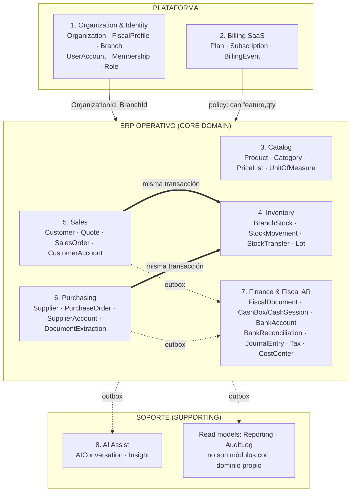
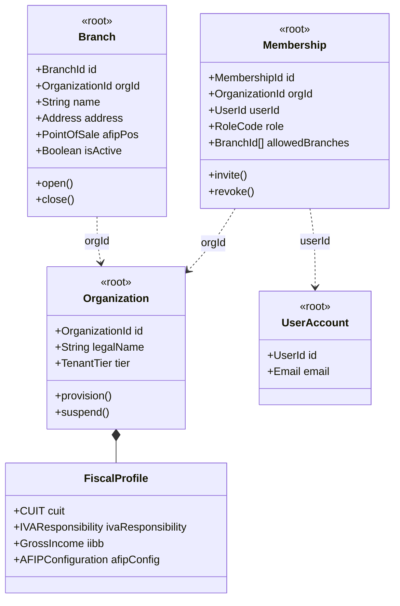
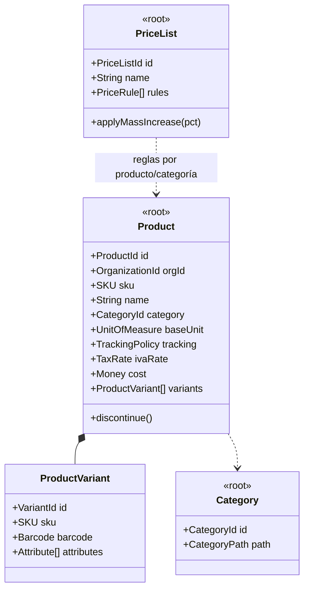
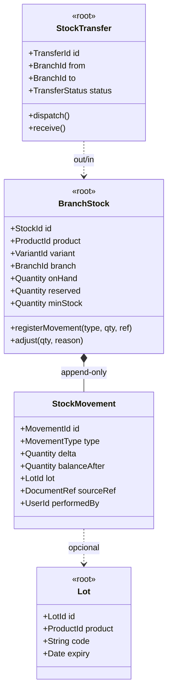
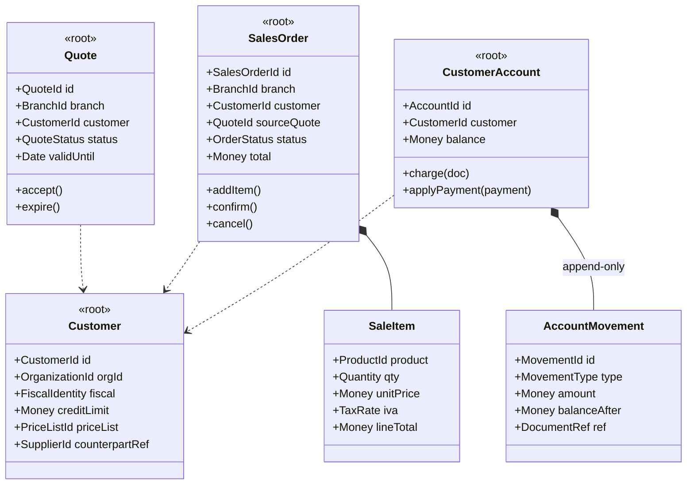
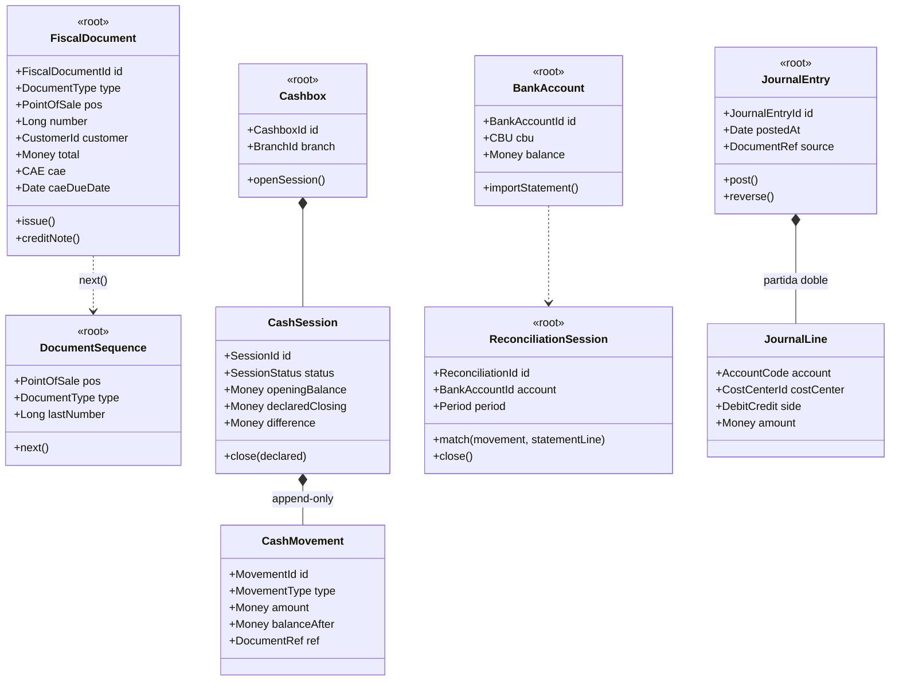

# Modelo de Dominio Aliadata — V2 (Auditoría + Rediseño)

> **Tipo de documento:** Auditoría arquitectónica crítica del modelo v1 + modelo de dominio optimizado para una **V1 comercial realista**.
> **Fuentes auditadas:** `modelo-dominio-aliadata.md` (modelo v1) y el esquema real implementado del proyecto **v0-saa-s-empresarial-completo** (Supabase, 55 tablas en producción).
> **Mercado objetivo:** PyMEs argentinas. Referentes: Odoo, ERPNext, SAP Business One.
> **Fecha:** Junio 2026.

---

## 0. Veredicto ejecutivo

El modelo v1 es un buen ejercicio de DDD, pero **está diseñado para la empresa que Aliadata quiere ser en 5 años, no para la que necesita ser en 18 meses**. Sus tres errores estratégicos:

1. **Declara AI Platform + Automation como Core Domain.** Para un ERP comercial que compite con Odoo/ERPNext, el core domain es el ERP operativo confiable. La IA es Supporting. El modelo v1 invierte la pirámide de inversión.
2. **Propone consistencia eventual donde se necesita consistencia transaccional.** "Vendí pero el stock no bajó" no es un problema de UX optimista (riesgo R9 del v1): es un bug inaceptable en un punto de venta. En un monolito modular, venta y descuento de stock van en **la misma transacción**.
3. **13 bounded contexts para un equipo que hoy mantiene un solo esquema Postgres.** Cada contexto tiene costo fijo (contratos, eventos versionados, ACLs). El código real demuestra que el equipo ya acumula deuda con un modelo mucho más simple; multiplicar fronteras multiplica la deuda.

Además, la auditoría del código real revela problemas que **ningún rediseño conceptual arregla si no se pagan primero**: triple clave de tenancy (`user_id`, `company_id`, `account_id` coexistiendo), **dos sistemas de inventario paralelos e inconsistentes**, y ventas con esquema plano legacy + esquema con ítems al mismo tiempo.

**Resultado:** el modelo V2 reduce 13 contextos a **8 módulos** dentro de un monolito modular, elimina el patrón Party, promueve `Branch` a concepto de primer nivel, agrega `Quote`, `CashSession`, `FiscalProfile`, `BankReconciliation`, y degrada la IA a Supporting Domain con un modelo mínimo.

---

## 1. Auditoría del código real (v0-saa-s-empresarial-completo)

Antes de discutir teoría, lo que dice el esquema en producción:

| Hallazgo | Evidencia | Severidad |
|---|---|---|
| **H1 — Triple clave de tenancy** | `sales` tiene `user_id`, `company_id` y `account_id`. `companies`/`company_users` están vacías (legacy muerto); `accounts`/`account_members` son el modelo activo. | 🔴 Crítica |
| **H2 — Doble ledger de inventario** | Sistema A (activo): `products.stock` + `stock_movements` (492 filas) + `branch_stock` (2.249 filas). Sistema B (semi-muerto): `inventory_stock` + `inventory_movements` (21 filas) + `warehouses` (0 filas) + `product_variants`. Dos fuentes de verdad para la misma pregunta: "¿cuánto stock tengo?". | 🔴 Crítica |
| **H3 — Venta plana + venta con ítems** | `sales` tiene `product_id`, `amount`, `quantity` (venta de un solo producto, legacy) **y** existe `sale_items` (20 filas). Misma dualidad en `purchases`/`purchase_items`. | 🔴 Crítica |
| **H4 — Dual-ledger por sucursal documentado como hack** | El comentario de `branch_stock` lo admite: *"when a sale or purchase has branch_id, this table is updated instead of products.stock"*. El stock total de un producto no tiene una fuente única. | 🔴 Crítica |
| **H5 — Cliente sin identidad fiscal** | `clients` no tiene `tax_id`; `suppliers` sí. Imposible emitir factura A sin CUIT del cliente. | 🟠 Alta |
| **H6 — Scope creep fuera del ERP** | `courses`, `posts`, `replies`, `meetings`, `seguros`, `purchase_pools`, `landing_sections`, `fair_*` conviven en el mismo esquema que el ERP. | 🟠 Alta |
| **H7 — Insights duplicados** | `insights` (427 filas) y `ai_insights` (726 filas) coexisten. | 🟡 Media |
| **H8 — Cosas bien hechas** | `operation_idempotency` (ledger de idempotencia atómico), `plan_limits` (gating simple por plan), `billing_events` con MercadoPago, RLS habilitado en todo, `stock_movements` con `quantity_before/after` y numeración. | ✅ Conservar |

**Lectura de arquitecto:** el equipo construye rápido y migra a medias. El riesgo número uno de Aliadata no es elegir mal entre Party y Customer/Supplier; es **acumular tres generaciones de modelo en el mismo esquema sin retirar las anteriores**. El modelo V2 incluye un plan de retirada (§7).

---

## 2. Respuestas a las siete preguntas de la auditoría

### 2.1 Qué decisiones del v1 son correctas (conservar)

- Separar `Billing::Invoice` (SaaS) de la factura fiscal del tenant. Es la decisión más importante del v1 y se mantiene intacta.
- Referencias entre agregados **por ID**, nunca por objeto. Regla de oro confirmada.
- Movimientos append-only como fuente de verdad del stock y de la caja (patrón ledger). El código real ya lo hace con `stock_movements`.
- `Membership` separando identidad global de pertenencia al tenant. Correcto y ya implementado (`account_members`).
- Transactional Outbox en lugar de broker. Correcto (la tabla `events` ya existe, vacía — hay que usarla, ver §5.9).
- `WorkflowExecution` separado de `Workflow` (si Automation sobrevive al recorte; en V1 comercial se pospone).
- Agregados pequeños, una transacción por agregado **entre contextos** (con la excepción crítica de §5.9: venta+stock).

### 2.2 Qué agregados deben simplificarse

| Agregado v1 | Problema | Decisión V2 |
|---|---|---|
| `Party` + roles | Sobrediseño para PyME (ver §3) | Eliminar → `Customer` y `Supplier` |
| `AIAgent`, `AICreditWallet`, `KnowledgeBase`, `Embedding` | Plataforma de agentes con economía de créditos para un producto que aún no la vende | Eliminar de V1 → queda `AIConversation` + `Insight` con límites por plan |
| `Workflow`/`WorkflowExecution` | Motor de automatización genérico sin casos de uso pagos | Posponer; reemplazar por jobs internos hard-codeados (alertas de stock, resumen mensual) |
| `Integration`/`Webhook` | Genérico prematuro | Reducir a adaptadores concretos: AFIP, MercadoPago |
| `PriceList` con vigencias | Las PyMEs argentinas remarcan por inflación, no manejan 12 listas | V1: `PriceList` simple (mayorista/minorista) sin vigencias por línea; remarcación masiva como comando |
| `ProductVariant` con atributos dinámicos | Sistema B muerto en el código real | Mantener variantes, pero como parte del agregado `Product`, un solo nivel |
| `Shipment`, `Receipt` como entidades | Logística que no existe aún | Campos de estado en la orden; promover a entidad cuando haya logística real |

### 2.3 Qué bounded contexts están sobrediseñados

De los 13 del v1: **AI Platform** (plataforma → módulo de soporte), **Automation** (eliminado de V1), **Integration** (contexto → adaptadores), **Partner** (disuelto: Customer va a Sales, Supplier a Purchasing; comparten Value Objects fiscales), **Reporting** y **Audit** (correctos como read models, pero no necesitan ser "contextos" con equipo propio: son proyecciones + una tabla append-only). El mapa V2 queda en 8 módulos (§4).

### 2.4 Qué entidades faltan

`Quote` (§3.3) · `CashSession` (§3.7) · `FiscalProfile` con CUIT/condición IVA/IIBB/config AFIP (§3.6) · `FiscalDocument` con numeración por punto de venta y CAE · `BankReconciliation` (§3.5) · `CostCenter` (simple, opcional) · `PaymentReceived`/`PaymentMade` como agregados explícitos (hoy el código no registra cobros, solo ventas) · `CustomerAccount`/`SupplierAccount` (cuenta corriente, que el código real no tiene y es la funcionalidad más pedida por PyMEs) · `Branch` como concepto de primer nivel (§3.2) · `UnitOfMeasure` ya existe en código y falta en el modelo v1.

### 2.5 Qué relaciones deben replantearse

- **Sales → Inventory por evento asíncrono (v1) → misma transacción (V2).** Ver §5.9. La invariante "no vender bajo cero" no puede ser eventual.
- **Party ← CustomerRole/SupplierRole (composición) → agregados independientes** con `FiscalIdentity` como VO compartido (Shared Kernel mínimo).
- **Warehouse → Branch.** El v1 tiene Warehouse referenciando Branch como atributo. En V2, `Branch` es el eje físico y `StorageLocation` (depósito) es opcional dentro de la sucursal. Una PyME con un local no debería ver el concepto "depósito".
- **Saldo de cuenta corriente:** el v1 lo deriva de `Receivable`/`Payable` vía read model — correcto en teoría, pero en V2 el agregado `CustomerAccount` mantiene el saldo materializado dentro de su propia transacción (ledger con `balance_after` por movimiento, como ya hace `stock_movements`). Más simple de operar y de auditar que CQRS.

### 2.6 Riesgos de mantenimiento

1. **Deuda de migración compuesta (H1–H4):** cada feature nueva debe decidir contra qué generación del esquema escribir. Es el riesgo dominante; congela velocidad.
2. **Eventos versionados sin consumidores:** infraestructura de Published Language para 13 contextos que un equipo chico no va a mantener. Menos contratos, más invariantes en el agregado.
3. **RLS + lógica de negocio duplicada:** con tres claves de tenancy, las políticas RLS son frágiles. Una sola clave (`account_id` → renombrar conceptualmente `organization_id`) en TODA tabla del tenant.
4. **El módulo comunidad/cursos comparte ciclo de deploy con el ERP.** Un bug en posts no debe poder tocar ventas. Mínimo: esquemas Postgres separados (`erp.*`, `community.*`).
5. **Soft-delete inconsistente:** `clients.deleted_at` y `products.deleted_at` existen; el resto no. Definir política única.

### 2.7 Problemas a escala (miles de organizaciones, millones de transacciones)

- **Tablas ledger crecen sin límite** (`stock_movements`, futuros `account_movements`, `cash_movements`): particionar por rango de fecha desde el diseño, índice `(account_id, created_at)`, archivado a cold storage según `history_days` del plan (¡ya existe en `plan_limits`! — usarlo).
- **Hot rows:** `products.stock` como columna mutable única genera contención bajo concurrencia de POS. El V2 lo resuelve: el stock vive por `(product, branch)` en `BranchStock`, que reparte el lock naturalmente; el total por producto es una vista/suma.
- **Numeración fiscal secuencial** (requisito AFIP: sin huecos por punto de venta) es un cuello de botella serializado por diseño: aislarlo en un agregado pequeño `DocumentSequence` con lock corto, jamás dentro de la transacción larga de la venta completa.
- **RLS a escala:** RLS por `account_id` funciona hasta decenas de miles de tenants si los índices empiezan por `account_id`. Reservar schema-per-tenant solo para enterprise (el `TenantTier` del v1 es buena idea — se conserva).
- **Reportes sobre millones de filas:** nunca sobre las tablas transaccionales. Proyecciones agregadas (`daily_sales_summary` por account/branch) alimentadas por el outbox.
- **Noisy neighbor de IA:** resuelto con `max_ai_queries_per_month` de `plan_limits` + rate-limit por tenant. No hace falta wallet de créditos para esto.

---

## 3. Revisiones específicas solicitadas

### 3.1 Party vs Customer/Supplier — **recomendación: agregados separados**

El v1 adopta Party con roles citando a Odoo (`res.partner`). Desafío punto por punto:

| Criterio | Party + roles | Customer / Supplier separados |
|---|---|---|
| Complejidad de modelo | Polimorfismo en cada query, formulario y permiso ("Party que juega de...") | Dos agregados planos y obvios |
| Mantenibilidad | Toda feature de ventas debe filtrar por rol; bugs de rol activo/inactivo | Cambios en clientes no tocan proveedores |
| Reportes | `JOIN party_roles` en todo reporte comercial | Directos |
| Permisos | "Vendedor ve Parties con CustomerRole" — RLS y políticas se complican | "Vendedor ve customers" — trivial |
| UX | El usuario PyME piensa "clientes" y "proveedores", no "partes" | Coincide con el modelo mental |
| Caso CUIT dual | Lo resuelve nativamente | Requiere mecanismo explícito |
| Código real hoy | No existe | **Ya implementado** (`clients`, `suppliers`) |
| Migración futura a Party | — | Posible: extraer `FiscalIdentity` a tabla común si el dolor aparece |

El único beneficio real de Party es el caso "me compra y me vende", que en PyMEs es minoritario (típicamente <10% de los terceros) y tiene una solución barata sin polimorfismo:

```
Customer (agregado, contexto Sales)        Supplier (agregado, contexto Purchasing)
 ├─ FiscalIdentity <<VO compartido>>        ├─ FiscalIdentity <<VO compartido>>
 │   (CUIT/DNI, razón social, cond. IVA)    │
 └─ counterpartRef: SupplierId? ──────────── └─ counterpartRef: CustomerId?
```

- `FiscalIdentity` es un **Value Object del Shared Kernel** (junto a `Money`, `OrganizationId`, `BranchId`): misma validación de CUIT en ambos lados, cero duplicación de lógica fiscal.
- Un chequeo de unicidad por CUIT al crear sugiere vincular (`counterpartRef`). La compensación de saldos cliente/proveedor (raro y delicado contablemente) se modela como operación explícita de Finance, no como consecuencia implícita de compartir entidad.
- ERPNext —referente directo en tamaño de cliente— usa exactamente Customer/Supplier separados y nadie lo considera un defecto.

**Veredicto:** para la V2 comercial, **Customer/Supplier separados**. Party es elegancia que cobra intereses todos los días y paga dividendos una vez al año.

### 3.2 Branch como Aggregate Root de primer nivel — **sí, y es la corrección más urgente**

El código real ya demostró que Branch no puede ser un atributo: el hack del dual-ledger (H4) existe porque el modelo no le dio a la sucursal el lugar que la operación exige. Decisión V2:

- **`Branch` es Aggregate Root** en el contexto Organization (la sucursal tiene ciclo de vida: abrir, cerrar, transferir).
- **Todo documento operativo lleva `BranchId` obligatorio** (venta, compra, gasto, movimiento de caja). La organización con un solo local tiene una `Branch` "Casa Central" creada en el onboarding — el concepto existe siempre, la UI lo oculta si hay una sola.
- **El stock vive por `(ProductId, BranchId)`** en el agregado `BranchStock` — única fuente de verdad. `products.stock` desaparece; el total es `Σ branch_stock`. Esto elimina el dual-ledger y de paso el hot-row a escala (§2.7).
- **Cada `Cashbox` pertenece a una `Branch`** (una sucursal puede tener varias cajas).
- **Transferencias entre sucursales** = dos movimientos atómicos (out/in) con `transfer_id` común — caso de uso nuevo que el modelo v1 ni menciona y toda PyME multi-sucursal necesita la semana uno.
- Reportes: todo cubo natural es `(account, branch, período)` — con `BranchId` en cada documento, gratis.
- `Warehouse`/`StorageLocation` queda como subdivisión **opcional** de Branch para la minoría que separa salón de depósito. No es un agregado en V1.

### 3.3 Ventas: Quote → SalesOrder → Invoice → Payment — **sí, con bypass para POS**

Falta `Quote` y falta todo lo posterior a la venta (el código real no registra cobranzas). Flujo V2:

```
Quote (presupuesto, vence, sin compromiso de stock)
  ↓ accept()
SalesOrder (compromete stock en la misma transacción)
  ↓ invoice()
FiscalDocument (factura/ticket AFIP, CAE, numeración por punto de venta)
  ↓
PaymentReceived (cobro: efectivo→CashSession, transferencia→BankAccount, cta cte→CustomerAccount)
```

**Ventajas:** el presupuesto es la herramienta de venta número uno en servicios y B2B; separa compromiso comercial de hecho fiscal; habilita cuenta corriente (factura emitida ≠ cobrada); cada etapa tiene su invariante propia.
**Desventajas y mitigación:** cuatro pasos matan al kiosco. Solución estándar (Odoo POS hace lo mismo): el comando `quickSale()` crea SalesOrder confirmada + documento + cobro **en una sola transacción y una sola pantalla**. El dominio mantiene las cuatro etapas; la UX las comprime. `Quote` es opcional, no estado obligatorio.

### 3.4 Inventario: SerialNumber, Lot, Reservation

| Concepto | Industrias que lo necesitan | Decisión V1 comercial |
|---|---|---|
| **Lot** (lote + vencimiento) | Alimentos, farmacia, cosmética, agro-insumos — enorme en PyME argentina | **Sí, como capability opcional** (`Product.trackingPolicy = none\|lot`). El movimiento referencia `lot_id` opcional. Diseñarlo ahora evita migrar el ledger después. |
| **SerialNumber** | Electrónica, maquinaria, garantías | **Posponer** (`trackingPolicy = serial` reservado). Pocas PyMEs del segmento inicial; alto costo (una entidad por unidad física). |
| **Reservation** | E-commerce multicanal, alta concurrencia sobre el mismo stock | **Posponer.** En el monolito V2, la venta descuenta stock en la misma transacción → no hay ventana entre "prometido" y "descontado" que justifique reservas. Se vuelve necesaria recién con canales asíncronos (tienda online). El campo `reserved` queda en el diseño de `BranchStock` para no romper el esquema al activarla. |

### 3.5 Finanzas: BankReconciliation, CostCenter, FiscalProfile

- **BankReconciliation — sí, V1.** Sin conciliación, el saldo bancario del sistema diverge del real en semanas y el usuario deja de confiar en el módulo (y luego en el producto). Modelo: `BankStatement` importado (CSV/API) + `ReconciliationSession` que matchea `BankMovement` ↔ `statement lines`. Es además terreno perfecto para IA de soporte (sugerir matches) — IA agregando valor sin ser dueña del dominio.
- **CostCenter — sí, pero mínimo.** Una dimensión analítica opcional (`cost_center_id`) en gastos y compras + catálogo plano. No jerarquías ni distribuciones porcentuales en V1. Costo casi nulo, lo piden contadores, y agregar la columna después es migración dolorosa sobre millones de filas.
- **FiscalProfile — sí, obligatorio** (ver 3.6). Sin él no hay facturación electrónica en Argentina, es decir, no hay producto.
- **JournalEntry:** se conserva con partida doble, pero **generado automáticamente** desde los documentos (venta → asiento) y de cara a contadores/export. No es UI principal de la PyME. `Receivable`/`Payable` del v1 se reemplazan por `CustomerAccount`/`SupplierAccount` (ledger de cuenta corriente con imputación de pagos) — mismo propósito, lenguaje del usuario argentino ("cuenta corriente"), mismo patrón ledger del resto del sistema.

### 3.6 Argentina: FiscalProfile

```
Organization (contexto Organization Mgmt)
 └─ FiscalProfile <<entidad dentro del agregado Organization>>
     ├─ CUIT <<VO con dígito verificador>>
     ├─ IVAResponsibility <<VO enum: RI, Monotributo, Exento, CF>>
     ├─ GrossIncome (IIBB: número, jurisdicción, convenio multilateral simple)
     ├─ AFIPConfiguration (certificado, ambiente homologación/producción)
     └─ PointOfSale[] (punto de venta AFIP, vinculado a Branch)
```

**Dónde vive:** dentro del agregado `Organization` (cambia junto: razón social + CUIT + condición IVA se modifican en un solo trámite). **Pero** la *lógica* que lo consume —qué letra de comprobante corresponde (A/B/C), cómo se discrimina IVA— vive en el módulo **Fiscal (AR)** como Domain Service `InvoiceTypeResolver(emisorProfile, receptorFiscalIdentity) → tipo`. La comunicación con AFIP (WSFE) es un **adaptador de infraestructura detrás de un ACL**: el dominio conoce `CAE`, `CAEDueDate`, `DocumentType`; jamás el SOAP de AFIP. Diseñar Fiscal (AR) como módulo enchufable deja la puerta abierta a otros países sin contaminar Sales.

### 3.7 Caja: CashSession — **sí, imprescindible en retail**

```
Cashbox (1 por caja física, pertenece a Branch)
 └─ CashSession <<entidad, ciclo: OPEN → CLOSED>>
     ├─ openedBy, openingBalance (apertura)
     ├─ CashMovement[] (ventas en efectivo, ingresos, egresos, retiros)
     └─ close(declaredBalance) → calcula expected, registra diferencia (arqueo)
```

Invariantes: una sola sesión abierta por Cashbox; todo movimiento de efectivo exige sesión abierta; la diferencia de cierre queda registrada (señal antifraude — los comercios lo piden explícitamente). Eventos: `CashSessionOpened`, `CashMovementRegistered`, `CashSessionClosed` (con diferencia). El cierre Z diario sale de acá gratis.

### 3.8 IA: de Core Domain a Supporting Domain — **sí, degradar**

El v1 declara: *"tu core domain no es el ERP —eso es paridad con Odoo— sino AI Platform + Automation"*. **Esta es la afirmación más peligrosa del documento v1.** Refutación:

1. **Test de supervivencia:** si la IA desaparece mañana, ¿hay producto? Con el ERP sólido, sí. Al revés, no. El que no puede faltar es el core.
2. **Test de cheque:** la PyME paga por facturar, controlar stock y cobrar. Los insights son la razón por la que *renueva*, no por la que *compra*.
3. **Test de riesgo:** un insight de IA equivocado molesta; un stock equivocado pierde al cliente. La inversión en calidad sigue al riesgo.
4. **El propio código real lo confirma:** lo que existe y se usa (`ai_insights`, `invoice_documents` con OCR de facturas) es IA *de soporte a procesos del ERP*, no una plataforma de agentes. El uso real ya votó.

**Modelo V2 de IA (Supporting):** `AIConversation` (+`AIMessage`), `Insight` (unificando `insights`/`ai_insights`), `DocumentExtraction` (el OCR de facturas de compra — esta feature es excelente y se conserva como parte de Purchasing con IA detrás). Gating por `plan_limits.max_ai_queries_per_month`. **Se eliminan de V1:** `AIAgent` configurable, `AICreditWallet`, `KnowledgeBase`/`Embedding`, tools con escritura en el ERP. Cuando haya tracción, la plataforma de agentes se construye *sobre* un ERP estable — el camino inverso no existe. Sí se conserva del v1 la regla de seguridad: si algún día la IA escribe en el ERP, pasa por los mismos comandos y permisos que un humano (nunca acceso directo a agregados).

### 3.9 Event-Driven: separar conceptos y elegir

| Concepto | Qué es | ¿V2 lo usa? |
|---|---|---|
| **Domain Events** | Hechos de negocio publicados al confirmar una transacción | ✅ Sí — in-process, vía Transactional Outbox |
| **Event Sourcing** | El estado ES la secuencia de eventos; se reconstruye reproduciéndolos | ❌ No. Los ledgers (stock, caja, cta cte) son *append-only con saldo materializado* — patrón contable, no event sourcing. No confundirlos: el ledger se consulta por SQL directo, no se "reproduce". |
| **Event-Driven Architecture** | Servicios que se comunican solo por eventos vía broker | ❌ No como arquitectura global. Solo el outbox interno. |
| **Microservicios** | Despliegue y datos independientes por servicio | ❌ No. Una base, un deploy, módulos con fronteras lógicas. |

**Estrategia V2: Monolito Modular + Outbox.**

1. **Síncrono y transaccional (mismo commit):** venta → descuento de stock → movimiento de caja → numeración fiscal. Son la invariante del negocio. Que módulos distintos compartan una transacción **no** rompe el monolito modular: se cruzan por interfaces de aplicación (commands), no por SQL ajeno.
2. **Asíncrono vía outbox (tabla `events`, que ya existe):** asientos contables, proyecciones de reporting, `AuditLog`, insights de IA, emails. Todo lo que puede esperar segundos. Consumers idempotentes con reintentos.
3. **Sin broker hasta que el outbox duela** (decenas de eventos/segundo sostenidos). Postgres LISTEN/NOTIFY o polling alcanza por años.
4. **Eventos versionados solo en los que cruzan al exterior** (webhooks futuros). Los internos se refactorizan con el código.

El v1 acierta en el outbox y se equivoca en el alcance: propone coreografía asíncrona entre Sales e Inventory (§7.3 del v1), que en un monolito es complejidad sin beneficio y con un costo real (stock fantasma).

---

## 4. Modelo V2: mapa de módulos (8, no 13)



**Shared Kernel (lo único compartido):** `OrganizationId`, `BranchId`, `Money(amount, currency)`, `Quantity`, `FiscalIdentity(CUIT/DNI, legalName, ivaCondition)`, `TaxRate`, `Address`. Flechas dobles = llamada síncrona transaccional vía command. Punteadas = eventos por outbox.

**Clasificación estratégica corregida:** Core = Sales + Inventory + Purchasing + Finance/Fiscal AR (la experiencia "ERP argentino que funciona" ES el diferenciador en este segmento; Odoo es genérico y caro de implementar, ERPNext no habla AFIP nativo). Supporting = AI Assist, Catalog. Generic = Billing, Identity (Supabase Auth), Reporting, Audit.

---

## 5. Modelo táctico V2 por módulo

### 5.1 Organization & Identity



Notas: `Branch` es root propio (no composición de Organization) para que abrir/cerrar sucursales y sus permisos (`allowedBranches` en Membership — un cajero ve solo su sucursal) no bloqueen el agregado Organization. `PointOfSale` AFIP vive en Branch: la numeración fiscal es por punto de venta. Roles V1: lista cerrada (`owner`, `admin`, `seller`, `cashier`, `accountant`) — RBAC dinámico es sobrediseño hoy (`plan_limits.internal_roles` ya apunta a esto).

### 5.2 Billing (SaaS) — simplificado

Se conserva del código real, formalizado: `Plan` (catálogo global = `plan_limits`), `Subscription` (estado en `accounts`: plan, trial, vencimiento) y `BillingEvent` (append-only, MercadoPago). **Sin** `UsageRecord`/overage en V1: los planes son de cupo duro (el límite bloquea, no factura extra), que es lo que el código ya hace. `Invoice`/`Payment` del SaaS los gestiona MercadoPago; el dominio guarda referencias (`mercadopago_payment_id`). Menos contabilidad propia = menos riesgo.

### 5.3 Catalog



`applyMassIncrease(pct)` es un comando de primera clase: la remarcación por inflación es EL caso de uso argentino de precios. `TrackingPolicy = none | lot | serial(reservado)`.

### 5.4 Inventory



Única fuente de verdad: `BranchStock` por `(product/variant, branch)`. Invariante `onHand ≥ 0` (configurable: permitir negativo con advertencia es pedido frecuente en retail — decisión por organización). `StockMovement` conserva el buen diseño real (`balanceAfter`, numeración). Stock total = suma, como vista. Eventos: `StockMovementRegistered`, `StockBelowMinimum`, `LotNearExpiry`, `TransferDispatched/Received`.

### 5.5 Sales



`confirm()` ejecuta en una transacción: validar límite de crédito (si es cta cte) → descontar `BranchStock` → emitir al outbox `SaleConfirmed`. El comando `quickSale()` (POS) encadena confirm + FiscalDocument + cobro. Purchasing es simétrico (`Supplier`, `PurchaseOrder` con `receive()` que suma stock, `SupplierAccount`, y `DocumentExtraction` = el OCR de facturas existente, conservado).

### 5.6 Finance & Fiscal (AR)



`JournalEntry` se genera por consumer del outbox a partir de los documentos (asincrónico está bien: la contabilidad tolera segundos; la caja y el stock no). `Tax` catálogo versionado (IVA 21/10.5/27, percepciones después).

### 5.7 AI Assist (Supporting)

`AIConversation` (+ `AIMessage` append-only), `Insight` (unificado: tipo, severidad, payload, leído/descartado), `DocumentExtraction` (vive en Purchasing, la IA es el motor). Consume eventos del outbox (`SaleConfirmed`, `StockBelowMinimum`…) para generar insights; jamás escribe en agregados del ERP. Límite por plan, sin wallet.

### 5.8 Domain Events V2 (catálogo recortado)

| Módulo | Eventos |
|---|---|
| Organization | `OrganizationProvisioned`, `BranchOpened`, `BranchClosed`, `MembershipGranted/Revoked` |
| Billing | `TrialStarted`, `PlanChanged`, `PaymentRegistered`, `SubscriptionExpired` |
| Catalog | `ProductCreated`, `ProductDiscontinued`, `PricesMassUpdated` |
| Inventory | `StockMovementRegistered`, `StockBelowMinimum`, `StockAdjusted`, `TransferDispatched`, `TransferReceived`, `LotNearExpiry` |
| Sales | `QuoteIssued`, `QuoteAccepted`, `SaleConfirmed`, `SaleCanceled`, `PaymentReceived`, `CustomerAccountCharged/Settled` |
| Purchasing | `PurchaseOrdered`, `PurchaseReceived`, `SupplierPaymentMade`, `InvoiceDocumentExtracted` |
| Finance/Fiscal | `FiscalDocumentIssued`, `CreditNoteIssued`, `CashSessionOpened/Closed`, `CashMovementRegistered`, `BankStatementImported`, `MovementReconciled`, `JournalEntryPosted` |

Consumidores: Reporting (proyecciones), AuditLog (todo), AI Assist (selectivo), Email/notificaciones. Ninguno emite eventos de negocio.

### 5.9 Regla de consistencia (la corrección central al v1)

| Operación | Modo | Por qué |
|---|---|---|
| Venta → stock | **Misma transacción** | Invariante de negocio: no vender lo que no hay |
| Venta → numeración fiscal | **Misma transacción** (lock corto en `DocumentSequence`) | AFIP exige secuencia sin huecos |
| Venta → caja / cta cte | **Misma transacción** | El cobro es parte del hecho |
| Venta → asiento contable | Outbox (asíncrono) | Tolera demora; simplifica la transacción caliente |
| Venta → reporting/audit/insights/email | Outbox | Read models puros |
| Compra → stock | Misma transacción (al recibir) | Simétrico a venta |

---

## 6. Multi-tenancy V2

Se conserva la estrategia del v1 (shared DB + RLS) con tres correcciones surgidas del código real: **(1)** una sola clave de tenancy — `organization_id` (hoy `account_id`) en TODA tabla del tenant; eliminar `user_id`-como-tenant y `company_id`; **(2)** todo índice de tabla transaccional empieza por `(organization_id, ...)`; **(3)** `Membership.allowedBranches` agrega el segundo nivel de aislamiento (sucursal) que el v1 no contempla y el negocio multi-sucursal exige. `TenantTier` en Organization se conserva para futura migración enterprise.

---

## 7. Plan de retirada de deuda (prerequisito del modelo V2)

| Paso | Acción | Resuelve |
|---|---|---|
| 1 | Backfill y `NOT NULL` de `account_id` en todas las tablas ERP; RLS solo por `account_id`; drop `companies`, `company_users`, `user_id`-tenancy, `company_id` | H1 |
| 2 | Migrar ventas/compras planas a `sale_items`/`purchase_items`; eliminar `product_id/amount/quantity` de las cabeceras | H3 |
| 3 | Unificar inventario: migrar `inventory_stock`/`inventory_movements` (21 filas) al ledger `branch_stock` + `stock_movements`; crear Branch "Casa Central" por tenant; drop `products.stock` (vista de compatibilidad mientras tanto); drop `warehouses` vacía | H2, H4 |
| 4 | Agregar `FiscalIdentity` a `clients` (CUIT/DNI, condición IVA) y `suppliers` | H5 |
| 5 | Mover `courses/posts/replies/meetings/seguros/purchase_pools/landing_sections/fair_*` a esquema `community` separado | H6 |
| 6 | Unificar `insights` + `ai_insights` | H7 |
| 7 | Activar el outbox sobre la tabla `events` (ya existe) con relay e idempotencia (reusar el patrón de `operation_idempotency`) | §5.9 |
| 8+ | Construir lo nuevo: FiscalProfile + FiscalDocument + AFIP, CashSession, CustomerAccount/SupplierAccount, Quote, BankReconciliation | §3 |

**Regla:** ninguna feature nueva sobre tablas en retirada. El orden importa: 1–3 son prerequisito de todo lo demás.

---

## 8. Riesgos del modelo V2 (honestidad inversa)

| Riesgo de mis propias recomendaciones | Mitigación |
|---|---|
| Customer/Supplier separados → si el segmento real resulta B2B con alto solapamiento, duele | `FiscalIdentity` compartido + `counterpartRef` dejan la extracción a Party factible; medir el solapamiento real con datos |
| Transacciones síncronas venta+stock+caja → transacción más grande, hot path más largo | Mantenerla corta (sin HTTP, sin IA, sin AFIP dentro — el CAE puede obtenerse en estado `pending_cae` async con reintento, AFIP lo permite) |
| Posponer Reservation → tienda online futura la exigirá | Campo `reserved` ya presente en `BranchStock`; activarla es feature, no migración |
| Recortar AI Platform → si la visión de agentes era el pitch de inversión, esto lo achica | El recorte es de *secuencia*, no de visión: agentes sobre ERP estable en V3 |
| Monolito modular → disciplina de fronteras sin enforcement físico | Lint de imports entre módulos + revisión de que ningún módulo lee tablas de otro |

---

## 9. Síntesis

| Pregunta | Respuesta corta |
|---|---|
| ¿Party o Customer/Supplier? | **Separados**, con `FiscalIdentity` VO compartido (§3.1) |
| ¿Branch como root? | **Sí** — y stock por `(product, branch)` como única verdad (§3.2) |
| ¿Quote? | **Sí**, opcional, con `quickSale()` para POS (§3.3) |
| ¿Serial/Lot/Reservation? | Lot sí (capability), Serial y Reservation pospuestos con diseño previsto (§3.4) |
| ¿BankReconciliation/CostCenter/FiscalProfile? | Sí / sí mínimo / sí obligatorio (§3.5) |
| ¿FiscalProfile dónde? | Dentro de `Organization`; lógica en módulo Fiscal AR; AFIP detrás de ACL (§3.6) |
| ¿CashSession? | **Sí** — apertura/movimientos/cierre con arqueo (§3.7) |
| ¿IA core o supporting? | **Supporting** — el ERP debe funcionar sin ella (§3.8) |
| ¿Event-driven? | Monolito modular + domain events internos + outbox; sin event sourcing, sin microservicios (§3.9, §5.9) |
| ¿Cuántos contextos? | 8 módulos, no 13 (§4) |
| ¿Primer paso? | Pagar la deuda H1–H4 antes de construir nada nuevo (§7) |

---

## 10. Revisión de observaciones del product owner (decisiones registradas)

Cuatro observaciones recibidas tras la entrega del V2, analizadas con criterio de protección de la arquitectura. Veredictos:

### 10.1 AIAgent como Aggregate Root mínimo "para reservar espacio" — **RECHAZADO (mantener diseño)**

Un Aggregate Root se justifica por sus invariantes; un `AIAgent` sin responsabilidades no tiene ninguna. Crearlo hoy significa tabla + CRUD + RLS + permisos + tests + pantallas para una entidad que no hace nada, y el espacio conceptual reservado prematuramente suele reservarse mal: en V3 se migraría igual, pero con datos en producción. El espacio se reserva donde es gratis: en el lenguaje ubicuo y el roadmap (ya está en V3).

**Concesión de bajo costo adoptada:** `AIConversation` lleva un discriminador `conversation_kind (general | reposicion | contable | ...)`. Permite rutear conversaciones a comportamientos especializados sin crear un agregado. El AR `AIAgent` nace en V3, cuando tenga estado e invariantes reales (presupuesto, tools habilitadas, prompt versionado).

### 10.2 Reconsiderar Party por el caso "cliente que también es proveedor" — **RECHAZADO (mantener diseño)**

El V2 no eligió "separados a secas": eligió separados **con `FiscalIdentity` como VO compartido y `counterpartRef`**, que ya cubre el caso dual sin polimorfismo. Los datos reales (1.101 clientes, proveedores de un dígito) muestran solapamiento ~0%; Party castigaría el 100% de queries, formularios, permisos y reportes para optimizar un caso inexistente. La asimetría de migración favorece el diseño actual: extraer un futuro `parties` común es barato porque el VO ya unifica la estructura; la migración inversa (Party → separados) es mucho más cara.

**Trigger de revisión:** si el solapamiento medido supera ~20% de los terceros activos, evaluar extracción de `FiscalIdentity` a tabla común.

### 10.3 IA supporting con AIConversation + BusinessInsight + AIAgent — **PARCIAL (2 de 3)**

`AIConversation` ✅ e `Insight` ✅ ya están en el V2 (§5.7). `AIAgent` ❌ por §10.1. Se ratifica además `DocumentExtraction` (OCR de facturas en Purchasing) como la pieza de IA con mejor relación valor/costo — IA acelerando un proceso core sin ser dueña de nada. Dominio de soporte V2 cerrado: `AIConversation` + `Insight` + `DocumentExtraction`.

### 10.4 Roadmap propuesto (AFIP en V2.5) — **PARCIAL, con una corrección innegociable**

**AFIP no puede ser V2.5.** En Argentina la facturación electrónica es la condición de existencia del producto: sin comprobante válido, la PyME no adopta — usaría Aliadata *además de* su facturador, no *en lugar de*. `FiscalProfile` + `FiscalDocument` + `DocumentSequence` + adaptador WSFE van en V2. Mitigación de costo: CAE asincrónico (estado `pending_cae` con reintento) para que el hot path de la venta no dependa del uptime de AFIP.

**Sí se adopta** bajar BankReconciliation y JournalEntry completo a V2.5: caja y cuenta corriente son el dolor diario de la PyME; la conciliación y la contabilidad formal son el dolor del contador, que llega después. Y se agrega el paso cero que el roadmap propuesto omitía: la retirada de deuda (§7) es prerequisito de toda construcción.

**Roadmap definitivo:**

| Fase | Contenido |
|---|---|
| **V2.0 — deuda** | Tenancy única, ledger único de stock, sale_items, FiscalIdentity en clientes, outbox activo (§7 pasos 1–7) |
| **V2.1 — operación** | Branch + BranchStock, FiscalProfile, **AFIP/FiscalDocument**, CashSession, Quote, CuentasCorrientes. CostCenter solo como columna nullable |
| **V2.5 — finanzas** | BankReconciliation, JournalEntry completo (generación automática vía outbox), CostCenter con UI, percepciones/retenciones |
| **V3 — inteligencia** | AIAgent (con casos de uso conocidos), KnowledgeBase, automatizaciones, predicción |

---

*Aliadata V2 — auditoría y modelo de dominio. La ventaja competitiva en este segmento no es la elegancia del modelo: es un ERP argentino que factura, no pierde stock y cierra la caja todos los días.*
