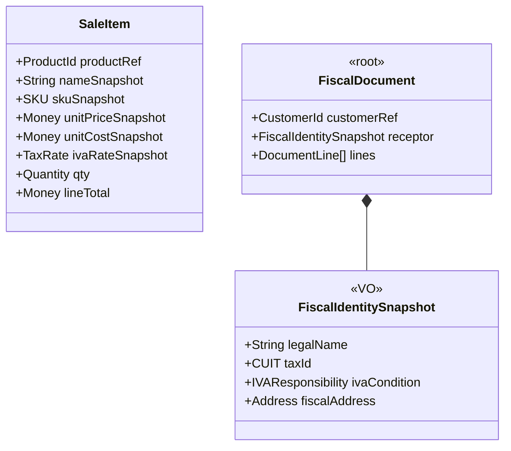
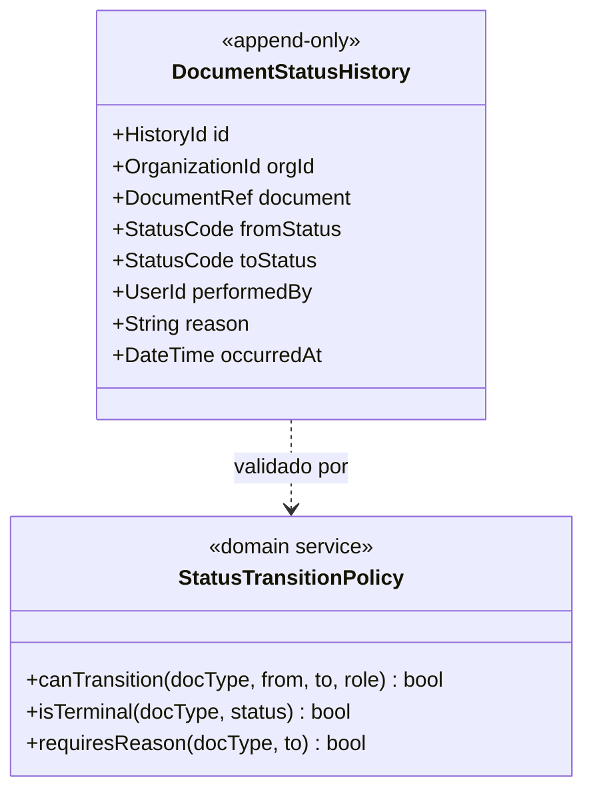
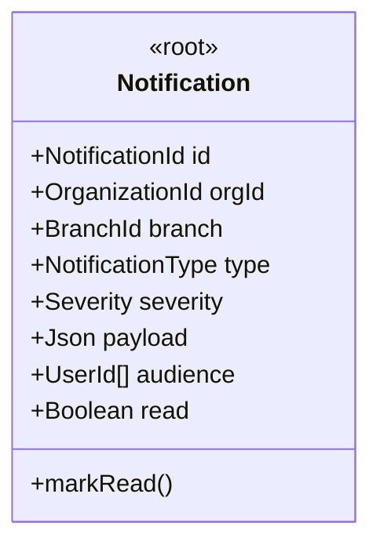
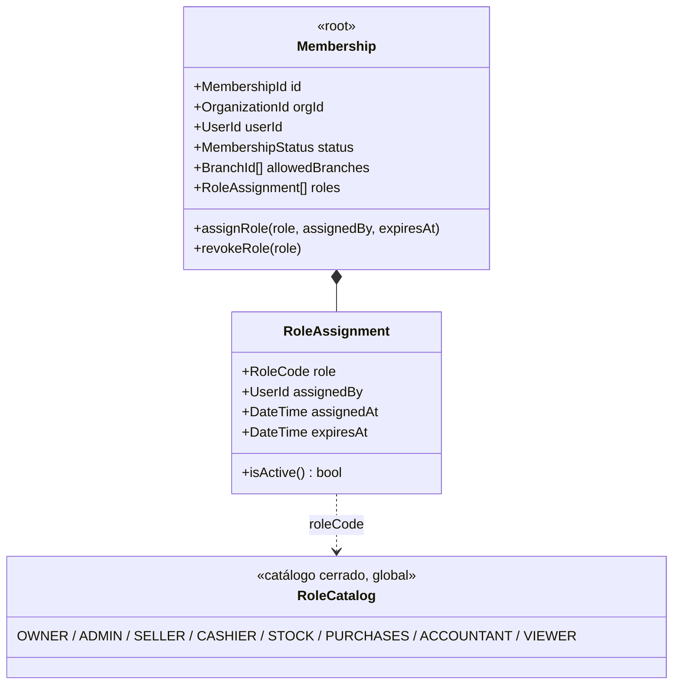
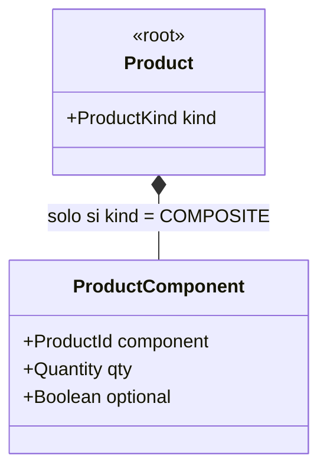

# Modelo de Dominio Aliadata — V3

> **Tipo de documento:** Extensión del modelo V2 con patrones extraídos de `TPI_PROG4_FOOD_STORE_v6` (spec Food Store, UML v7).
> **Regla de lectura:** este documento NO reemplaza al V2 — lo extiende. Todo lo no mencionado aquí sigue vigente tal como está en `modelo-dominio-aliadata-v2.md` (incluida la sección §10 de decisiones registradas).
> **Criterio aplicado:** Food Store es un sistema single-tenant de dominio acotado (pedidos de comida). Cada patrón se evaluó antes de adoptarlo: lo que en un TPI es buena práctica puede ser un error en un ERP multi-tenant. Hay adopciones, adaptaciones y rechazos explícitos.

---

## 0. Resumen de decisiones

| # | Patrón en Food Store | Decisión para Aliadata | Sección |
|---|---|---|---|
| 1 | Snapshot Pattern (`nombre_snapshot`, `precio_snapshot`, `subtotal_snap`) | ✅ **Adoptar y ampliar** (incluye snapshot fiscal del cliente) | §1 |
| 2 | FSM con catálogo de estados + `es_terminal` + transiciones válidas | ✅ **Adoptar** como patrón transversal de documentos | §2 |
| 3 | Historial de estados append-only (`estado_desde NULL` inicial, motivo obligatorio en cancelación) | ✅ **Adoptar** — `DocumentStatusHistory` genérico | §2 |
| 4 | Aviso en tiempo real post-commit (WebSocket) | ✅ **Adaptar** — notificaciones como consumer del outbox + Supabase Realtime (no WSManager propio) | §3 |
| 5 | Soft delete uniforme (`deleted_at` + filtro global + repo base) | ✅ **Adoptar** con política explícita de qué NO se soft-deletea | §4 |
| 6 | RBAC: catálogo de roles + pivot con `asignado_por` y `expires_at` | ✅ **Adaptar** al nivel Membership (por tenant, no por usuario global) | §5 |
| 7 | UoW + capas Router→Service→UoW→Repository, commit único, efectos post-commit | ✅ **Adoptar** como arquitectura de implementación del monolito modular | §6 |
| 8 | Idempotency key en pagos (UUID hacia MercadoPago) | ✅ **Adoptar** — generaliza el `operation_idempotency` ya existente | §6.3 |
| 9 | `UnidadMedida` tipada (peso/volumen/contable) + cantidad decimal | ✅ **Adoptar** — formaliza la tabla `units_of_measure` ya existente | §7.1 |
| 10 | Ingredientes / composición de producto (`ProductoIngrediente` con cantidad y unidad) | ⚠️ **Adaptar como capability opcional** (lista de materiales ligera / combos) | §7.2 |
| 11 | Direcciones múltiples con `es_principal` | ✅ **Adoptar** en Customer | §7.3 |
| 12 | Imágenes vía CDN (Cloudinary, `imagenes_url[]`) | ✅ **Adoptar** vía Supabase Storage (no introducir un proveedor nuevo) | §7.4 |
| 13 | Reglas de reporting EST-01…05 (excluir cancelados, usar snapshots, nunca float) | ✅ **Adoptar** como invariantes de Reporting | §8 |
| 14 | Convenciones API (RFC 7807, paginación estándar), rate limiting, seed data | ✅ **Adoptar** como estándares de plataforma | §9 |
| 15 | Stock como columna en `Producto` con CHECK ≥ 0 | ❌ **Rechazar** — contradice `BranchStock` del V2 (única fuente de verdad por sucursal) | §10 |
| 16 | Roles asignados al Usuario global | ❌ **Rechazar** — en multi-tenant el rol vive en `Membership`, jamás en `UserAccount` | §10 |
| 17 | JWT por query param en WebSocket | ❌ **Rechazar** — riesgo de fuga en logs; Supabase Realtime ya resuelve auth | §10 |
| 18 | WSManager singleton propio | ❌ **Rechazar** — infraestructura que Supabase Realtime provee | §10 |

---

## 1. Snapshot Pattern — inmutabilidad histórica de documentos

**Origen (Food Store):** `DetallePedido` congela `nombre_snapshot`, `precio_snapshot`, `subtotal_snap` al crear el pedido (RN-04). Los reportes usan el snapshot, nunca el producto actual (EST-02).

**Por qué Aliadata lo necesita más que Food Store:** en una economía con inflación, el precio de un producto cambia semanalmente (comando `applyMassIncrease` del V2). Si `SaleItem` solo referencia `ProductId`, un reporte de margen de marzo calculado en julio miente. Y hay un caso que Food Store no tiene: **la condición fiscal del cliente también cambia** (un monotributista pasa a RI) — la factura emitida debe conservar la condición vigente al momento de emisión, o el tipo de comprobante (A/B) deja de poder justificarse ante una inspección.

**Regla V3 — todo documento confirmado es una fotografía completa e inmutable:**



Alcance del snapshot por documento:

| Documento | Qué congela al confirmarse |
|---|---|
| `SalesOrder` / `PurchaseOrder` | Por línea: nombre, SKU, precio unitario, **costo unitario** (imprescindible para margen histórico), alícuota IVA |
| `FiscalDocument` | Todo lo anterior + `FiscalIdentitySnapshot` del receptor + datos del emisor (punto de venta, condición IVA propia) |
| `Quote` | Igual que SalesOrder — un presupuesto aceptado 20 días después debe honrar el precio cotizado, no el remarcado |
| `StockMovement` | Ya lo hace en V2 (`balanceAfter`); se agrega `unitCostSnapshot` para valuación de inventario |

Invariante: **después de `confirm()`, las líneas no se editan** — se corrige con documento nuevo (nota de crédito, ajuste), nunca con UPDATE. Esto ya era implícito en V2; V3 lo hace regla de negocio explícita (equivalente a RN-04 de Food Store).

---

## 2. FSM + Historial de estados append-only (patrón transversal)

**Origen:** Food Store define la FSM del pedido como datos (`EstadoPedido` con `es_terminal`, mapa de transiciones) + `HistorialEstadoPedido` append-only con tres reglas finas: primera transición con `estado_desde = NULL` (RN-02), prohibición total de UPDATE/DELETE (RN-03), motivo obligatorio al cancelar (RN-05).

**Qué le falta al V2:** define estados (`OrderStatus`, `QuoteStatus`, `SessionStatus`…) pero no especifica **transiciones válidas ni historial de estados**. El `AuditLog` genérico registra "algo cambió"; no responde eficientemente "¿quién confirmó esta venta y cuándo pasó a facturada?" — que es la pregunta de auditoría más frecuente en un ERP.

**Adopción V3 — un patrón, todos los documentos:**



Reglas (numeradas para trazabilidad, estilo Food Store):

- **RN-A1:** toda transición de estado de un documento (Quote, SalesOrder, PurchaseOrder, FiscalDocument, CashSession, StockTransfer) inserta un registro en `DocumentStatusHistory` **en la misma transacción**.
- **RN-A2:** la creación del documento registra la primera entrada con `fromStatus = NULL`.
- **RN-A3:** `DocumentStatusHistory` es append-only: ninguna capa emite UPDATE ni DELETE (enforzable con RLS/grants en Postgres, no solo por convención).
- **RN-A4:** un estado terminal no admite transiciones salientes; la validación vive en `StatusTransitionPolicy` (datos, no `if`s dispersos), con las transiciones permitidas **por rol** — ej.: `cashier` no puede anular una factura.
- **RN-A5:** `reason` obligatorio en transiciones destructivas: cancelación, anulación, ajuste de stock, diferencia de arqueo.

Máquinas de estado V3 (las que el V2 dejaba implícitas):

```
Quote:         DRAFT → SENT → ACCEPTED | EXPIRED | REJECTED        (terminales: ACCEPTED, EXPIRED, REJECTED)
SalesOrder:    DRAFT → CONFIRMED → INVOICED → PAID                 (+ → CANCELED desde DRAFT/CONFIRMED, con motivo)
FiscalDocument: PENDING_CAE → ISSUED → (CREDITED por NC)           (terminal: CREDITED; ISSUED nunca se borra)
StockTransfer: DRAFT → DISPATCHED → RECEIVED                       (+ → CANCELED solo desde DRAFT)
CashSession:   OPEN → CLOSED                                       (CLOSED terminal; diferencia registrada con motivo)
```

**Relación con AuditLog:** no compiten. `DocumentStatusHistory` es dominio (consultable en la pantalla del documento, con invariantes); `AuditLog` sigue siendo el registro técnico universal alimentado por el outbox. El historial de estados es la vista que el usuario ve como "línea de tiempo del documento" — exactamente el timeline de Food Store, generalizado.

---

## 3. Aviso en tiempo real (snapshot + historial + **aviso**)

**Origen:** Food Store emite broadcast WebSocket **después del commit** (RN-06), con reconexión exponencial y resincronización por GET al reconectar.

**Adaptación (no adopción literal):** el principio correcto es *"efectos observables solo post-commit"* — y el V2 ya tiene el mecanismo para eso: el **Transactional Outbox**. Construir un WSManager singleton propio (correcto en un TPI) sería duplicar infraestructura que Supabase Realtime ya provee, con auth y RLS incluidos.

```
Transacción (venta + stock + caja + historial)
  → COMMIT
    → outbox relay
       ├─ proyecciones de reporting
       ├─ AuditLog
       ├─ AI Insights
       └─ Notification (nuevo consumer V3)
            ├─ canal realtime por organización/branch (badge en UI, sin polling)
            └─ Notification persistida (campana de notificaciones)
```



Casos de uso iniciales (todos derivados de eventos que el V2 ya emite): `StockBelowMinimum` → aviso al rol con permiso de compras; `CashSessionClosed` con diferencia ≠ 0 → aviso al admin; `FiscalDocumentIssued` fallido (CAE rechazado) → aviso urgente; `QuoteAccepted` → aviso al vendedor; `TransferDispatched` → aviso a la sucursal destino.

Reglas: la notificación **nunca** se crea dentro de la transacción de negocio (es consumer del outbox — equivalente exacto de la RN-06 de Food Store); la UI se resincroniza por query al reconectar (patrón de resiliencia de Food Store §9.6, que se adopta tal cual); `Notification` es un read model con estado propio (`read`), no un domain event.

---

## 4. Soft Delete uniforme

**Origen:** Food Store aplica `deleted_at TIMESTAMPTZ` en todas las entidades de negocio, filtro global `WHERE deleted_at IS NULL`, y `soft_delete()` en el repositorio base.

**Estado en Aliadata:** el V2 detectó la inconsistencia (H-riesgo §2.6.5: `clients` y `products` tienen `deleted_at`, el resto no) y pidió "política única" sin definirla. V3 la define:

| Categoría | Política | Entidades |
|---|---|---|
| **Maestros** | ✅ Soft delete (`deleted_at` + `deleted_by`) | Customer, Supplier, Product, Category, PriceList, CostCenter, Branch*, Cashbox, BankAccount |
| **Documentos confirmados** | ❌ **Jamás se borran** (ni soft): se **anulan** vía transición de estado (`CANCELED`, nota de crédito) con motivo (RN-A5) | SalesOrder, FiscalDocument, PurchaseOrder, CashSession, JournalEntry |
| **Ledgers append-only** | ❌ Ni delete ni update: se **contra-asientan** (movimiento inverso referenciando al original) | StockMovement, CashMovement, AccountMovement, DocumentStatusHistory |
| **Borradores** | ✅ Hard delete permitido (un draft sin confirmar no tiene valor probatorio) | Quote/SalesOrder en DRAFT, carritos |
| **Plataforma** | Según regulación: Membership se revoca (estado), UserAccount se anonimiza (derecho de supresión) — nunca delete físico con documentos asociados | UserAccount, Membership |

*`Branch` con historial: se desactiva (`is_active = false`), no se borra — tiene movimientos referenciándola.

Reglas de implementación (de Food Store, generalizadas): **RN-B1** — todo GET/list filtra `deleted_at IS NULL` en el repositorio base, no en cada query; **RN-B2** — el soft delete registra `deleted_by` (Food Store no lo tiene; un ERP lo necesita para auditoría); **RN-B3** — unicidad conviviendo con soft delete: índices únicos parciales (`UNIQUE (org_id, sku) WHERE deleted_at IS NULL`) para poder recrear un SKU borrado; **RN-B4** — el borrado de un maestro exige verificación de no-referencia activa (no se soft-deletea un producto con stock ≠ 0 o incluido en documentos DRAFT).

---

## 5. RBAC enriquecido

**Origen:** Food Store: catálogo `Rol` semántico + pivot `UsuarioRol` con PK compuesta, `asignado_por_id` y `expires_at` (rol temporal), enforcement con `require_role([...])` por endpoint, y roles operativos de grano funcional (STOCK y PEDIDOS, no solo admin/cliente).

**Qué toma V3 y qué corrige:**



Cambios respecto del V2 (que tenía `Membership.role` singular):

- **Múltiples roles por Membership** (pivot de Food Store): el encargado de una PyME es SELLER + CASHIER + STOCK a la vez. Un solo rol obliga a inflar permisos.
- **`assignedBy` + `assignedAt`:** quién otorgó el rol es dato de auditoría de primera clase (Food Store lo trae; imprescindible en un ERP).
- **`expiresAt` (rol temporal):** directamente aplicable al retail — cajero suplente por vacaciones, contador externo con acceso por la temporada de balance. Costo de modelado casi nulo, valor alto.
- **Roles nuevos tomados del grano funcional de Food Store:** `STOCK` (deposito: ve productos y ajusta stock, sin precios de costo ni finanzas) y `PURCHASES` se agregan al catálogo del V2 (`owner/admin/seller/cashier/accountant`) + `VIEWER` (solo lectura, para el dueño que mira desde el celular).
- **Se ratifica (contra Food Store):** catálogo de roles **cerrado y global** — sin RBAC dinámico por tenant en V3 (decisión §5.1 del V2 sigue firme). Y el rol vive en `Membership`, no en el usuario (§10.16).
- **Matriz rol × transición de estado:** el enforcement de Food Store es por endpoint; en Aliadata además es por transición FSM (RN-A4): `CASHIER` cobra pero no anula; `STOCK` ajusta con motivo pero no confirma compras.

---

## 6. Arquitectura de implementación: UoW, capas y post-commit

**Origen:** la regla de oro de Food Store — `Router → Service → UoW → Repository → Model`, imports unidireccionales, **ningún service hace commit**, efectos externos (WS) fuera del bloque transaccional.

### 6.1 Adopción como estándar del monolito modular

Esta es la pieza que le faltaba al V2: definía *qué* es transaccional (§5.9) pero no *cómo* se estructura el código para garantizarlo. V3 adopta el layering de Food Store por módulo:

```
app/modules/<modulo>/router.py    → HTTP puro, valida schema, delega
app/modules/<modulo>/service.py   → lógica de negocio, stateless, orquesta repos vía UoW
app/core/uow.py                   → transacción única, commit/rollback, acceso a repos
app/modules/<modulo>/repository.py→ queries sin lógica de negocio (BaseRepository[T])
app/modules/<modulo>/model.py     → modelo, sin imports de capas superiores
```

- **RN-C1:** el commit ocurre solo en el UoW. La regla del V2 "venta + stock + caja en la misma transacción" se implementa con **un solo UoW compartido por los services de Sales, Inventory y Finance** en el comando `quickSale()` — los módulos se cruzan por services, nunca por repositories ajenos (el lint de fronteras del V2 §8 aplica a nivel repository/model).
- **RN-C2:** todo efecto externo (outbox relay, notificación, llamada a AFIP/MercadoPago) ocurre **después del commit**. La escritura del evento en la tabla outbox sí va dentro de la transacción (eso ES el patrón outbox); su publicación es post-commit.
- **RN-C3:** `BaseRepository[T]` genérico con `soft_delete()` (RN-B1/B2) y paginación estándar incluidas.

### 6.2 Convenciones API (adoptadas tal cual)

Errores RFC 7807 (`detail`, `code`, `field`), paginación `?page&size → {items, total, page, pages}`, prefijo versionado `/api/v1`, OpenAPI en `/docs`. Sin cambios: son estándares correctos.

### 6.3 Idempotencia generalizada

Food Store usa `idempotency_key` UUID hacia MercadoPago; Aliadata ya tiene `operation_idempotency` para RPCs. V3 unifica: **toda operación de escritura no-idempotente por naturaleza** (crear venta, cobrar, emitir comprobante, cerrar caja) exige `Idempotency-Key` del cliente, registrada en la misma transacción (el diseño existente ya es correcto: commit/rollback atómico, sin estados intermedios). Se extiende a: reintentos del webhook de MercadoPago (dedupe por `mp_payment_id`), reintentos de obtención de CAE (dedupe por `FiscalDocumentId`), y consumers del outbox (dedupe por `event_id`).

---

## 7. Adopciones menores al catálogo y maestros

### 7.1 UnidadMedida tipada

Food Store tipifica la unidad (`peso | volumen | contable`) y permite cantidad `DECIMAL(10,3)`. Aliadata ya tiene `units_of_measure` (10 filas) sin formalizar en el modelo. V3: `UnitOfMeasure` como catálogo global (nombre, símbolo, tipo) + `Quantity` VO que porta su unidad. Conversión entre unidades del mismo tipo (compra por kg, vende por unidad) queda como capability V3.5 — pero el `tipo` se persiste desde ahora para habilitarla sin migración.

### 7.2 Composición de producto (de "ingredientes" a BOM ligera)

`ProductoIngrediente` (cantidad + unidad + removible) es, generalizado, una **lista de materiales de un nivel**: combos, canastas, productos elaborados (panadería, rotisería — segmento real de Aliadata). Adopción como **capability opcional**:



Regla de stock: al vender un `COMPOSITE`, el movimiento de stock se registra **sobre los componentes** (explosión simple de un nivel, dentro de la misma transacción de la venta). Sin recursión multi-nivel ni órdenes de producción — eso es manufactura, fuera de alcance. `es_alergeno` no se adopta (específico de gastronomía; cabe en `ProductComponent.attributes` si un vertical lo pide).

### 7.3 Direcciones múltiples del cliente

`DireccionEntrega` con `alias` y `es_principal` (única por usuario) → `Customer.addresses: Address[]` con `isPrimary` (invariante: exactamente una primaria). La dirección **fiscal** sigue viviendo en `FiscalIdentity` (inmutable por snapshot en documentos); las de entrega son operativas y editables.

### 7.4 Imágenes de producto

`imagesUrl[]` en Product + imagen en Category, con upload firmado desde backend, validación de MIME/tamaño, y eliminación por id de asset al borrar el maestro (el flujo completo de Food Store §10). Proveedor: **Supabase Storage** (ya en el stack) en lugar de Cloudinary — no introducir un vendor nuevo para resolver lo que el stack ya resuelve. Transformaciones (resize/WebP) vía render endpoint de Storage.

### 7.5 Seed de aprovisionamiento por tenant

El "seed data obligatorio" de Food Store (roles, estados, formas de pago, unidades) se convierte en el **comando de provisioning** de `OrganizationProvisioned`: crear Branch "Casa Central", Cashbox default, lista de precios default, plan de cuentas mínimo, unidades de medida, formas de pago (EFECTIVO, TRANSFERENCIA, MERCADOPAGO, CTA_CTE). Un tenant recién creado debe poder vender en menos de 5 minutos.

---

## 8. Invariantes de Reporting (EST-01…05 generalizadas)

Las cinco reglas de estadísticas de Food Store, elevadas a invariantes de las proyecciones del V2:

- **RN-D1:** documentos `CANCELED`/anulados jamás suman en ingresos ni cantidades (las notas de crédito **restan** — caso que Food Store no tiene).
- **RN-D2:** ingresos y márgenes se calculan sobre **snapshots** (`unitPriceSnapshot`, `unitCostSnapshot`), nunca sobre el maestro actual.
- **RN-D3:** ingresos *confirmados* solo con pago acreditado (`mp_status = approved` o cobro registrado); ingresos *devengados* (facturado no cobrado) se reportan como métrica separada — distinción que Food Store no necesita y un ERP sí.
- **RN-D4:** dinero siempre `DECIMAL`/`Money` VO — jamás float (ya era regla V2; ahora numerada).
- **RN-D5:** filtros de período con semántica de fecha local del tenant (zona horaria de la organización), tipo `date` en los bordes.

---

## 9. Endurecimiento de plataforma

Adoptados de Food Store §4: rate limiting en login/registro (5 intentos/IP/15 min → 429 + Retry-After); refresh token con invalidación en logout; access token corto (30 min) + refresh (7 días) — todo esto lo provee Supabase Auth con configuración, no con código propio. Validación de firma en webhooks entrantes (MercadoPago) antes de procesar. Tests de integración con fixtures por rol (patrón `conftest.py` de Food Store §13: `admin_headers`, `cashier_headers`, factories de venta/producto) como estándar mínimo de cada módulo — con Postgres efímero, no SQLite (ver §10).

---

## 10. Rechazos explícitos (y por qué)

| Patrón Food Store | Por qué NO entra en Aliadata |
|---|---|
| `Producto.stock_cantidad` como columna con CHECK ≥ 0 | Es el modelo que el V2 desmanteló (H2/H4): columna única = hot row + imposible multi-sucursal. La verdad es `BranchStock` + ledger. |
| Roles en el usuario (`UsuarioRol` global) | En multi-tenant, el mismo usuario es ADMIN en la org A y VIEWER en la B. El rol pertenece a `Membership` (V2 §5.1). Food Store es single-tenant; su modelo no traslada. |
| WSManager singleton propio | Infraestructura duplicada: Supabase Realtime da canales con auth + RLS. El *principio* (broadcast post-commit) se adopta (§3); la *pieza* no. |
| JWT por query param en el handshake WS | Los query strings quedan en logs de proxies/servers. Riesgo innecesario; Realtime autentica por token en el protocolo. |
| FSM de 5 estados fija con eliminación de estados por versión | La lección es tener FSM como datos; los estados concretos de cada documento de Aliadata son propios (§2). No copiar la máquina, copiar el patrón. |
| SQLite in-memory para tests | Un ERP que depende de RLS, índices parciales, `DATE_TRUNC`, particiones y constraints de Postgres no puede testearse contra otro motor. Postgres efímero (testcontainers). |
| `costo_envio` fijo y descuento como campo suelto | En Aliadata los descuentos ya son entidad de línea/documento (V2 §5.5) y el envío, si aparece, será un concepto facturable — no un default hardcodeado. |

---

## 11. Impacto en el roadmap (delta sobre V2 §10.4)

| Fase | Se agrega (de este documento) |
|---|---|
| **V2.0 — deuda** | Política de soft delete unificada (§4, barata de aplicar durante las migraciones ya planificadas) · `BaseRepository` + UoW + layering (§6) como estándar desde el primer módulo migrado |
| **V2.1 — operación** | Snapshots en documentos (§1) · FSM + `DocumentStatusHistory` (§2) · RBAC multi-rol con `expiresAt` (§5) · seed de provisioning (§7.5) · direcciones múltiples (§7.3) |
| **V2.5 — finanzas** | Notificaciones realtime (§3, requiere outbox maduro) · invariantes de reporting RN-D (§8) · imágenes de producto (§7.4) |
| **V3 — inteligencia** | Composición de producto/BOM ligera (§7.2) · conversión de unidades (§7.1) · sin cambios en lo ya planificado (AIAgent, KnowledgeBase, predicción) |

Los rechazos (§10) no consumen roadmap: son decisiones registradas para no rediscutirlas.

---

*Aliadata V3 — lo que un TPI bien especificado le enseña a un ERP: que la inmutabilidad histórica (snapshot), la trazabilidad de estados (historial) y el aviso oportuno (notificación post-commit) no son features — son la definición de un sistema en el que se puede confiar.*
